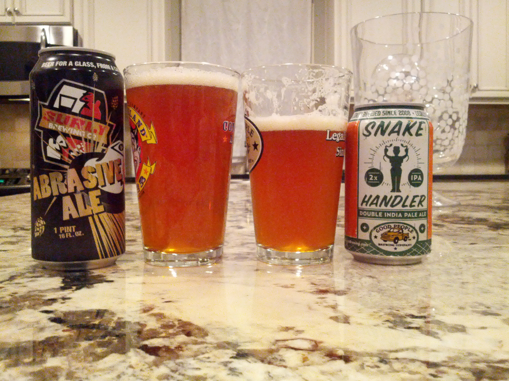
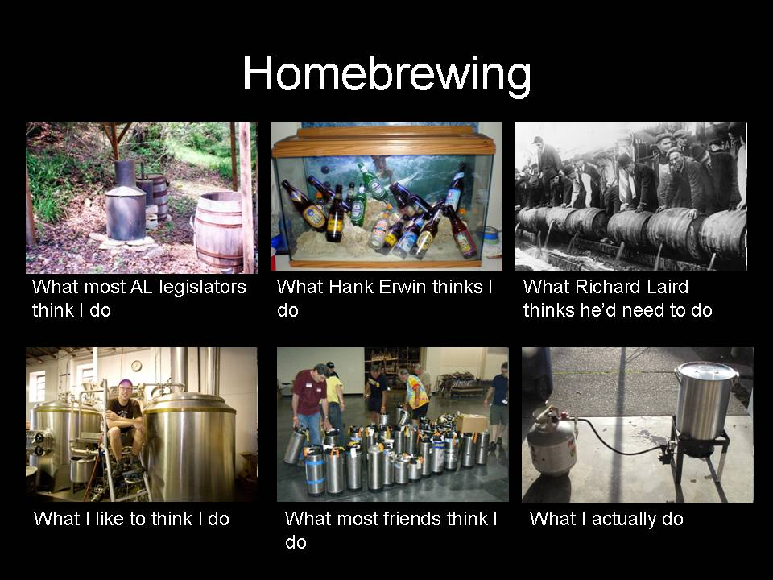
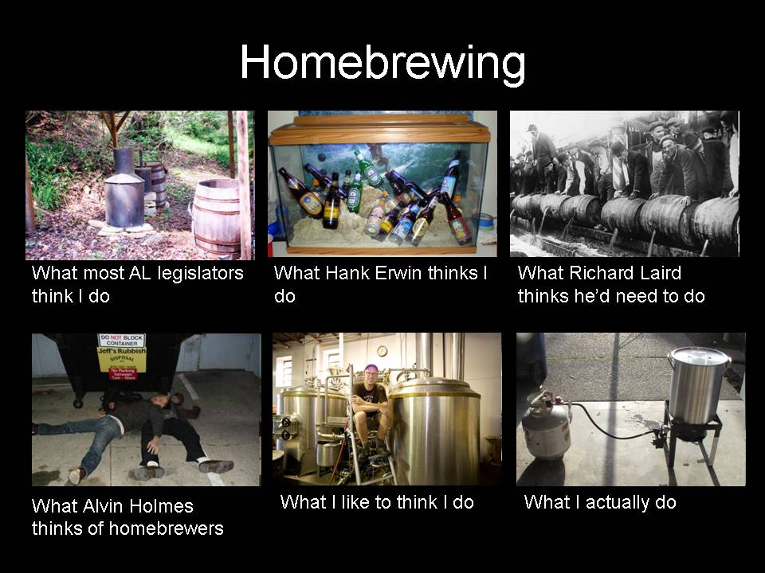
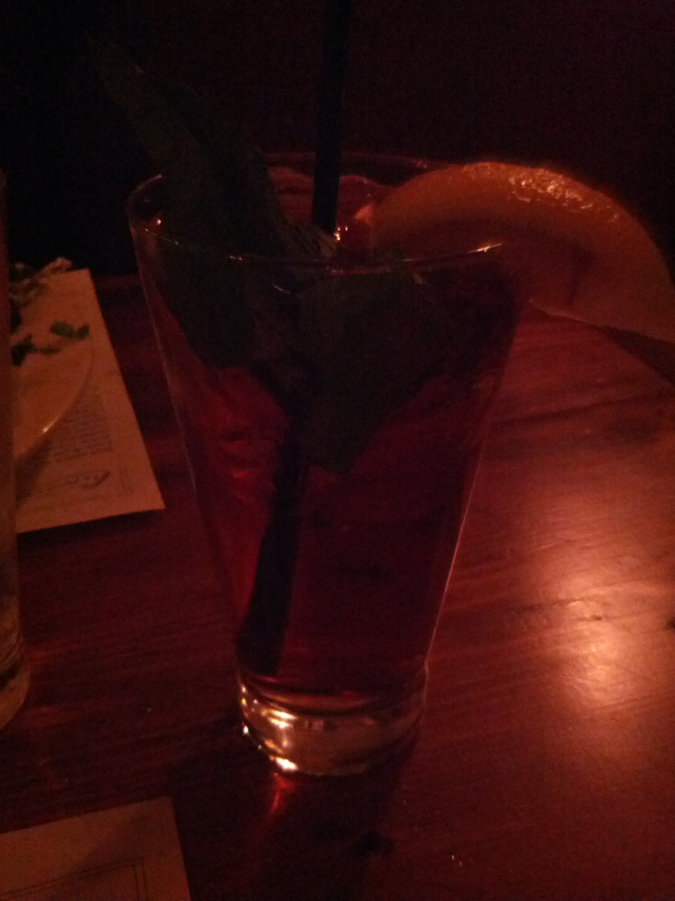

> I'm at Variety Playhouse for Jeff Mangum (1099 Euclid Ave, Atlanta) http://4sq.com/vZd4hG

 [Wed Feb 01 23:58:45 +0000 2012](https://twitter.com/nhudson/status/164860266381713408)

----

> Doing a side by side of @gpbrewing snake handler and surly abrasive. 
> 
> 

 [Fri Feb 03 00:05:42 +0000 2012](https://twitter.com/nhudson/status/165224395034464256)

----

> If you like piney, enamel ripping, palate destroying double ipa then I suggest the surly abrasive.  If you like balance then I suggest snake

 [Fri Feb 03 00:27:09 +0000 2012](https://twitter.com/nhudson/status/165229802301816833)

----

Replying to [@mmayhew](https://twitter.com/mmayhew/status/165236369311023104)

> didn't think that was out yet. How is it?

 [Fri Feb 03 00:54:25 +0000 2012](https://twitter.com/nhudson/status/165236666469072898)

----

Replying to [@mmayhew](https://twitter.com/mmayhew/status/165236369311023104)

> also that has like 6% abv you are already drunk aren't you?

 [Fri Feb 03 00:57:10 +0000 2012](https://twitter.com/nhudson/status/165237355886821376)

----

Replying to [@_TheBlack77 and @GPBrewing](https://twitter.com/_TheBlack77/status/165299083416829952)

> Snake was my favorite of the two.

 [Fri Feb 03 13:23:33 +0000 2012](https://twitter.com/nhudson/status/165425190594035713)

----

Replying to [@ditchell](https://twitter.com/ditchell/status/165462684211482625)

> see if you can locate Little Birds single. Btw the show was awesome I am sure you will enjoy yourself.

 [Fri Feb 03 16:02:05 +0000 2012](https://twitter.com/nhudson/status/165465085773492224)

----

> I'm at Avondale Brewing Company (201 41st St. S, at 2nd Ave. S, Birmingham) http://4sq.com/xCplRS

 [Sat Feb 04 20:08:05 +0000 2012](https://twitter.com/nhudson/status/165889382233018368)

----

> Hearing other people discuss beer/hombrew/brewing makes me want to poke my ears out. I am sure I sound just as moronic.

 [Sat Feb 04 20:20:02 +0000 2012](https://twitter.com/nhudson/status/165892388928225280)

----

> OK to add to my last tweet, apparently its just this dude who is annoying me. Though I am annoyed by 90% of the population.

 [Sat Feb 04 20:23:08 +0000 2012](https://twitter.com/nhudson/status/165893171874775041)

----

> watch for my new show on ABC Family called "lying liar mcliarson". Its about someone or a group of people lying.

 [Tue Feb 07 01:54:58 +0000 2012](https://twitter.com/nhudson/status/166701452910276608)

----

> I don't watch much basketball but the officiating in this game is terrible. #wareagle

 [Wed Feb 08 02:50:19 +0000 2012](https://twitter.com/nhudson/status/167077772353748992)

----

> No good call comes from your dad at 630a.

 [Sun Feb 12 13:00:29 +0000 2012](https://twitter.com/nhudson/status/168680874496360448)

----

Replying to [@brightsides, @_TheBlack77, @meyer440 and @topher72](https://twitter.com/brightsides/status/168696322084450304)

> death in the family is never a good call.  Thanks for thinking of me.

 [Mon Feb 13 15:34:25 +0000 2012](https://twitter.com/nhudson/status/169082001729667072)

----

> Homebrewing meme. I didn't come up with this but its awesome. #homebrewing #alapolitics 
> 
> 

 [Tue Feb 14 22:11:45 +0000 2012](https://twitter.com/nhudson/status/169544369983066112)

----

> Homebrew meme part 2 with my personal favorite Alvin Holmes added. #homebrew #alapolitics 
> 
> 

 [Tue Feb 14 22:52:19 +0000 2012](https://twitter.com/nhudson/status/169554541287714816)

----

> Thanks to @ddanner for leaving this at my house.  — Drinking a Buffalo Sweat by @TallgrassBeer — http://untp.it/xMIAo1

 [Tue Feb 14 23:01:08 +0000 2012](https://twitter.com/nhudson/status/169556810058043393)

----

> RT @vbatts: OMG, a video of @spotrh is *finally* posted https://t.co/a9yMhx8g Such a nice proper rant ;) &lt;3

 [Tue Feb 14 23:42:11 +0000 2012](https://twitter.com/nhudson/status/169567139446009856)

----

> OK so apparently the entire state of Arkansas smells like a mixture of McDonalds and baby shit.

 [Wed Feb 15 23:33:00 +0000 2012](https://twitter.com/nhudson/status/169927217227378688)

----

> I've now pinned Arkansas as the shittiest state in the union.

 [Sat Feb 18 18:42:30 +0000 2012](https://twitter.com/nhudson/status/170941275233730560)

----

> glad to be home. 1400 miles driving to Oklahoma and back in 3 days. #butthurts

 [Sun Feb 19 01:51:17 +0000 2012](https://twitter.com/nhudson/status/171049181224505344)

----

> RT @freethehops: Sick of buying @StoneBrewingCo & @allagashbeer & @TheBruery in states other than Alabama? Call ur Senator today & ask t ...

 [Tue Feb 21 17:52:59 +0000 2012](https://twitter.com/nhudson/status/172015977633021952)

----

> RT @freethehops: BY THE SKIN OF OUR TEETH. We passed the Senate 14-13.

 [Wed Feb 22 01:13:21 +0000 2012](https://twitter.com/nhudson/status/172126800502210560)

----

> Simply amazing.  — Drinking a Rayon Vert by @greenflashbeer — http://untp.it/z0Znh0

 [Sat Feb 25 23:04:58 +0000 2012](https://twitter.com/nhudson/status/173544040514588672)

----

Replying to [@casey1111 and @JClyde_Bham](https://twitter.com/casey1111/status/173541840128188417)

> what!! Wcipa with coffee??? Insane.

 [Sat Feb 25 23:08:18 +0000 2012](https://twitter.com/nhudson/status/173544881489321984)

----

Replying to [@casey1111 and @_TheBlack77](https://twitter.com/casey1111/status/173544905187139585)

> and I bought a case and split it. We know a guy :P. I think overton and vine is the only place that has it.

 [Sat Feb 25 23:10:15 +0000 2012](https://twitter.com/nhudson/status/173545373229518848)

----

Replying to [@casey1111](https://twitter.com/casey1111/status/173545726855487488)

> cool. I'll be there tomorrow. Hopefully they have that on again.

 [Sat Feb 25 23:14:53 +0000 2012](https://twitter.com/nhudson/status/173546538033876994)

----

Replying to [@carriejones](https://twitter.com/carriejones/status/173581153033400320)

> i feel sorry for you.

 [Sun Feb 26 02:06:57 +0000 2012](https://twitter.com/nhudson/status/173589838652637185)

----

Replying to [@_TheBlack77](https://twitter.com/_TheBlack77/status/173624805730422785)

> can't wait to age some. Going to become very earthy I think.

 [Sun Feb 26 04:30:54 +0000 2012](https://twitter.com/nhudson/status/173626066575953921)

----

> Pimms Cup I had tonight at Chez Fonfon tonight. Excellent place if you have never been. 
> 
> 

 [Sun Feb 26 04:36:25 +0000 2012](https://twitter.com/nhudson/status/173627447412137985)

----

Replying to [@KaleeDionne](https://twitter.com/KaleeDionne/status/174066384542769152)

> used to get them every 3 months, till I started using a neti pot. Best thing I ever started doing.

 [Mon Feb 27 12:48:28 +0000 2012](https://twitter.com/nhudson/status/174113670543056896)

----

Replying to [@KaleeDionne](https://twitter.com/KaleeDionne/status/174113780031164416)

> yeah its weird but it works.

 [Mon Feb 27 13:26:42 +0000 2012](https://twitter.com/nhudson/status/174123292490334209)

----

> You know you use vim too much when you start typing :wq and hitting the 'esc' key in the browser or any other place other than vim. #vim

 [Mon Feb 27 21:55:23 +0000 2012](https://twitter.com/nhudson/status/174251307484454913)

----

> Looks like @ChainHost is gone. Along with my websites.  @mmayhew @vbatts any luck? Cause I've got nothing in responses

 [Wed Feb 29 03:03:19 +0000 2012](https://twitter.com/nhudson/status/174691187301687296)

----

Replying to [@vbatts, @mmayhew and @mattspeer](https://twitter.com/vbatts/status/174853951055859715)

> same here and I paid mine and then it went down. 3 days since I contacted support too.

 [Wed Feb 29 13:56:02 +0000 2012](https://twitter.com/nhudson/status/174855448766316544)

----

> Peoples douchiness is ruining my chi today.

 [Wed Feb 29 17:18:35 +0000 2012](https://twitter.com/nhudson/status/174906421207511040)

----

> RT @EmilyDziedzic: 1 We're all adults. 2 Be flexible. 3 It's not always about you. 4 Use common sense. 5 If you have none, get some!

 [Wed Feb 29 21:26:39 +0000 2012](https://twitter.com/nhudson/status/174968849974837251)