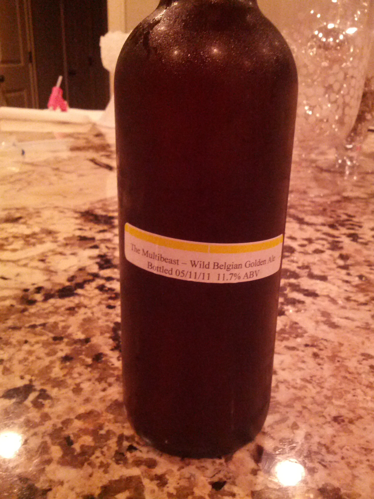
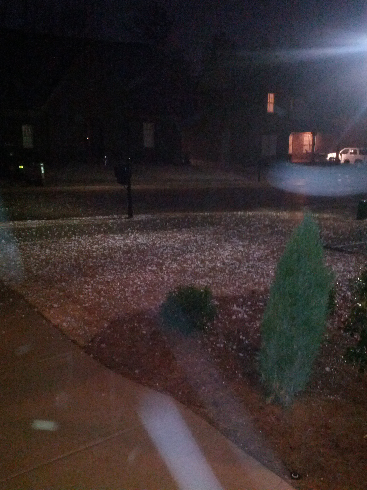

> About to start @_TheBlack77 Multibeast. Wish me luck. 
> 
> 

 [Sat Mar 03 00:18:59 +0000 2012](https://twitter.com/nhudson/status/175736987268030466)

----

> Golf ball size hail at my house in Hoover. #alwx 
> 
> 

 [Sat Mar 03 01:05:53 +0000 2012](https://twitter.com/nhudson/status/175748789284507649)

----

Replying to [@prestonprewett](https://twitter.com/prestonprewett/status/175746384564195328)

> don't tell me that. I'll be there sometime tomorrow afternoon.

 [Sat Mar 03 01:23:52 +0000 2012](https://twitter.com/nhudson/status/175753325243928577)

----

> The new hotness is the remastered Archers of Loaf Vee Vee album.  I am sure @captainsdead would agree.  Plus green vinyl is in these days.

 [Sat Mar 03 02:44:28 +0000 2012](https://twitter.com/nhudson/status/175773605840433152)

----

Replying to [@_TheBlack77](https://twitter.com/_TheBlack77/status/175779567464747009)

> no but damn I'm saucey

 [Sat Mar 03 03:16:52 +0000 2012](https://twitter.com/nhudson/status/175781762646016001)

----

Replying to [@captainsdead](https://twitter.com/captainsdead/status/175926011878318080)

> cool I didn't get the banner cause I bought it of amazon.  Never listened to vv till last night either. Great album

 [Sat Mar 03 14:32:57 +0000 2012](https://twitter.com/nhudson/status/175951905070125056)

----

Replying to [@captainsdead](https://twitter.com/captainsdead/status/176027770806214656)

> nope. I have been a big fan of the 1st album for forever but for some reason never looked at the second album.

 [Sat Mar 03 20:06:28 +0000 2012](https://twitter.com/nhudson/status/176035837195190272)

----

Replying to [@captainsdead](https://twitter.com/captainsdead/status/176036648998547456)

> oh I will. Loved it last night. Will be on solid rotation till I'm sick of it.

 [Sat Mar 03 20:32:57 +0000 2012](https://twitter.com/nhudson/status/176042501063450625)

----

> There is something that Dana does not not know.

 [Sun Mar 04 04:41:57 +0000 2012](https://twitter.com/nhudson/status/176165560923590657)

----

> RT @freethehops: Check out the beer list for Suds of the South this weekend... http://www.brownpapertickets.com/event/228271

 [Thu Mar 08 01:07:39 +0000 2012](https://twitter.com/nhudson/status/177561182364909568)

----

> Suds of the South. (@ Wilhagan's w/ 3 others) http://4sq.com/zyxofI

 [Sat Mar 10 22:12:10 +0000 2012](https://twitter.com/nhudson/status/178604185170870272)

----

Replying to [@_TheBlack77 and @gwalt](https://twitter.com/_TheBlack77/status/178653996662276098)

> next Saturday. Looking to fill spot too. Get tix if you can go.

 [Sun Mar 11 04:18:58 +0000 2012](https://twitter.com/nhudson/status/178696491102248960)

----

> Brewing up a Columbus forward IPA today. Using whole leaf and pellets. http://yfrog.com/oeyouaywj

 [Sun Mar 11 19:20:45 +0000 2012](https://twitter.com/nhudson/status/178923433567072256)

----

> Sparging now. Wonderful copper color. And so far hit all my temps due to a new thermometer http://yfrog.com/h7r4ajsj

 [Sun Mar 11 19:34:06 +0000 2012](https://twitter.com/nhudson/status/178926791476514817)

----

> Second setback of the day. Propane just ran out. Off to get a refill.

 [Sun Mar 11 20:17:32 +0000 2012](https://twitter.com/nhudson/status/178937721753051137)

----

Replying to [@casey1111](https://twitter.com/casey1111/status/178941386895265793)

> this is the one I bought from Target this morning. http://yfrog.com/h3gmektxj

 [Sun Mar 11 20:34:12 +0000 2012](https://twitter.com/nhudson/status/178941919446052864)

----

Replying to [@casey1111](https://twitter.com/casey1111/status/178943068492414978)

> no its a regular cooking one. The one that broke was a remote, but I never liked it.

 [Sun Mar 11 20:44:55 +0000 2012](https://twitter.com/nhudson/status/178944615481741312)

----

> Close up of some lupulin goodness. #homebrew http://yfrog.com/esh3gzqj

 [Sun Mar 11 21:07:55 +0000 2012](https://twitter.com/nhudson/status/178950404812443649)

----

Replying to [@casey1111](https://twitter.com/casey1111/status/178944935591034881)

> yeah same here after using one. Not at all accurate.

 [Sun Mar 11 21:16:39 +0000 2012](https://twitter.com/nhudson/status/178952602938114049)

----

Replying to [@DDanner](https://twitter.com/DDanner/status/178957599021080576)

> yeah lucky for me I hadn't hit boil yet and Walgreens is right down the road.

 [Sun Mar 11 22:46:50 +0000 2012](https://twitter.com/nhudson/status/178975295691440129)

----

> Brewday complete. Hit all my numbers except for the OG. Not off by much though. #homebrew.

 [Sun Mar 11 22:51:38 +0000 2012](https://twitter.com/nhudson/status/178976506289197058)

----

Replying to [@acnatta and @SecondFront](https://twitter.com/acnatta/status/179340862801707009)

> he really didn't say that did he??

 [Tue Mar 13 00:58:17 +0000 2012](https://twitter.com/nhudson/status/179370762753421312)

----

> I am pretty sure that I am the only one on this state that sees a problem with voting in churches.

 [Tue Mar 13 13:00:05 +0000 2012](https://twitter.com/nhudson/status/179552409574572032)

----

> Dropping off the Jeep (@ Hendrick Buick) http://4sq.com/xuvmJr

 [Tue Mar 13 13:00:53 +0000 2012](https://twitter.com/nhudson/status/179552611538706433)

----

> Amen "@DDanner: Drinking a Founders KBS thanks to Heather at the Homewood Pig. Don't believe the hype... way better than CBS."

 [Fri Mar 16 00:48:55 +0000 2012](https://twitter.com/nhudson/status/180455570275450880)

----

> 2012 vintage.  — Drinking a Kentucky Breakfast Stout (KBS) by @foundersbrewing — http://untp.it/zZdQHr #photo

 [Fri Mar 16 00:50:39 +0000 2012](https://twitter.com/nhudson/status/180456005983932416)

----

> My view for the next few days. http://yfrog.com/h2qyildj

 [Fri Mar 16 21:09:40 +0000 2012](https://twitter.com/nhudson/status/180762782508122113)

----

Replying to [@topher72](https://twitter.com/topher72/status/180770201015558146)

> how the hell did you get so much?

 [Fri Mar 16 22:29:04 +0000 2012](https://twitter.com/nhudson/status/180782764151422976)

----

Replying to [@mmayhew](https://twitter.com/mmayhew/status/180771044133576705)

> about 40 miles outside gatlinburg. In a cabin for the weekend.

 [Fri Mar 16 22:37:57 +0000 2012](https://twitter.com/nhudson/status/180785001015685120)

----

Replying to [@ACD7](https://twitter.com/ACD7/status/180847666358534144)

> in the mountains in Sevierville. Right now regretting coming.

 [Sat Mar 17 12:24:55 +0000 2012](https://twitter.com/nhudson/status/180993114394214401)

----

Replying to [@ACD7](https://twitter.com/ACD7/status/180997379087020033)

> family stuff. I guess you live and learn.

 [Sat Mar 17 13:06:33 +0000 2012](https://twitter.com/nhudson/status/181003590238879744)

----

> Excited to attempt to purchase #dld2012 tickets.

 [Sat Mar 17 16:52:35 +0000 2012](https://twitter.com/nhudson/status/181060472861237248)

----

Replying to [@stuartjcarter](https://twitter.com/@stuartjcarter/status/181079183538126849)

> nope. Site told me at 12:01 that it was sold out.

 [Sat Mar 17 19:34:59 +0000 2012](https://twitter.com/nhudson/status/181101342520131585)

----

> Found some fresh Ruination.  — Drinking a Ruination IPA by @StoneBrewingCo — http://untp.it/zlZ49e

 [Sat Mar 17 23:22:23 +0000 2012](https://twitter.com/nhudson/status/181158569993973760)

----

Replying to [@adamnason](https://twitter.com/adamnason/status/182107290139246594)

> $15 each

 [Tue Mar 20 14:53:30 +0000 2012](https://twitter.com/nhudson/status/182117666927026176)

----

> Just racked up my 1st Cider. Fresh pressed apples from AppleBarn. Added 2lbs of dark brown sugar and added yeast #homebrewing

 [Wed Mar 21 01:12:17 +0000 2012](https://twitter.com/nhudson/status/182273390474821633)

----

> I walked in to work this morning and found that my kernel was tainted.

 [Wed Mar 21 13:57:26 +0000 2012](https://twitter.com/nhudson/status/182465946982694912)

----

Replying to [@EmilyDziedzic](https://twitter.com/EmilyDziedzic/status/182801166009249792)

> Thanks!!

 [Thu Mar 22 12:17:15 +0000 2012](https://twitter.com/nhudson/status/182803125021839360)

----

> Present #1 from my favorite person in the world. http://yfrog.com/ocfu1drj

 [Thu Mar 22 21:34:05 +0000 2012](https://twitter.com/nhudson/status/182943253711163392)

----

Replying to [@carriejones](https://twitter.com/carriejones/status/183030656446636033)

> thanks!  It was a good one!

 [Fri Mar 23 12:04:47 +0000 2012](https://twitter.com/nhudson/status/183162374759518208)

----

> Present #3 from the best woman I know. My very 1st lawn mower. #reelmower http://yfrog.com/h7m15yawj

 [Fri Mar 23 13:03:44 +0000 2012](https://twitter.com/nhudson/status/183177208305688577)

----

> After a long day in the yard. My reward.  — Drinking a Rayon Vert by @greenflashbeer — http://untp.it/GM7pcl #photo

 [Sat Mar 24 21:07:43 +0000 2012](https://twitter.com/nhudson/status/183661396473548801)

----

> Seeing a kid wearing a Joy Division shirt is awesome and frightening at the same time.

 [Mon Mar 26 01:10:36 +0000 2012](https://twitter.com/nhudson/status/184084908212367361)

----

Replying to [@brightsides](https://twitter.com/brightsides/status/184085127066943488)

> haha we would all be so lucky.

 [Mon Mar 26 01:50:31 +0000 2012](https://twitter.com/nhudson/status/184094952060502016)

----

> Much needed after today.  — Drinking an Arrogant Bastard Ale by @StoneBrewingCo — http://untp.it/H7qpE0 #photo

 [Mon Mar 26 23:10:06 +0000 2012](https://twitter.com/nhudson/status/184416970391826432)

----

> Ready for my mouth to be destroyed.  — Drinking a Palate Wrecker by @greenflashbeer — http://untp.it/GXTm2M #photo

 [Thu Mar 29 00:30:14 +0000 2012](https://twitter.com/nhudson/status/185161913322307586)

----

> RT @ConanOBrien: After his shocking statement, Ron Burgundy proves once again he is the master of the jazz flute. Check it out: http://t ...

 [Thu Mar 29 02:11:46 +0000 2012](https://twitter.com/nhudson/status/185187465211027456)

----

> Drinking a Maibock by Gordon Biersch Brewing — http://untp.it/Hpj8hy

 [Thu Mar 29 02:15:02 +0000 2012](https://twitter.com/nhudson/status/185188285155520514)

----

Replying to [@chipwtd](https://twitter.com/chipwtd/status/185188414457516032)

> might not have but it was quite good. Looking forward to another one tomorrow.

 [Thu Mar 29 02:18:52 +0000 2012](https://twitter.com/nhudson/status/185189248318713856)

----

Replying to [@DDanner](https://twitter.com/DDanner/status/185387388040790016)

> Great beer, going to drink another one or two tonight.

 [Thu Mar 29 15:46:17 +0000 2012](https://twitter.com/nhudson/status/185392444798550018)

----

Replying to [@MondayNight and @MondayNightCar](https://twitter.com/MondayNight/status/185372268271112192)

> y'all headed to Birmingham soon?

 [Thu Mar 29 17:26:44 +0000 2012](https://twitter.com/nhudson/status/185417722610458625)

----

> @EmilyDziedzic you been to @leroylounge yet?  If so how is it?

 [Thu Mar 29 17:52:19 +0000 2012](https://twitter.com/nhudson/status/185424159810129920)

----

Replying to [@EmilyDziedzic and @LeroyLounge](https://twitter.com/EmilyDziedzic/status/185424563625136129)

> sounds like a plan!

 [Thu Mar 29 19:29:22 +0000 2012](https://twitter.com/nhudson/status/185448583565287424)

----

> X2 — Drinking a Palate Wrecker by @greenflashbeer — http://untp.it/H54EDz

 [Fri Mar 30 00:54:13 +0000 2012](https://twitter.com/nhudson/status/185530335025577985)

----

> Happy birthday @vbatts

 [Fri Mar 30 01:46:14 +0000 2012](https://twitter.com/nhudson/status/185543425741963264)

----

> Good lord. My Mac just updated to Chrome 20.0.1087.0.

 [Sat Mar 31 17:06:09 +0000 2012](https://twitter.com/nhudson/status/186137318401380352)

----

> Oh white labs. How I hate you.  Your vial explodes all over my hands when I open you. Half the yeast is gone/tainted at that point #homebrew

 [Sat Mar 31 18:37:40 +0000 2012](https://twitter.com/nhudson/status/186160347730817025)

----

> So to everyone who uses ham radio, what would stop me from just buying a radio and using it with no license?  What could actually happen?

 [Sun Apr 01 02:46:45 +0000 2012](https://twitter.com/nhudson/status/186283428705083392)

----

Replying to [@alanjones19](https://twitter.com/0xAlan/status/186295146269245440)

> I can buy one online.  I don't see where they check your license.

 [Sun Apr 01 03:36:40 +0000 2012](https://twitter.com/nhudson/status/186295994403651584)

----

Replying to [@alanjones19](https://twitter.com/0xAlan/status/186296485556649985)

> No idea.  Sounds too easy.  I would assume if it was easy people would be doing it regardless.

 [Sun Apr 01 03:40:39 +0000 2012](https://twitter.com/nhudson/status/186296993478488065)