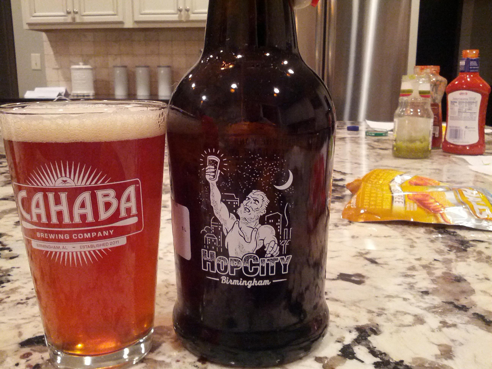

> Great example of a Kolsch. Grainy, clean , clear with a slight fruity finish. — Drinking a Reissdorf Kölsch — http://untp.it/PXlXct

 [Sat Sep 01 19:47:34 +0000 2012](https://twitter.com/nhudson/status/241985671881953280)

----

> RT @jasonrobert: Good news, everyone! @emersoncollege is still undefeated in college football! #ecwelcome

 [Sun Sep 02 00:21:32 +0000 2012](https://twitter.com/nhudson/status/242054616290848768)

----

> Can't believe this is available in Alabama. — Drinking a Boxer's Revenge by @jesterkingbeer — http://untp.it/T4VCxG

 [Sun Sep 02 00:54:37 +0000 2012](https://twitter.com/nhudson/status/242062943397765120)

----

> VanGorter needs to bust some heads. Defence is looking a bit tired. #wareagle #wde

 [Sun Sep 02 02:04:04 +0000 2012](https://twitter.com/nhudson/status/242080421205131264)

----

> Going to be a long season #wareagle #wde

 [Sun Sep 02 02:30:40 +0000 2012](https://twitter.com/nhudson/status/242087115763089410)

----

> Defense needs work, passing game needs a lot of work, running game looks good as long as we don't fumble. #wde #wareagle

 [Sun Sep 02 02:36:06 +0000 2012](https://twitter.com/nhudson/status/242088482309279744)

----

> Am I the only one who find it weird and strange when your dad LOL's you in a text?

 [Mon Sep 03 15:35:40 +0000 2012](https://twitter.com/nhudson/status/242647053031833600)

----

> Updating my laptop to openSuSE 12.2 this morning.  This would be the 1st time I haven't messed around with any early releases. #linux

 [Wed Sep 05 13:47:52 +0000 2012](https://twitter.com/nhudson/status/243344700222889985)

----

> OpenSuSE Upgraded to 12.2, only issue is that Grub2 is broke.  Manually fixed.  Why include it if it doesn't generate the conf correctly??

 [Wed Sep 05 16:21:22 +0000 2012](https://twitter.com/nhudson/status/243383330895192064)

----

Replying to [@mmayhew](https://twitter.com/mmayhew/status/243387339756425216)

> Yeah. Thought I fixed it to, but I didn't.  Its trying to point to an .img file that doesn't exist and fails.  Stupid.

 [Wed Sep 05 16:38:12 +0000 2012](https://twitter.com/nhudson/status/243387564940214274)

----

Replying to [@jospoortvliet](https://twitter.com/jospoortvliet/status/243388962213863425)

> I would love to know.  I dist upgraded from 12.1.  Looks like the grub2 option is looking for a .img file that doesn't exist.

 [Wed Sep 05 17:12:49 +0000 2012](https://twitter.com/nhudson/status/243396276677394432)

----

> ::yawn:: #newkindles

 [Thu Sep 06 20:34:51 +0000 2012](https://twitter.com/nhudson/status/243809509737381888)

----

> Work+yard work means its beer:30. This hits the spot. — Drinking a Snake Handler Double IPA by @GPBrewing — http://untp.it/NPnhlq

 [Fri Sep 07 00:45:53 +0000 2012](https://twitter.com/nhudson/status/243872683366952961)

----

> @urbanfabricfm you playing tonight?

 [Fri Sep 07 22:56:40 +0000 2012](https://twitter.com/nhudson/status/244207584800825346)

----

Replying to [@urbanfabricfm](https://twitter.com/urbanfabricfm/status/244210639126540288)

> awesome what time you start. I'll be at the beer tent on morris all night.

 [Fri Sep 07 23:09:44 +0000 2012](https://twitter.com/nhudson/status/244210876037599232)

----

Replying to [@GJones83412762](https://twitter.com/GJones83412762/status/244218467253882880)

> pigs westerns whole foods should all have it.

 [Sat Sep 08 03:44:36 +0000 2012](https://twitter.com/nhudson/status/244280048025219072)

----

> The donut police! http://instagr.am/p/PVLiIIDzDF/

 [Sat Sep 08 22:23:13 +0000 2012](https://twitter.com/nhudson/status/244561557089026048)

----

> ladies, if your husband ever asks. "You alright with natty light" please slap him and look for a divorce attorney

 [Sun Sep 09 00:11:14 +0000 2012](https://twitter.com/nhudson/status/244588741811920898)

----

Replying to [@Brndon](https://twitter.com/Brndon/status/244590016674811904)

> surprisingly enough it was at Publix.

 [Sun Sep 09 00:19:15 +0000 2012](https://twitter.com/nhudson/status/244590756562604032)

----

Replying to [@papagraf and @SarahMillerArt](https://twitter.com/papagraf/status/244935901107609601)

> she totally forced me to give her your iPad and take that picture, I swear. :P

 [Sun Sep 09 23:19:33 +0000 2012](https://twitter.com/nhudson/status/244938121676980226)

----

Replying to [@papagraf and @SarahMillerArt](https://twitter.com/papagraf/status/244959761584517120)

> :) post if you will.

 [Mon Sep 10 00:47:43 +0000 2012](https://twitter.com/nhudson/status/244960309872312321)

----

Replying to [@SarahMillerArt](https://twitter.com/@SarahMillerArt/status/244990624108011521)

> yeah I wanted to but couldn't make it happen. :(  looks like you had a good time though.

 [Mon Sep 10 02:57:20 +0000 2012](https://twitter.com/nhudson/status/244992927225491457)

----

> RT @AuFootball34: Retweet if your still All-In
> #WarEagle

 [Mon Sep 10 03:11:16 +0000 2012](https://twitter.com/nhudson/status/244996432636035072)

----

Replying to [@SarahMillerArt](https://twitter.com/@SarahMillerArt/status/244993732024340480)

> DJ Coco can do that. Hate I missed that.

 [Mon Sep 10 03:12:41 +0000 2012](https://twitter.com/nhudson/status/244996789533556737)

----

> Don't know why but I am pissed about this Sonic Youth list http://stereogum.com/1144241/sonic-youth-albums-from-worst-to-best/top-stories/lead-story/

 [Mon Sep 10 16:35:42 +0000 2012](https://twitter.com/nhudson/status/245198878989770754)

----

Replying to [@BrianMcAlister and @HopCity](https://twitter.com/BrianMcAlister/status/245196533136502784)

> Last I checked they will be open on Thursday

 [Mon Sep 10 16:36:18 +0000 2012](https://twitter.com/nhudson/status/245199028718026752)

----

> Its been years since I've been to Center Point. Only thing going for it is T-Bones.

 [Tue Sep 11 17:19:07 +0000 2012](https://twitter.com/nhudson/status/245572189976416256)

----

> If you're already thinking about Friday as I am, come out to @CahabaBrewing taproom on Friday and I will pour you a cold one or eight.

 [Tue Sep 11 22:41:22 +0000 2012](https://twitter.com/nhudson/status/245653288521981952)

----

Replying to [@jmccarty](https://twitter.com/jmccarty/status/245683453784375296)

> I did. Famous with Peppers

 [Wed Sep 12 00:52:00 +0000 2012](https://twitter.com/nhudson/status/245686164646920192)

----

> I was trying to stay away from commenting on the meh Apple announcement, but this  would upset me if I owned one. http://gizmodo.com/5942710/fuck-that-goddamn-iphone-adapter-costs-30-bucks

 [Wed Sep 12 19:46:15 +0000 2012](https://twitter.com/nhudson/status/245971607946919936)

----

> Last night I was apart of a 7 year (2005-2012) vertical tasting of @SierraNevada Bigfoot.  Quite amazing, my fav being 2005 and 2011.

 [Wed Sep 12 21:17:53 +0000 2012](https://twitter.com/nhudson/status/245994666238021632)

----

> Tonight I am pairing @CrookedStave Petite Sour with various cheeses and fig jam.  Should be interesting...

 [Wed Sep 12 21:19:26 +0000 2012](https://twitter.com/nhudson/status/245995058313187328)

----

Replying to [@chipwtd](https://twitter.com/chipwtd/status/246012024641961984)

> last night at a bjcp judge class.

 [Wed Sep 12 22:28:54 +0000 2012](https://twitter.com/nhudson/status/246012540281311233)

----

Replying to [@chipwtd](https://twitter.com/chipwtd/status/246017247800356864)

> Beer Judge Certification Program. Its for judging homebrew.

 [Wed Sep 12 22:52:49 +0000 2012](https://twitter.com/nhudson/status/246018555525607426)

----

> Currently enjoying an Avondale Battlefield IPA. And yes that is my yellow and white polka dotted bag.  http://instagr.am/p/PfjOdCDzMb/

 [Wed Sep 12 23:03:08 +0000 2012](https://twitter.com/nhudson/status/246021152655413248)

----

> RT @captainsdead: i love diane rehm and all but listening to her is akin to watching an animal die a slow painful death.

 [Thu Sep 13 01:34:07 +0000 2012](https://twitter.com/nhudson/status/246059149899726848)

----

> Lost track of all the beer pairings I had tonight. Some excellent some not so much.

 [Thu Sep 13 01:41:32 +0000 2012](https://twitter.com/nhudson/status/246061017640095744)

----

> @CrookedStave petite sour and fig jam/preserves is an excellent pairing. Sweetness of the jam cuts into the sourness of the beer excellant

 [Thu Sep 13 01:44:23 +0000 2012](https://twitter.com/nhudson/status/246061734459215873)

----

Replying to [@SarahMillerArt and @CrookedStave](https://twitter.com/@SarahMillerArt/status/246019553220509696)

> it was. Fig jam with the beer was quite amazing.

 [Thu Sep 13 02:50:01 +0000 2012](https://twitter.com/nhudson/status/246078249707380736)

----

Replying to [@SarahMillerArt](https://twitter.com/@SarahMillerArt/status/246069516533112832)

> oh I know. All the feminine looks are my style.

 [Thu Sep 13 02:50:41 +0000 2012](https://twitter.com/nhudson/status/246078418947563521)

----

Replying to [@SarahMillerArt](https://twitter.com/@SarahMillerArt/status/246078554448723968)

> I have plenty more :P

 [Thu Sep 13 02:51:43 +0000 2012](https://twitter.com/nhudson/status/246078679292211200)

----

Replying to [@_TheBlack77 and @chipwtd](https://twitter.com/_TheBlack77/status/246232685234774017)

> don't recall, which means no I wasn't. They were interesting. Hard to taste anything past 09.

 [Thu Sep 13 13:05:21 +0000 2012](https://twitter.com/nhudson/status/246233103033593856)

----

Replying to [@SarahMillerArt](https://twitter.com/@SarahMillerArt/status/246079245728755712)

> need to make some homemade fig jam, then ill share again.

 [Thu Sep 13 14:36:50 +0000 2012](https://twitter.com/nhudson/status/246256125257846784)

----

> If anyone ever wondered what a 911 system looks like here you go. Pretty boring. Yes those are 9600 baud mod http://instagr.am/p/PhUrvODzF_/

 [Thu Sep 13 15:34:14 +0000 2012](https://twitter.com/nhudson/status/246270572860956672)

----

Replying to [@casey1111 and @hopcity](https://twitter.com/casey1111/status/246273553408851968)

> no, got pushed back.  Stupid bham city red tape.

 [Thu Sep 13 15:53:39 +0000 2012](https://twitter.com/nhudson/status/246275457501245440)

----

> Another e911 setup. This one is more standard for us. No those arent 9600 baud modems they bare 1200 baud.  http://instagr.am/p/PhlmGsDzCx/

 [Thu Sep 13 18:02:12 +0000 2012](https://twitter.com/nhudson/status/246307807954083841)

----

> The back of the rack. Nothing special, don't even know why I am posting these.  http://instagr.am/p/PhlutQDzC2/

 [Thu Sep 13 18:02:56 +0000 2012](https://twitter.com/nhudson/status/246307995603050496)

----

Replying to [@JClyde_Bham](https://twitter.com/JClyde_Bham/status/246432504100290560)

> is that new glarus?

 [Fri Sep 14 02:21:22 +0000 2012](https://twitter.com/nhudson/status/246433426746507264)

----

Replying to [@JClyde_Bham](https://twitter.com/JClyde_Bham/status/246433822927900673)

> oh has to be Raspberry Tart.

 [Fri Sep 14 02:23:49 +0000 2012](https://twitter.com/nhudson/status/246434044848529408)

----

> I suggest everyone come out to @CahabaBrewing tonight so I can pour you a pint. Come on start the weekend off right #okauba

 [Fri Sep 14 12:48:14 +0000 2012](https://twitter.com/nhudson/status/246591186456952834)

----

Replying to [@SarahMillerArt](https://twitter.com/@SarahMillerArt/status/246613290883633153)

> its the only way to drink it. Anything else you might as well just be drinking a 5 hour energy.

 [Fri Sep 14 14:31:58 +0000 2012](https://twitter.com/nhudson/status/246617288495751168)

----

Replying to [@SarahMillerArt](https://twitter.com/@SarahMillerArt/status/246617962482655232)

> for me I found it much better once I switched to french press and ground my own.  Brought out nice subtle flavors.

 [Fri Sep 14 14:43:16 +0000 2012](https://twitter.com/nhudson/status/246620133932539904)

----

Replying to [@SarahMillerArt and @CahabaBrewing](https://twitter.com/@SarahMillerArt/status/246637432987062273)

> Here is the menu.  http://johnscitydiner.com/beerdinner912.pdf

 [Fri Sep 14 17:21:30 +0000 2012](https://twitter.com/nhudson/status/246659953681641472)

----

Replying to [@SarahMillerArt](https://twitter.com/@SarahMillerArt/status/246660372558385153)

> yeah they all are, but the food at John's is really good too.  For the amount you get the price is pretty cheap.

 [Fri Sep 14 17:26:23 +0000 2012](https://twitter.com/nhudson/status/246661182138769408)

----

Replying to [@SarahMillerArt](https://twitter.com/@SarahMillerArt/status/246660372558385153)

> I also laughed a bit cause I always think the same thing.

 [Fri Sep 14 17:34:10 +0000 2012](https://twitter.com/nhudson/status/246663140882935809)

----

Replying to [@SarahMillerArt](https://twitter.com/@SarahMillerArt/status/246662340047683587)

> nope I am actually going to be pouring at their tap room tonight.

 [Fri Sep 14 17:34:48 +0000 2012](https://twitter.com/nhudson/status/246663301554126848)

----

Replying to [@casey1111](https://twitter.com/casey1111/status/246665041095561216)

> nope now I am.

 [Fri Sep 14 17:43:02 +0000 2012](https://twitter.com/nhudson/status/246665372877602816)

----

> !!!!!!!!!!!!!!!!!!!!!!!!!!!!!RT @BottletreeCafe: SHOW ANNOUNCEMENT! 
> THE HOLD STEADY 
> OCTOBER 10! 
> TIX ON SALE NOW!!! 
> http://www.thebottletree.com

 [Fri Sep 14 17:56:20 +0000 2012](https://twitter.com/nhudson/status/246668720808787968)

----

Replying to [@SarahMillerArt](https://twitter.com/@SarahMillerArt/status/246664282165612545)

> you should come by sometime tonight, I'll gladly pour you one!

 [Fri Sep 14 21:10:23 +0000 2012](https://twitter.com/nhudson/status/246717552967954432)

----

Replying to [@SarahMillerArt](https://twitter.com/@SarahMillerArt/status/246720200408449024)

> its right past 27th st on 3rd ave south. Right before you go under the 31 bridge.

 [Fri Sep 14 21:45:22 +0000 2012](https://twitter.com/nhudson/status/246726357722202112)

----

> RT @freethehops: 2nd Annual Fall FestivAle tix on sale now! 11/2/12 @ Old Car Heaven! Our heaven will be all these rare Alabama beers! h ...

 [Sat Sep 15 05:56:21 +0000 2012](https://twitter.com/nhudson/status/246849918642298880)

----

> Cutting grass instead of listening to the auburn game. My sanity seems to be in tacked today.

 [Sat Sep 15 17:11:01 +0000 2012](https://twitter.com/nhudson/status/247019705443942400)

----

> Sunsetting at my family's place. Quite nice today.  http://instagr.am/p/PnWlcLjzFv/

 [Sat Sep 15 23:46:04 +0000 2012](https://twitter.com/nhudson/status/247119121911775232)

----

> RT @WarBlogle: If you laugh at Auburn’s win over ULM and I respond with your Lord’s record against ULM, then that’s it. That’s all we’re ...

 [Sun Sep 16 00:07:27 +0000 2012](https://twitter.com/nhudson/status/247124503052824577)

----

> Motorcycle ride today. Stopped at Rail Road Park and good lord what a ton of people. Stopped into @gpbrewing to watch the Panthers

 [Sun Sep 16 18:13:20 +0000 2012](https://twitter.com/nhudson/status/247397775094992897)

----

> Nope, nah, no, uh uh, not happening. #backtobed

 [Mon Sep 17 12:08:30 +0000 2012](https://twitter.com/nhudson/status/247668350027722752)

----

> RT @freethehops Tix to Fall FestivAle are on sale now!  http://www.fallfestivale.com/ http://www.freethehops.org/festivale/tickets.php

 [Mon Sep 17 14:58:42 +0000 2012](https://twitter.com/nhudson/status/247711179080863744)

----

Replying to [@SarahMillerArt](https://twitter.com/@SarahMillerArt/status/247703213271314432)

> no joke. Don't know whats wrong with me today all I can think about is laying in bed.

 [Mon Sep 17 16:54:53 +0000 2012](https://twitter.com/nhudson/status/247740418534539264)

----

Replying to [@SarahMillerArt](https://twitter.com/@SarahMillerArt/status/248121282816782336)

> congrats!

 [Tue Sep 18 18:17:15 +0000 2012](https://twitter.com/nhudson/status/248123537209040896)

----

> Hey fall. Welcome home, stay awhile.

 [Wed Sep 19 13:17:02 +0000 2012](https://twitter.com/nhudson/status/248410370077761536)

----

> Heading to the emerald coast for a few days. Hopefully relaxing. I'll be the pale guy under the shade reading if you see me.

 [Thu Sep 20 12:35:23 +0000 2012](https://twitter.com/nhudson/status/248762278445469696)

----

Replying to [@SarahMillerArt](https://twitter.com/@SarahMillerArt/status/248839842094518274)

> oh I do. I'll be out in the shade with my 100 SPF

 [Thu Sep 20 18:28:46 +0000 2012](https://twitter.com/nhudson/status/248851209308499968)

----

> Temperance at McGuires.  http://instagr.am/p/Pz9ERZDzGK/

 [Thu Sep 20 21:13:04 +0000 2012](https://twitter.com/nhudson/status/248892557520666625)

----

> I just spent all my spare cash trying to cut the rope on a gen 1 iPad. #stupid

 [Thu Sep 20 22:07:11 +0000 2012](https://twitter.com/nhudson/status/248906176765501440)

----

> 0.18 cent soup. Worth all 0.18 http://instagr.am/p/P0EkOrDzLS/

 [Thu Sep 20 22:18:39 +0000 2012](https://twitter.com/nhudson/status/248909060768948226)

----

> I really hope no one is using Internet Explorer let alone Netscape anymore.  http://instagr.am/p/P0H6I-DzNq/

 [Thu Sep 20 22:48:02 +0000 2012](https://twitter.com/nhudson/status/248916454852919296)

----

> Excellent Porter. — Drinking a Lighthouse Porter by @pbbrew — http://untp.it/RF1VCE

 [Fri Sep 21 00:04:43 +0000 2012](https://twitter.com/nhudson/status/248935752950501376)

----

> Glad I am on vacation, but pissed I am missing @usaaquarium in Birmingham tonight.

 [Fri Sep 21 01:24:31 +0000 2012](https://twitter.com/nhudson/status/248955836083363840)

----

> My view for the next bit. #nofilter.  http://instagr.am/p/P2B9dzjzD8/

 [Fri Sep 21 16:34:24 +0000 2012](https://twitter.com/nhudson/status/249184816233345024)

----

> Spf 50 every 15 minutes please.

 [Fri Sep 21 17:01:39 +0000 2012](https://twitter.com/nhudson/status/249191673823887360)

----

Replying to [@SarahMillerArt](https://twitter.com/@SarahMillerArt/status/249197773491154944)

> congrats. Glad its going to a good cause. One of the favorites I've seen.

 [Fri Sep 21 18:08:16 +0000 2012](https://twitter.com/nhudson/status/249208436980609024)

----

> I just got wet walking into the ocean. Little fishes are nibbling today.

 [Fri Sep 21 18:09:15 +0000 2012](https://twitter.com/nhudson/status/249208686663315457)

----

> Just cracked a half empty/full can of @oscarblues Dales Pale. Can't say that ever happened before.

 [Fri Sep 21 18:15:48 +0000 2012](https://twitter.com/nhudson/status/249210333502259200)

----

> I am witnessing fully dressed people in the ocean. Jeans, denim dresses long sleeves. Its weird but I am sure its because of their religion

 [Fri Sep 21 18:44:11 +0000 2012](https://twitter.com/nhudson/status/249217476334845952)

----

> Got drunk and dropped my phone into the water of the cooler. Won't charge but still works. Here is to hoping it dries out.

 [Fri Sep 21 22:16:56 +0000 2012](https://twitter.com/nhudson/status/249271018198294529)

----

Replying to [@jasonrobert](https://twitter.com/jasonrobert/status/249271428719992832)

> wish you were too. Though she'd a tear for my Nexus. Looks like I will have to get another one.

 [Fri Sep 21 22:38:29 +0000 2012](https://twitter.com/nhudson/status/249276439868891137)

----

Replying to [@stuartjcarter](https://twitter.com/@stuartjcarter/status/249284833539416064)

> yeah I am doing that tonight. Need to find a bag of rice.

 [Fri Sep 21 23:12:23 +0000 2012](https://twitter.com/nhudson/status/249284971108376577)

----

Replying to [@mmayhew and @jmccarty](https://twitter.com/mmayhew/status/249304247391367168)

> well it might be too late. I tried charging it and it turned off. Ugh.

 [Sat Sep 22 03:13:40 +0000 2012](https://twitter.com/nhudson/status/249345692785598464)

----

> Today's view.  http://instagr.am/p/P4WfwMjzGI/

 [Sat Sep 22 14:12:31 +0000 2012](https://twitter.com/nhudson/status/249511499255648257)

----

> Broke my glasses tonight. So lets count, broken phone check, broken glasses check. What's next? I'm waiting world I'm waiting.

 [Sun Sep 23 07:15:39 +0000 2012](https://twitter.com/nhudson/status/249768976865955840)

----

> Being without a phone and glasses is weird and very annoying. Just ordered some try ons from Warby Parker. Hopefully I can find a good pair.

 [Mon Sep 24 02:09:23 +0000 2012](https://twitter.com/nhudson/status/250054292755582976)

----

Replying to [@SarahMillerArt](https://twitter.com/@SarahMillerArt/status/250058631876329473)

> go go go

 [Mon Sep 24 03:03:56 +0000 2012](https://twitter.com/nhudson/status/250068019898896384)

----

Replying to [@SarahMillerArt](https://twitter.com/@SarahMillerArt/status/250068983523467264)

> make sure you stretch! So far all are looking awesome.

 [Mon Sep 24 03:13:37 +0000 2012](https://twitter.com/nhudson/status/250070455887749121)

----

Replying to [@SarahMillerArt](https://twitter.com/@SarahMillerArt/status/250072888189792256)

> got drunk and dumped my phone in water, it no longer charges. Dropped my glasses last night and stepped on them.

 [Mon Sep 24 03:43:19 +0000 2012](https://twitter.com/nhudson/status/250077929655119872)

----

Replying to [@SarahMillerArt](https://twitter.com/@SarahMillerArt/status/250191375277109248)

> it's an android phone but still does just as bad of damage. Phone physically works it just won't charge anymore.

 [Mon Sep 24 11:27:38 +0000 2012](https://twitter.com/nhudson/status/250194781056143360)

----

> Why on earth am I up this early??? #cantsleeptweet

 [Mon Sep 24 11:28:31 +0000 2012](https://twitter.com/nhudson/status/250195000904777728)

----

Replying to [@SarahMillerArt](https://twitter.com/@SarahMillerArt/status/250196718325465088)

> yeah will have to. I have insurance on it so I'll just pay the deductible.

 [Mon Sep 24 11:37:15 +0000 2012](https://twitter.com/nhudson/status/250197198225170432)

----

> New phone should be here tomorrow.  Eye appt scheduled for 1pm.  Now what to do for the rest of my day off?

 [Mon Sep 24 16:04:29 +0000 2012](https://twitter.com/nhudson/status/250264449867448320)

----

Replying to [@G_Blackstone](https://twitter.com/G_Blackstone/status/250267155038359552)

> well there is that…

 [Mon Sep 24 16:31:35 +0000 2012](https://twitter.com/nhudson/status/250271272913747969)

----

Replying to [@SarahMillerArt](https://twitter.com/@SarahMillerArt/status/250294563258892289)

> my fav one is on the top right. They all look amazing. Good work, stretch and give yourself a pat on the back.

 [Mon Sep 24 18:41:22 +0000 2012](https://twitter.com/nhudson/status/250303932843315200)

----

> Eyes fully dilated. Hopefully spell check corrects all my mistakes.

 [Mon Sep 24 18:42:19 +0000 2012](https://twitter.com/nhudson/status/250304171268509696)

----

Replying to [@SarahMillerArt](https://twitter.com/@SarahMillerArt/status/250330265250045953)

> sounds like a pretty productive weekend/day then.  Congrats

 [Mon Sep 24 22:13:49 +0000 2012](https://twitter.com/nhudson/status/250357397435080704)

----

> Awesome thx. “@WarbyParkerHelp: @nhudson We hope you find a great pair too! Let us know if you need any help throughout the process.”

 [Mon Sep 24 23:34:52 +0000 2012](https://twitter.com/nhudson/status/250377793102307329)

----

> Bottle date 8.31.2012. Thanks @gwalt — Drinking a Pliny the Elder by Russian River Brewing Company — http://untp.it/UAIvVZ

 [Tue Sep 25 00:57:38 +0000 2012](https://twitter.com/nhudson/status/250398621751713792)

----

> Surprisingly very low brett character in this one. — Drinking a Wild Wild Brett Blue by @CrookedStave — http://untp.it/PT8lzX

 [Tue Sep 25 01:00:30 +0000 2012](https://twitter.com/nhudson/status/250399346162540544)

----

> Amazing how better I feel now I have a phone again. Though I'll miss not getting messages.

 [Wed Sep 26 21:04:07 +0000 2012](https://twitter.com/nhudson/status/251064633715195904)

----

> So new glasses time. Here is me with @WarbyParker Huxley's. This pair is my favorite so far. 
> 
> 

 [Thu Sep 27 02:23:34 +0000 2012](https://twitter.com/nhudson/status/251145023461154816)

----

> Here are the @WarbyParker Crosby 
> 
> 

 [Thu Sep 27 02:24:32 +0000 2012](https://twitter.com/nhudson/status/251145264277114880)

----

> Here are @WarbyParker Larkin 
> 
> 

 [Thu Sep 27 02:25:14 +0000 2012](https://twitter.com/nhudson/status/251145443252256768)

----

> Here are the @WarbyParker Miles. They are a bit small I think. 
> 
> 

 [Thu Sep 27 02:26:03 +0000 2012](https://twitter.com/nhudson/status/251145645749051392)

----

> And finally the @WarbyParker Fillmore. Not me at all. 
> 
> 

 [Thu Sep 27 02:26:54 +0000 2012](https://twitter.com/nhudson/status/251145860048629760)

----

Replying to [@jasonrobert](https://twitter.com/jasonrobert/status/251145932261949440)

> agreed I liked them too. Just too small for my face.

 [Thu Sep 27 02:30:33 +0000 2012](https://twitter.com/nhudson/status/251146780987756544)

----

Replying to [@acnatta](https://twitter.com/acnatta/status/251146227180261376)

> thanks Huxley is in the running right now.

 [Thu Sep 27 02:31:07 +0000 2012](https://twitter.com/nhudson/status/251146925615759361)

----

Replying to [@tsutrav](https://twitter.com/tsutrav/status/251149054568955904)

> thanks. Those are slowly creeping up my list. More I wear them the more I like them.

 [Thu Sep 27 02:43:26 +0000 2012](https://twitter.com/nhudson/status/251150022006153216)

----

Replying to [@SarahMillerArt](https://twitter.com/@SarahMillerArt/status/251153846112509952)

> I was saying I liked not having people being able to get ahold of me.  Life was quiet for a few days.

 [Thu Sep 27 13:02:57 +0000 2012](https://twitter.com/nhudson/status/251305929419677697)

----

Replying to [@SarahMillerArt and @warbyparker](https://twitter.com/@SarahMillerArt/status/251162179900940288)

> Dont know yet.  Right now its between the Huxleys and the Larkin's.

 [Thu Sep 27 13:03:28 +0000 2012](https://twitter.com/nhudson/status/251306060055474178)

----

Replying to [@SarahMillerArt](https://twitter.com/@SarahMillerArt/status/251306523286986752)

> :P I am definitely not popular.

 [Thu Sep 27 13:09:51 +0000 2012](https://twitter.com/nhudson/status/251307668222930944)

----

Replying to [@SarahMillerArt and @warbyparker](https://twitter.com/@SarahMillerArt/status/251306802354991104)

> yeah its looking I may get those.  Waiting a few more days to be sure.

 [Thu Sep 27 13:10:17 +0000 2012](https://twitter.com/nhudson/status/251307776901517312)

----

Replying to [@SarahMillerArt](https://twitter.com/@SarahMillerArt/status/251307935538495488)

> India Pale Ale.

 [Thu Sep 27 13:15:09 +0000 2012](https://twitter.com/nhudson/status/251308998916190208)

----

> Thanks @Hopcitybham for this growler of @CahabaBrewing Oktoberfest. Awesome beer. Really solid. 
> 
> 

 [Fri Sep 28 00:42:45 +0000 2012](https://twitter.com/nhudson/status/251482034474737665)

----

> Drinking an Oktoberfest by Cahaba Brewing Company — http://untp.it/S4dAB0

 [Fri Sep 28 01:20:36 +0000 2012](https://twitter.com/nhudson/status/251491567225954305)

----

> RT @HopCity: Birminghamers! Get your Hop City B'Ham news @Hopcitybham !

 [Fri Sep 28 02:58:16 +0000 2012](https://twitter.com/nhudson/status/251516142798139392)

----

> RT @CahabaBrewing: Is it Cahaba Time already? Cheesy! Oh well the taproom just opened. Quit your job &amp; come on down. A beer is your  ...

 [Fri Sep 28 20:20:42 +0000 2012](https://twitter.com/nhudson/status/251778483380944896)

----

> RT @CahabaBrewing: @hopcitybham tells me @CahabaBrewing Oktoberfest was the first keg kicked on the draft-to-go wall. Thanks in part to  ...

 [Sat Sep 29 00:59:09 +0000 2012](https://twitter.com/nhudson/status/251848557110378496)

----

> @chadcsu @crookedstave Batch #1. Simply amazing.  http://instagr.am/p/QJEB4OjzMY/

 [Sat Sep 29 01:58:48 +0000 2012](https://twitter.com/nhudson/status/251863566137843713)

----

> Moved on now to @chadcsu @crookedstave Surette Reserva  http://instagr.am/p/QJHHR8jzPB/

 [Sat Sep 29 02:25:20 +0000 2012](https://twitter.com/nhudson/status/251870246481313792)

----

> Bourbon Barrel from @balconeswhiskey .  Right now its carrying 5 gallons of Mead.  http://instagr.am/p/QKcm98DzAs/

 [Sat Sep 29 14:52:25 +0000 2012](https://twitter.com/nhudson/status/252058253138206720)

----

> RT @CahabaBrewing: The fun starts @ the brewery @ 4pm! We are celebrating our grand opening wit fun for the family, music, homemade root ...

 [Sat Sep 29 16:37:06 +0000 2012](https://twitter.com/nhudson/status/252084597599387648)

----

Replying to [@casey1111](https://twitter.com/casey1111/status/252461043056513024)

> I've been wanting to make one of those for quite some time.

 [Sun Sep 30 17:52:57 +0000 2012](https://twitter.com/nhudson/status/252466076372324353)

----

> @carboyjunkies meeting today. Secret location headquarters.  http://instagr.am/p/QNoyO2jzJB/

 [Sun Sep 30 20:36:45 +0000 2012](https://twitter.com/nhudson/status/252507295194435585)

----

> To the dude taking a dump and talking on your phone, does the person you are talking to know what you are doing?

 [Mon Oct 01 00:52:35 +0000 2012](https://twitter.com/nhudson/status/252571679442755584)