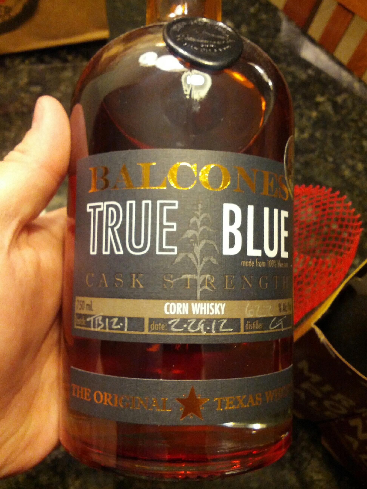

> Drinking an Of Love &amp; Regret by @stillwaterales at @jclyde_bham — http://untp.it/SxxmDB

 [Sat Dec 01 19:21:41 +0000 2012](https://twitter.com/nhudson/status/274956453637406721)

----

> Enjoying a Barrel Aged Debauched With Whole Juniper Bushes, Brett And A Taste Of Smoke — http://untp.it/TyFYdP

 [Sat Dec 01 19:22:55 +0000 2012](https://twitter.com/nhudson/status/274956764733116416)

----

> Drinking a Noel de Calabaza by @jollypumpkin at @jclyde_bham — http://untp.it/SCg46E

 [Sat Dec 01 19:29:54 +0000 2012](https://twitter.com/nhudson/status/274958520695263232)

----

> @JClyde_Bham knows #homebrewing needs to be legal. @alahomebrewing drinking a gpbrewing Snake Handler. http://instagr.am/p/StUAi_DzB5/

 [Sat Dec 01 20:54:42 +0000 2012](https://twitter.com/nhudson/status/274979862375194624)

----

> Thanks Jerry! — Drinking a Lost Guy Rye Ale by @SierraNevada at @jclyde_bham  — http://untp.it/UhP5xa

 [Sat Dec 01 21:40:40 +0000 2012](https://twitter.com/nhudson/status/274991427312828416)

----

> Drinking a Snake Handler Double IPA by @GPBrewing at @jclyde_bham — http://untp.it/11xtd55

 [Sat Dec 01 21:41:06 +0000 2012](https://twitter.com/nhudson/status/274991538747092993)

----

Replying to [@ditchell](https://twitter.com/ditchell/status/275749453061832704)

> holy crap man. Expanding like a mofo. 1st hops 2nd Brett beers. If you like RV grab a bottle of Orval. Congrats

 [Tue Dec 04 01:12:41 +0000 2012](https://twitter.com/nhudson/status/275769562102910976)

----

Replying to [@casey1111 and @ditchell](https://twitter.com/casey1111/status/275785859888971776)

> depends on how fresh the RV was. Its dry hopped pretty good. Its a tribute to Orval though.

 [Tue Dec 04 03:07:14 +0000 2012](https://twitter.com/nhudson/status/275798387025141760)

----

Replying to [@shadowhelm](https://twitter.com/shadowhelm/status/275963389078028288)

> but "Data and Geordi in the Morning" doesn't have a good ring to it.

 [Tue Dec 04 14:23:11 +0000 2012](https://twitter.com/nhudson/status/275968497752875009)

----

Replying to [@_TheBlack77, @casey1111 and @ditchell](https://twitter.com/_TheBlack77/status/275823190704549888)

> I have 4 or 5. Was going to wait a year and drink another. I have an Orval stashed to drink in 2014.

 [Tue Dec 04 14:27:22 +0000 2012](https://twitter.com/nhudson/status/275969549571076096)

----

Replying to [@shadowhelm](https://twitter.com/shadowhelm/status/275973914268684290)

> haha seeing that makes me take that back.

 [Tue Dec 04 15:54:40 +0000 2012](https://twitter.com/nhudson/status/275991518295244803)

----

> Brewing at @CahabaBrewing tonight. http://instagr.am/p/S370lqDzCU/

 [Wed Dec 05 23:54:17 +0000 2012](https://twitter.com/nhudson/status/276474608448860160)

----

> Mashed in and waiting now at @cahababrewing. Can't wait to see how this turns out. http://instagr.am/p/S4AWfVjzFm/

 [Thu Dec 06 00:33:09 +0000 2012](https://twitter.com/nhudson/status/276484389129576448)

----

> finally boiling. Things coming along nicely at @cahababrewing http://instagr.am/p/S4VUGvjzKY/

 [Thu Dec 06 03:36:47 +0000 2012](https://twitter.com/nhudson/status/276530601992019968)

----

> Clear run off of the beer I made at @cahababrewing tonight. Now to add yeast. http://instagr.am/p/S4gTPODzCD/

 [Thu Dec 06 05:12:59 +0000 2012](https://twitter.com/nhudson/status/276554809505611777)

----

Replying to [@_TheBlack77 and @CahabaBrewing](https://twitter.com/_TheBlack77/status/276526145451728896)

> brewed a dark mild. Will be at their End of the world party on the 21st.

 [Thu Dec 06 06:16:12 +0000 2012](https://twitter.com/nhudson/status/276570719528300546)

----

> Received my BOS award from the #MCBO for Cider. Too bad my metal says Mead. http://instagr.am/p/S6ZxwrjzAK/

 [Thu Dec 06 22:54:31 +0000 2012](https://twitter.com/nhudson/status/276821953019514880)

----

> RT @CahabaBrewing: Hey hey it's getting close to time for an IPA! Actually a big fruity and complex double ipa! Head on over now.. The t ...

 [Fri Dec 07 22:14:37 +0000 2012](https://twitter.com/nhudson/status/277174298861527040)

----

Replying to [@dartdog and @pjwarner](https://twitter.com/dartdog/status/277503365133529089)

> still not really up to date though ;)

 [Sat Dec 08 20:36:21 +0000 2012](https://twitter.com/nhudson/status/277511959518257152)

----

> RT @internationalwb: Did you know that @MikkellerBeer is finally available in #bama? Beer Hop Breakfast starts shipping out Monday!

 [Sat Dec 08 20:36:28 +0000 2012](https://twitter.com/nhudson/status/277511987850776576)

----

Replying to [@dartdog and @pjwarner](https://twitter.com/dartdog/status/277514391606419456)

> isn't the latest version 4.2.1?  At least that's what i am running in my Nexus

 [Sat Dec 08 20:50:54 +0000 2012](https://twitter.com/nhudson/status/277515619459547136)

----

> All mashed in at the right temp. 152. http://instagr.am/p/TE1QCxjzNB/

 [Tue Dec 11 00:06:06 +0000 2012](https://twitter.com/nhudson/status/278289518610747393)

----

> Brambling Cross hops ready to go. http://instagr.am/p/TE19UODzN-/

 [Tue Dec 11 00:12:13 +0000 2012](https://twitter.com/nhudson/status/278291058671116288)

----

> Boil achieved on tonights beer. Its a clone of this http://barclayperkins.blogspot.com/2011/04/lets-brew-wed http://instagr.am/p/TFBzFMDzKN/

 [Tue Dec 11 01:55:58 +0000 2012](https://twitter.com/nhudson/status/278317167685009408)

----

Replying to [@mmayhew and @vbatts](https://twitter.com/mmayhew/status/278320853211570176)

> I make sure to tell someone to simmer down at least once a week now.

 [Tue Dec 11 02:16:53 +0000 2012](https://twitter.com/nhudson/status/278322430353764353)

----

> Running off clear. Should ferment quickly. http://instagr.am/p/TFO2ERjzHb/

 [Tue Dec 11 03:49:53 +0000 2012](https://twitter.com/nhudson/status/278345835903864832)

----

> Doing an 03.03.03 - 12.12.12 tasting of Stone Vertical Epic. 
> 
> 

 [Thu Dec 13 01:19:20 +0000 2012](https://twitter.com/nhudson/status/279032720301121536)

----

> Aged really well. Slight sherry note in the nose. — Drinking a Stone 03.03.03 Vertical Epic Ale — http://untp.it/129gCGH #photo

 [Thu Dec 13 01:30:05 +0000 2012](https://twitter.com/nhudson/status/279035430706483200)

----

> One on the left was cellered at 55 the other was not. — Drinking a Stone 04.04.04 Vertical Epic Ale — http://untp.it/VXRH8n #photo

 [Thu Dec 13 01:37:37 +0000 2012](https://twitter.com/nhudson/status/279037324774481920)

----

> Best one so far. — Drinking a Stone 05.05.05 Vertical Epic Ale by @StoneBrewingCo — http://untp.it/Z1h2Qs #photo

 [Thu Dec 13 01:43:54 +0000 2012](https://twitter.com/nhudson/status/279038909382553601)

----

> Drinking a Stone 06.06.06 Vertical Epic Ale by @StoneBrewingCo — http://untp.it/UCG563 #photo

 [Thu Dec 13 01:50:49 +0000 2012](https://twitter.com/nhudson/status/279040647183347714)

----

> Drinking a Stone 07.07.07 Vertical Epic Ale by @StoneBrewingCo — http://untp.it/UCH9a1 #photo

 [Thu Dec 13 02:01:52 +0000 2012](https://twitter.com/nhudson/status/279043430271836161)

----

> Drinking a Stone 08.08.08 Vertical Epic Ale by @StoneBrewingCo — http://untp.it/UCIxtf #photo

 [Thu Dec 13 02:14:52 +0000 2012](https://twitter.com/nhudson/status/279046701795377153)

----

> Drinking a Stone 09.09.09 Vertical Epic Ale by @StoneBrewingCo — http://untp.it/UE0UeZ #photo

 [Thu Dec 13 02:26:48 +0000 2012](https://twitter.com/nhudson/status/279049705076432896)

----

> Drinking a Stone 10.10.10 Vertical Epic Ale by @StoneBrewingCo — http://untp.it/UCKxBO #photo

 [Thu Dec 13 02:38:11 +0000 2012](https://twitter.com/nhudson/status/279052566447398912)

----

> Drinking a Stone 11.11.11 Vertical Epic Ale by @StoneBrewingCo — http://untp.it/W7nMqx #photo

 [Thu Dec 13 02:47:23 +0000 2012](https://twitter.com/nhudson/status/279054883330596864)

----

> This tastes like Anchor Christmas. — Drinking a Stone 12.12.12 Vertical Epic Ale by @StoneBrewingCo — http://untp.it/129sAjA #photo

 [Thu Dec 13 02:57:34 +0000 2012](https://twitter.com/nhudson/status/279057446213939200)

----

> Drinking a Mini Growler Imperial Stout by Collaboration: Westbrook Brewing Co. / Evil Twin Brewing — http://untp.it/UEbEtY

 [Thu Dec 13 03:25:20 +0000 2012](https://twitter.com/nhudson/status/279064433211351042)

----

> Very nice palate clenser. — Drinking a Rueuze by @thebruery — http://untp.it/UCPdYa

 [Thu Dec 13 03:26:13 +0000 2012](https://twitter.com/nhudson/status/279064658051231744)

----

Replying to [@edg411](https://twitter.com/edg411/status/279067329533472768)

> they were all 3-4 oz pours.

 [Thu Dec 13 03:38:07 +0000 2012](https://twitter.com/nhudson/status/279067650003451904)

----

Replying to [@bruisinales](https://twitter.com/@bruisinales/status/278879613009133570)

> the PIGGLY WIGGLY you point to has one of the best selections in the entire state.

 [Thu Dec 13 18:34:08 +0000 2012](https://twitter.com/nhudson/status/279293141415231488)

----

Replying to [@bruisinales](https://twitter.com/@bruisinales/status/279293758095388672)

> of course, but I will say that they deserved to sell it over everyone else.  Sold it at cost while other did not

 [Thu Dec 13 18:38:32 +0000 2012](https://twitter.com/nhudson/status/279294249986555904)

----

Replying to [@bruisinales](https://twitter.com/@bruisinales/status/279294689834844160)

> what I am saying is that they (PW) were the only in state to sell at cost, others made profit.

 [Thu Dec 13 18:42:25 +0000 2012](https://twitter.com/nhudson/status/279295226047242241)

----

Replying to [@bruisinales](https://twitter.com/@bruisinales/status/279294689834844160)

> Out of everyone in our state, they PIGGLY WIGGLY, was the best place to have it, hands down.

 [Thu Dec 13 18:43:07 +0000 2012](https://twitter.com/nhudson/status/279295403533414401)

----

> RT @_TheBlack77: @_TheBlack77 @stonebrewingco @ddanner @gpharris @nhudson @gwalt @chriseidson @chipwtd whoops, no pic 
> 
> 

 [Fri Dec 14 03:21:55 +0000 2012](https://twitter.com/nhudson/status/279425960019910656)

----

> If you like beer make sure to drop in and see @LMNOPisces at the Homewood Pig. She sells good stuff. http://instagr.am/p/TO90fuDzHk/

 [Fri Dec 14 22:34:36 +0000 2012](https://twitter.com/nhudson/status/279716045911113728)

----

> Drinking a Funkmetal by @jesterkingbeer — http://untp.it/R0dklu #photo

 [Sun Dec 16 00:07:34 +0000 2012](https://twitter.com/nhudson/status/280101828899786752)

----

> Barrels at Straight to Ale http://instagr.am/p/TT8W7kjzD1/

 [Sun Dec 16 20:57:08 +0000 2012](https://twitter.com/nhudson/status/280416292014551040)

----

> I can say its been a unique day. Drive to hville for 48fps Hobbit drove back to bham, caught a plane to Austin.

 [Mon Dec 17 05:57:42 +0000 2012](https://twitter.com/nhudson/status/280552329999183872)

----

Replying to [@jeepinbird](https://twitter.com/jeepinbird/status/280638613664960512)

> actually it was quite good. You have to get use to it. Made the picture crisper and it seemed more beautiful

 [Mon Dec 17 13:00:44 +0000 2012](https://twitter.com/nhudson/status/280658787839406080)

----

Replying to [@chipwtd](https://twitter.com/chipwtd/status/280667071396847618)

> never. But I just flew there. Drove 1.5 hours north to Belton. Any specialty bottle shops I should try to hit b4 flying back?

 [Mon Dec 17 14:29:10 +0000 2012](https://twitter.com/nhudson/status/280681046062821376)

----

Replying to [@chipwtd](https://twitter.com/chipwtd/status/280701490216202242)

> yeah there is a specs by my hotel. I'll hit it up tonight.

 [Mon Dec 17 17:33:46 +0000 2012](https://twitter.com/nhudson/status/280727500819156992)

----

Replying to [@chipwtd](https://twitter.com/chipwtd/status/280701490216202242)

> just got back from specs. Got some stuff for tonight, but will go back before I leave. Saw bottles of 2012 Alaskan Smoked Porter.

 [Tue Dec 18 00:28:01 +0000 2012](https://twitter.com/nhudson/status/280831751100715008)

----

Replying to [@chipwtd](https://twitter.com/chipwtd/status/280841602090545152)

> yeah nice place. Picked up a bottle of @BalconesWhisky too.

 [Tue Dec 18 01:12:19 +0000 2012](https://twitter.com/nhudson/status/280842898633805825)

----

> Picked up some True Blue from @BalconesWhisky , can't wait to start sippin' 
> 
> 

 [Tue Dec 18 03:13:23 +0000 2012](https://twitter.com/nhudson/status/280873357333913600)

----

> RT @CahabaBrewing: End of the World party we're goin' all out. Discountd runner shirts, $3 Oktoberfest, special beers like @nhudson Keep ...

 [Thu Dec 20 18:35:41 +0000 2012](https://twitter.com/nhudson/status/281830247735914496)

----

Replying to [@mmayhew](https://twitter.com/mmayhew/status/281850935897112577)

> hook up an electric blower.  take the top off your exhaust on the roof.  Turn on the blower, and go to town.

 [Thu Dec 20 20:14:17 +0000 2012](https://twitter.com/nhudson/status/281855061716500480)

----

Replying to [@mmayhew](https://twitter.com/mmayhew/status/281855293149831168)

> Yeah its seriously the only way.  My grandfather use to do that every other year at his house.

 [Thu Dec 20 20:15:48 +0000 2012](https://twitter.com/nhudson/status/281855440273412097)

----

> Drinking a Hop Rod Rye™ by @bearrepublic — http://untp.it/XRcxBP #photo

 [Thu Dec 20 23:43:54 +0000 2012](https://twitter.com/nhudson/status/281907812131536896)

----

> RT @everetends: Celebrate the end of the world with a #beer tomorrow. Both @StraightToAle and @CahabaBrewing will have brewery parties h ...

 [Fri Dec 21 02:07:12 +0000 2012](https://twitter.com/nhudson/status/281943874652495872)

----

> @AlaHomebrewing glass holding my Mild at @CahabaBrewing #freehomebrew 
> 
> 

 [Fri Dec 21 23:45:58 +0000 2012](https://twitter.com/nhudson/status/282270709986762752)

----

> Making spent grain dog treats for my pups Christmas present. http://instagr.am/p/TjlECyjzMG/

 [Sat Dec 22 22:41:29 +0000 2012](https://twitter.com/nhudson/status/282616879984553985)

----

> Possibly my favorite Porter. — Drinking an Edmund Fitzgerald by @GLBC_Cleveland — http://untp.it/Y0tcmD

 [Sat Dec 22 23:14:57 +0000 2012](https://twitter.com/nhudson/status/282625300788047873)

----

Replying to [@edg411](https://twitter.com/edg411/status/282626280321609730)

> this and Black Butte are my two favs.

 [Sat Dec 22 23:20:40 +0000 2012](https://twitter.com/nhudson/status/282626740097015808)

----

> Drinking a Black Butte Porter by @deschutesbeer — http://untp.it/VWMY0Q

 [Sat Dec 22 23:46:19 +0000 2012](https://twitter.com/nhudson/status/282633195437031424)

----

> Drinking an Oculus by @CrookedStave — http://untp.it/UlKvRx

 [Sun Dec 23 03:10:33 +0000 2012](https://twitter.com/nhudson/status/282684591825891328)

----

Replying to [@mmayhew](https://twitter.com/mmayhew/status/282691768368132096)

> don't forget Walgreens

 [Sun Dec 23 03:42:42 +0000 2012](https://twitter.com/nhudson/status/282692682864787456)

----

> Is it me or is the whole Hobbit/LOTR ring issue Elrond's fault?  He could have just taken it at any time and dumped it into Mt Doom.

 [Sun Dec 23 03:43:59 +0000 2012](https://twitter.com/nhudson/status/282693006946103296)

----

Replying to [@mmayhew](https://twitter.com/mmayhew/status/282693322999480321)

> heck yeah man. I plan to take up your tradition this year.

 [Sun Dec 23 03:45:49 +0000 2012](https://twitter.com/nhudson/status/282693466142679040)

----

Replying to [@mmayhew](https://twitter.com/mmayhew/status/282693786658803712)

> awesome. Just awesome.

 [Sun Dec 23 03:47:37 +0000 2012](https://twitter.com/nhudson/status/282693919702122496)

----

> One sheet of dog treats are finally dry. Two more to go. http://instagr.am/p/TkJ3XujzFp/

 [Sun Dec 23 04:02:46 +0000 2012](https://twitter.com/nhudson/status/282697731217186816)

----

Replying to [@chipwtd](https://twitter.com/chipwtd/status/282850387545960449)

> good point. But Elrond could have easily killed Isildor and thrown his body in the fire. Guess it wouldn't been much of a story.

 [Sun Dec 23 15:50:41 +0000 2012](https://twitter.com/nhudson/status/282875884808052737)

----

> RT @LMNOPisces: Me on Shelton Bros High and Mighty Beer Show. Episode 56
> http://whmp.com/pages/11904106.php

 [Sun Dec 23 18:01:59 +0000 2012](https://twitter.com/nhudson/status/282908927635632128)

----

> Bourbon, Egg Nog, LOTR, and @hkwhateva makes for an excellent pre Christmas Eve evening.

 [Mon Dec 24 02:54:08 +0000 2012](https://twitter.com/nhudson/status/283042847454814208)

----

Replying to [@SeanInTheSky and @AlaHomebrewing](https://twitter.com/@SeanInTheSky/status/283262061826424833)

> I hope to get a Blichmann Floor standing burner.

 [Mon Dec 24 19:33:32 +0000 2012](https://twitter.com/nhudson/status/283294355706503168)

----

> 2011 Christmas Ale drank on 2012 Christmas. Merry Christmas! http://instagr.am/p/TpTE3pDzPP/

 [Tue Dec 25 03:59:52 +0000 2012](https://twitter.com/nhudson/status/283421778754289666)

----

Replying to [@_TheBlack77](https://twitter.com/_TheBlack77/status/283422931403538432)

> yeah excellent beer. You have to let this one age a bit before drinking.

 [Tue Dec 25 04:05:23 +0000 2012](https://twitter.com/nhudson/status/283423168373325824)

----

Replying to [@_TheBlack77](https://twitter.com/_TheBlack77/status/283430471801663489)

> yeah same here. I usually buy two each year.

 [Tue Dec 25 04:36:25 +0000 2012](https://twitter.com/nhudson/status/283430975927635968)

----

> You know you're a big nerd when your excited about a thermostat. #nest 
> 
> 

 [Tue Dec 25 14:36:02 +0000 2012](https://twitter.com/nhudson/status/283581868899713024)

----

> Also got my new Blichmann Floor Burner. Can't wait to start brewing on this thing.  @AlaHomebrewing 
> 
> 

 [Tue Dec 25 14:59:38 +0000 2012](https://twitter.com/nhudson/status/283587793538646019)

----

Replying to [@papagraf](https://twitter.com/papagraf/status/283604404261777409)

> same. Total shock that I got one.

 [Tue Dec 25 16:56:04 +0000 2012](https://twitter.com/nhudson/status/283617115100028928)

----

> Not really a fan of this beer. — Drinking a Festive Ale (2011) by @SweetWaterBrew — http://untp.it/UrWPj6

 [Wed Dec 26 01:27:30 +0000 2012](https://twitter.com/nhudson/status/283745823211274240)

----

> Installed the @nest last night. So far I am digging it. 
> 
> 

 [Wed Dec 26 16:32:52 +0000 2012](https://twitter.com/nhudson/status/283973659067027458)

----

Replying to [@_TheBlack77](https://twitter.com/_TheBlack77/status/283982834430013440)

> sure call anytime.

 [Wed Dec 26 17:48:11 +0000 2012](https://twitter.com/nhudson/status/283992619061743616)

----

Replying to [@tsutrav](https://twitter.com/tsutrav/status/283976621105500161)

> the app is pretty basic. It has the same functionally as the thermostat. Can't wait for it to start learning routines.

 [Wed Dec 26 17:49:14 +0000 2012](https://twitter.com/nhudson/status/283992885387489281)

----

> Drinking a Temptation by Russian River Brewing Company — http://untp.it/W2CVYb

 [Thu Dec 27 01:49:24 +0000 2012](https://twitter.com/nhudson/status/284113723545763840)

----

> Drinking a Wild Wild Brett Blue by @CrookedStave — http://untp.it/TxY8ek

 [Sun Dec 30 00:54:30 +0000 2012](https://twitter.com/nhudson/status/285187070840930304)

----

> At Bass Pro where Nextel always works.

 [Mon Dec 31 17:31:46 +0000 2012](https://twitter.com/nhudson/status/285800428568985603)

----

Replying to [@jmccarty](https://twitter.com/jmccarty/status/285804564958040064)

> yeah I know. I saw at least 6 people with them there.

 [Mon Dec 31 22:47:57 +0000 2012](https://twitter.com/nhudson/status/285879996466208769)

----

> Traditional English AK beer. Citrus, resin, husky, and all around awesome. Also 4%abv. #homebrew @AlaHomebrewing 
> 
> 

 [Mon Dec 31 22:49:43 +0000 2012](https://twitter.com/nhudson/status/285880434808721410)