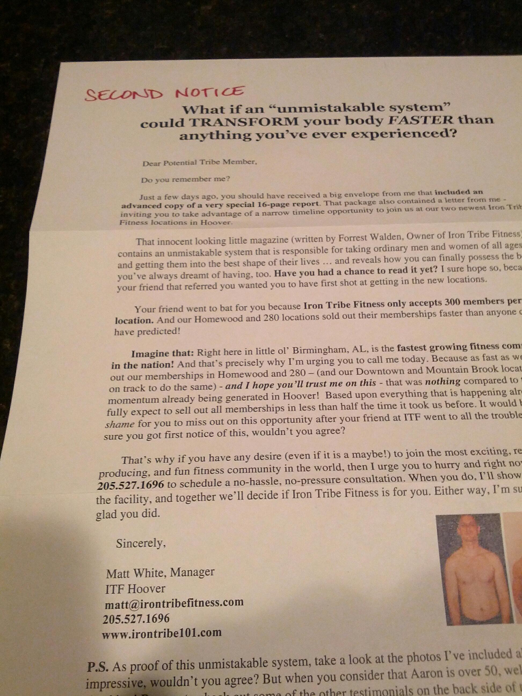
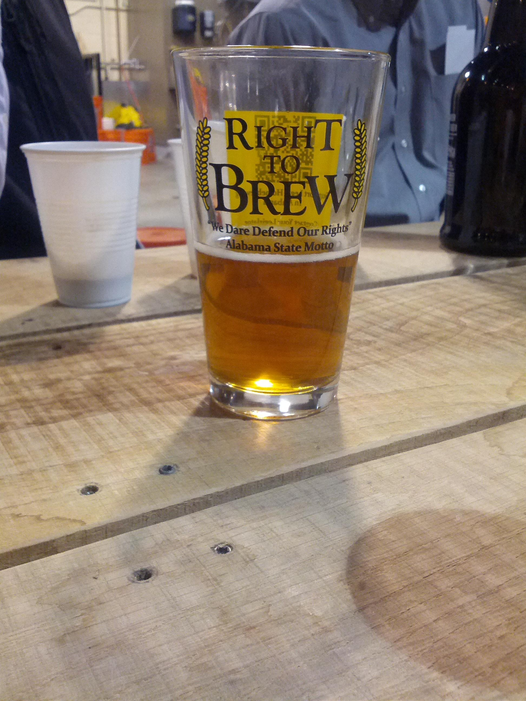
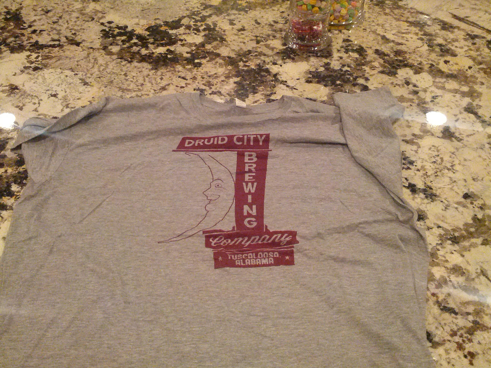
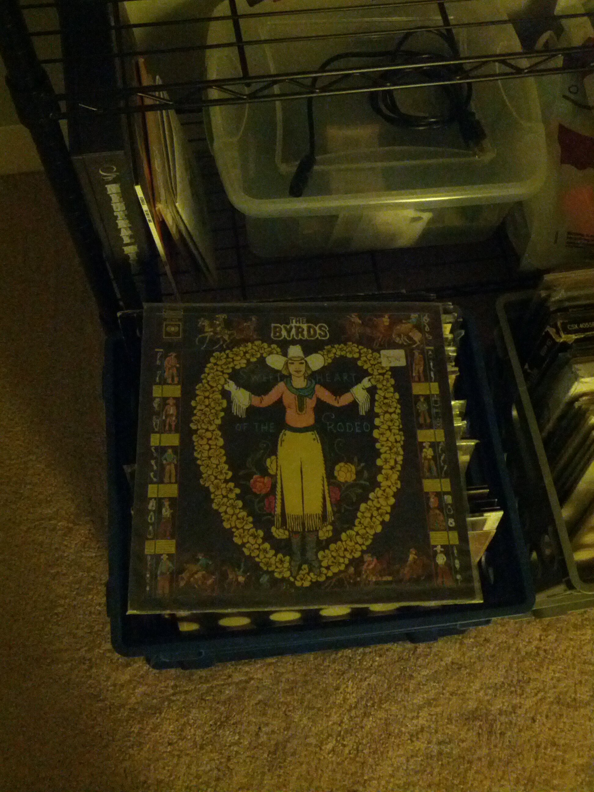
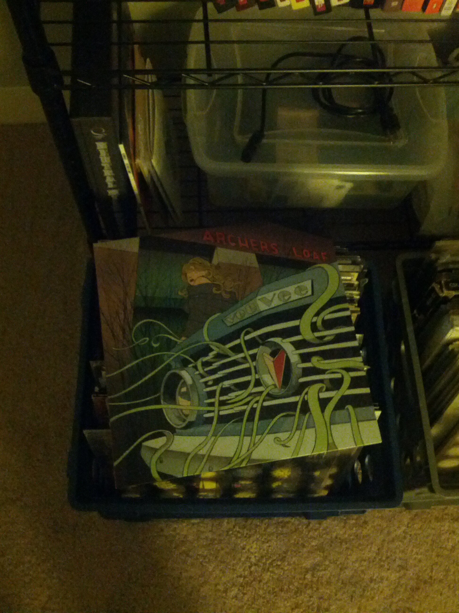

Replying to [@vbatts and @mmayhew](https://twitter.com/vbatts/status/286453511837859842)

> same here. Never used tmux. Just to comfortable with screen.

 [Wed Jan 02 12:57:33 +0000 2013](https://twitter.com/nhudson/status/286456193331904512)

----

> @vbatts I didn't know you were a model..... scary..... http://yfrog.com/esddahcj

 [Wed Jan 02 17:44:59 +0000 2013](https://twitter.com/nhudson/status/286528529791860737)

----

Replying to [@mmayhew, @teknotarded and @vbatts](https://twitter.com/mmayhew/status/286506834104315906)

> now you're making me want to look into it as well.... thanks.

 [Wed Jan 02 18:22:53 +0000 2013](https://twitter.com/nhudson/status/286538066594762752)

----

> Infuriating reddit commenters by 730 means a good morning.

 [Thu Jan 03 13:41:48 +0000 2013](https://twitter.com/nhudson/status/286829719360503809)

----

Replying to [@casey1111](https://twitter.com/casey1111/status/286881156329263105)

> Yeah I quite after I broke my last 6.5 gal one.  Too heavy and I didn't want to cut my keg off.

 [Thu Jan 03 20:00:38 +0000 2013](https://twitter.com/nhudson/status/286925052744695809)

----

> Anyone know of an Geo location based API to find your location via WAN IP?  Looking for Free/No Signup and no API key needed.

 [Fri Jan 04 17:16:02 +0000 2013](https://twitter.com/nhudson/status/287246019803090944)

----

Replying to [@SarahMillerArt](https://twitter.com/@SarahMillerArt/status/287263434163249155)

> I'm looking to find my location based on my WAN IP, and get the correct weather for my location :P

 [Fri Jan 04 18:32:28 +0000 2013](https://twitter.com/nhudson/status/287265255715909632)

----

> Pouring tonight at @CahabaBrewing, come get you a cold pint of shu.... uh Imperial Oka Uba IPA

 [Fri Jan 04 19:10:05 +0000 2013](https://twitter.com/nhudson/status/287274719621836800)

----

> Dear Friday 3pm is not a good time to make me want to build a LFS system. Not a good time.

 [Fri Jan 04 21:02:26 +0000 2013](https://twitter.com/nhudson/status/287302994184241152)

----

> The new hotness out of a can. — Drinking a Lily Flagg Milk Stout by @StraightToAle — http://untp.it/TSySQc

 [Sun Jan 06 03:48:03 +0000 2013](https://twitter.com/nhudson/status/287767458792763392)

----

> Uh not cool @irontribe not cool. Spam the old fashion way is still spam. 
> 
> 

 [Mon Jan 07 23:21:14 +0000 2013](https://twitter.com/nhudson/status/288425082689314817)

----

> What's funny about the @irontribe spam today is that I didn't sign up nor received a 1st notice or the 16 page report it says I got.

 [Mon Jan 07 23:22:11 +0000 2013](https://twitter.com/nhudson/status/288425328622317568)

----

Replying to [@IronTribe](https://twitter.com/IronTribe/status/288471662494625792)

> No I would not, please remove me from any form of marketing you have me on.

 [Tue Jan 08 15:34:01 +0000 2013](https://twitter.com/nhudson/status/288669896588537856)

----

> RT @AlaHomebrewing: Four weeks from today, the 2013 Alabama Legislative Session begins. We all must do our parts for legal #homebrew and ...

 [Tue Jan 08 16:48:23 +0000 2013](https://twitter.com/nhudson/status/288688610885111811)

----

> To the dog outside barking, keep it up. To the neighbor who thought it was our dog, fu and hahahaha

 [Wed Jan 09 03:23:18 +0000 2013](https://twitter.com/nhudson/status/288848394364006400)

----

> Pre-gaming before heading to Alabama Theater for The Last Crusade. http://instagr.am/p/UXM5XPDzDV/

 [Fri Jan 11 23:51:06 +0000 2013](https://twitter.com/nhudson/status/289882155864178688)

----

> Drinking a Noel de Calabaza by @jollypumpkin at @jclyde_bham — http://untp.it/WLFvll

 [Sat Jan 12 03:42:11 +0000 2013](https://twitter.com/nhudson/status/289940310686060544)

----

> Drinking a Fatso by @GPBrewing at @jclyde_bham — http://untp.it/WZIFT4

 [Sat Jan 12 04:00:30 +0000 2013](https://twitter.com/nhudson/status/289944918959472640)

----

Replying to [@Sadiealli](https://twitter.com/sadiealli/status/289951471489912832)

> excellent as always.

 [Sat Jan 12 04:37:59 +0000 2013](https://twitter.com/nhudson/status/289954352599269377)

----

Replying to [@Sadiealli and @sixcents24](https://twitter.com/sadiealli/status/290167270884384769)

> if your twitter is protected, you cant retweet.

 [Sat Jan 12 19:21:04 +0000 2013](https://twitter.com/nhudson/status/290176587469557760)

----

> Drinking a Surette Reserva Chardonnay Barrel Aged by @CrookedStave — http://untp.it/WOSqCQ #photo

 [Sat Jan 12 22:06:06 +0000 2013](https://twitter.com/nhudson/status/290218118138187776)

----

> Sorry ITT Tech commercial, working 7 days a week for someone other than yourself is not passion, its ignorance.

 [Tue Jan 15 03:17:42 +0000 2013](https://twitter.com/nhudson/status/291021311017377792)

----

> Dear marketing people. This is not how to do your job. 
> 
> 

 [Tue Jan 15 20:34:09 +0000 2013](https://twitter.com/nhudson/status/291282137586483200)

----

> Does the UPS driver and the FedEx driver wave as they pass each other on the street?

 [Tue Jan 15 23:14:56 +0000 2013](https://twitter.com/nhudson/status/291322606571900929)

----

> @AlaHomebrewing glasses all up in this months @freethehops meeting. 
> 
> 

 [Thu Jan 17 01:51:59 +0000 2013](https://twitter.com/nhudson/status/291724511114563584)

----

Replying to [@captainsdead and @theloubarlow](https://twitter.com/captainsdead/status/292015726443786241)

> couldn't agree more.

 [Thu Jan 17 21:10:59 +0000 2013](https://twitter.com/nhudson/status/292016186948993024)

----

> Drinking a Petite Sour - Farmhouse Table Beer by @CrookedStave — http://untp.it/VRgEB0

 [Sat Jan 19 19:28:18 +0000 2013](https://twitter.com/nhudson/status/292715125205499904)

----

> Drinking  The Oracle by @BellsBrewery — http://untp.it/VRgJof

 [Sat Jan 19 19:28:50 +0000 2013](https://twitter.com/nhudson/status/292715257036685312)

----

> Last bottle ever. Tastes amazing — Drinking a Black Chocolate Stout (2008) by @brooklynbrewery — http://untp.it/Vdz5kU #photo

 [Sat Jan 19 20:24:55 +0000 2013](https://twitter.com/nhudson/status/292729369661689858)

----

Replying to [@brightsides](https://twitter.com/brightsides/status/292729540021739520)

> no more:(

 [Sat Jan 19 20:26:44 +0000 2013](https://twitter.com/nhudson/status/292729830099783681)

----

Replying to [@_TheBlack77](https://twitter.com/_TheBlack77/status/292743365873774593)

> nope not brewing. Just drinking a few

 [Sat Jan 19 21:21:09 +0000 2013](https://twitter.com/nhudson/status/292743524410073089)

----

> RT @AlaHomebrewing: State Lawmakers To Study Homebrewing Bill http://via.whnt.com/w06R8Jb #RightToBrew #GoodPublicity

 [Mon Jan 21 14:30:57 +0000 2013](https://twitter.com/nhudson/status/293365067536277506)

----

> RT @AlaHomebrewing: More HB9 press out of Montgomery last night. #RightToBrew - http://po.st/q5M2zp

 [Tue Jan 22 18:00:02 +0000 2013](https://twitter.com/nhudson/status/293780072542916608)

----

> $2.25 @newbelgium Snow Day in Tullahoma, TN. I'll take that. #stuckinmiddleofnowhere

 [Tue Jan 22 22:43:27 +0000 2013](https://twitter.com/nhudson/status/293851396372049920)

----

> Drinking a Fantôme de Noël by Brasserie Fantôme at @jclyde_bham — http://untp.it/14fbktp

 [Thu Jan 24 23:57:05 +0000 2013](https://twitter.com/nhudson/status/294594706246094848)

----

> Drinking a Lady of the Woods by @ciscobrewers — http://untp.it/Uowjqk

 [Thu Jan 24 23:58:56 +0000 2013](https://twitter.com/nhudson/status/294595168278040577)

----

> Meh sweet. — Drinking a White Chocolate by @thebruery at @gpbrewing  — http://untp.it/10QhvjV

 [Sat Jan 26 19:19:04 +0000 2013](https://twitter.com/nhudson/status/295249516993589248)

----

> Drinking a Snake Handler Double IPA by @GPBrewing — http://untp.it/VCn1pW

 [Sat Jan 26 19:35:01 +0000 2013](https://twitter.com/nhudson/status/295253530808315904)

----

> Holy mother! — Drinking a Black Tuesday (2012) by @thebruery at @gpbrewing  — http://untp.it/Wtsn5h

 [Sat Jan 26 19:42:49 +0000 2013](https://twitter.com/nhudson/status/295255491007885313)

----

> Drinking a Fruet by @thebruery — http://untp.it/WDrqsf

 [Sat Jan 26 20:14:14 +0000 2013](https://twitter.com/nhudson/status/295263396625010688)

----

> Thanks to @druidcitybrew , I'm going to rock this tee. 
> 
> 

 [Sun Jan 27 00:00:43 +0000 2013](https://twitter.com/nhudson/status/295320389293309953)

----

> Drinking an Imperial Oka Uba IPA by Cahaba Brewing Company at @cahababrewing — http://untp.it/Wouo5V

 [Sun Jan 27 00:45:17 +0000 2013](https://twitter.com/nhudson/status/295331608955863041)

----

> Drinking a Fraxinus Maximus by Cahaba Brewing Company at @cahababrewing — http://untp.it/10RtCNK

 [Sun Jan 27 00:45:59 +0000 2013](https://twitter.com/nhudson/status/295331785758347265)

----

> Massive inky stout. Slow sipper for sure. — Drinking an Imperial Biscotti Break by @EvilTwinBrewing — http://untp.it/UtqZ5i

 [Sun Jan 27 00:47:26 +0000 2013](https://twitter.com/nhudson/status/295332150084005889)

----

> Never really have cared for Son Volt, due to my distain for Farrars part in Uncle Tupelos break up.  Saying that Trace is an awesome album.

 [Sun Jan 27 01:10:12 +0000 2013](https://twitter.com/nhudson/status/295337879792668672)

----

> Saison boiling this morning. http://instagr.am/p/U_mjP3DzBz/

 [Sun Jan 27 16:24:23 +0000 2013](https://twitter.com/nhudson/status/295567942140182528)

----

> Drinking a Ruthless Rye IPA (2013) by @SierraNevada — http://untp.it/WzVG6j

 [Wed Jan 30 01:25:22 +0000 2013](https://twitter.com/nhudson/status/296428862936596480)

----

Replying to [@casey1111](https://twitter.com/casey1111/status/296441925614055425)

> that sounds good. I'm working.

 [Wed Jan 30 02:18:21 +0000 2013](https://twitter.com/nhudson/status/296442194586378240)

----

> New hotness from @gpbrewing — Drinking a Pale Ale by @GPBrewing — http://untp.it/11gyMYi #photo

 [Wed Jan 30 22:47:21 +0000 2013](https://twitter.com/nhudson/status/296751483863572480)

----

> RT @AlaHomebrewing: More good press! Anniston Star - Homebrew bill back for another round - http://po.st/vGn1Jc #RightToBrew #HB9

 [Thu Jan 31 00:38:35 +0000 2013](https://twitter.com/nhudson/status/296779473913790464)

----

> Now playing on radio @nhudson sweetheart of the rodeo 
> 
> 

 [Thu Jan 31 00:59:26 +0000 2013](https://twitter.com/nhudson/status/296784720308617216)

----

> Moved on to Vee Vee, it has become my favorite Archers album. 
> 
> 

 [Thu Jan 31 02:08:16 +0000 2013](https://twitter.com/nhudson/status/296802043279052800)

----

Replying to [@Birmingsam](https://twitter.com/@Birmingsam/status/296800604603441152)

> I think I am the only one who doesn't care for it.

 [Thu Jan 31 02:09:09 +0000 2013](https://twitter.com/nhudson/status/296802267514929152)

----

> I wonder what Walmart's customer to cashier ratio is. I'm guessing 10000000000000 to 1

 [Fri Feb 01 03:09:17 +0000 2013](https://twitter.com/nhudson/status/297179789545070593)