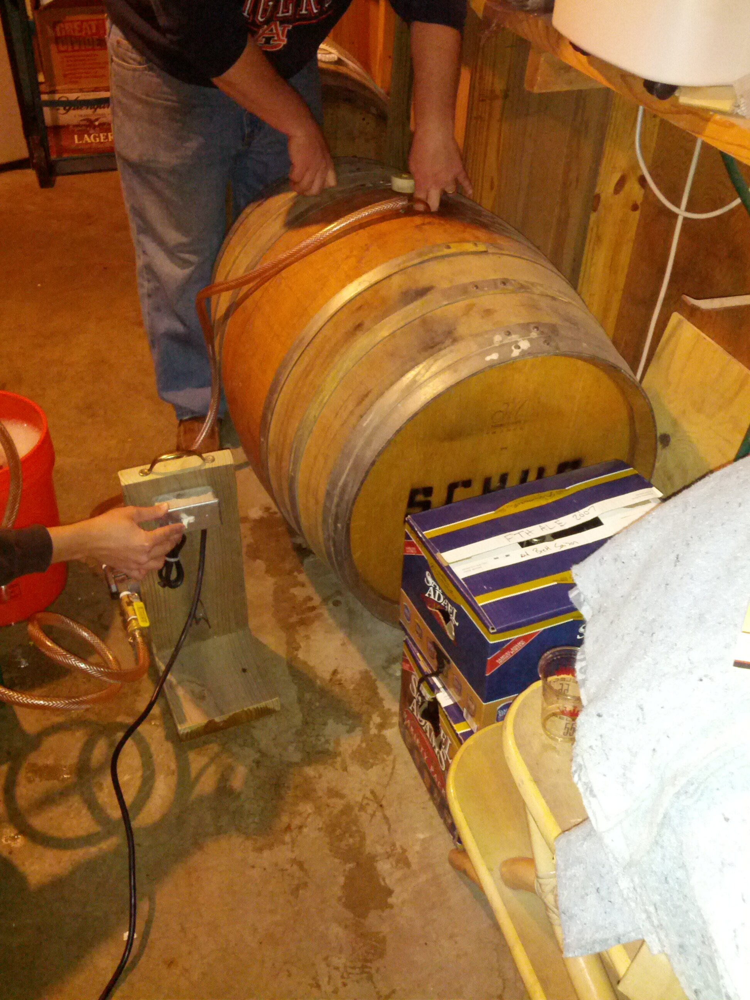
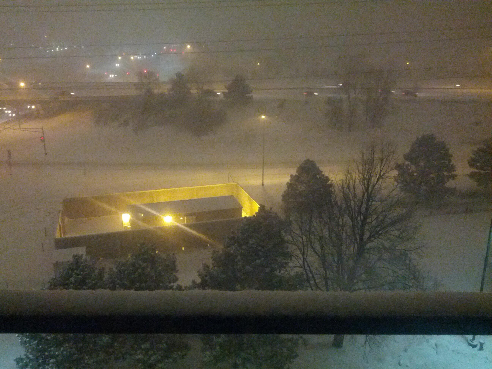
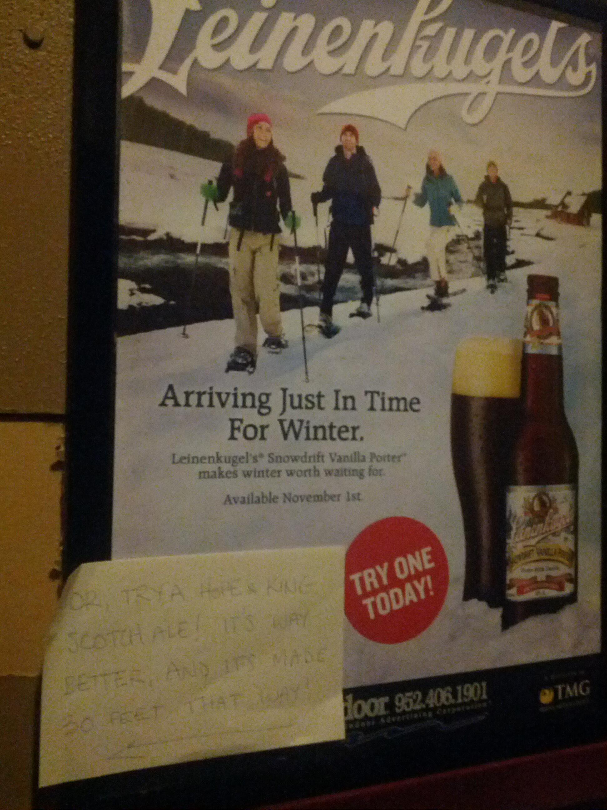
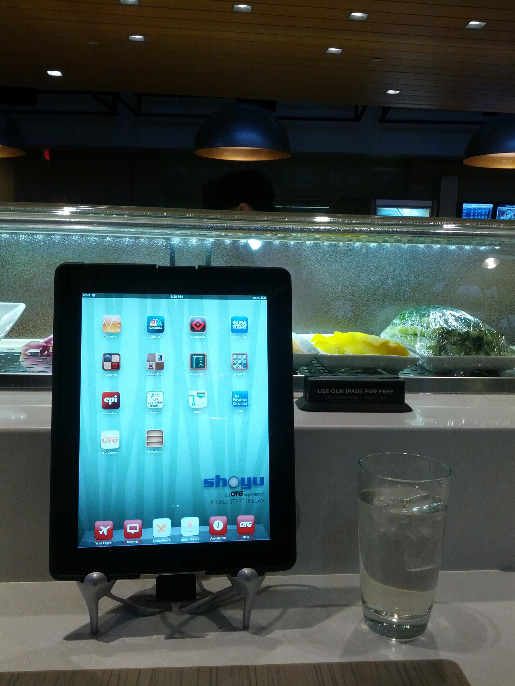
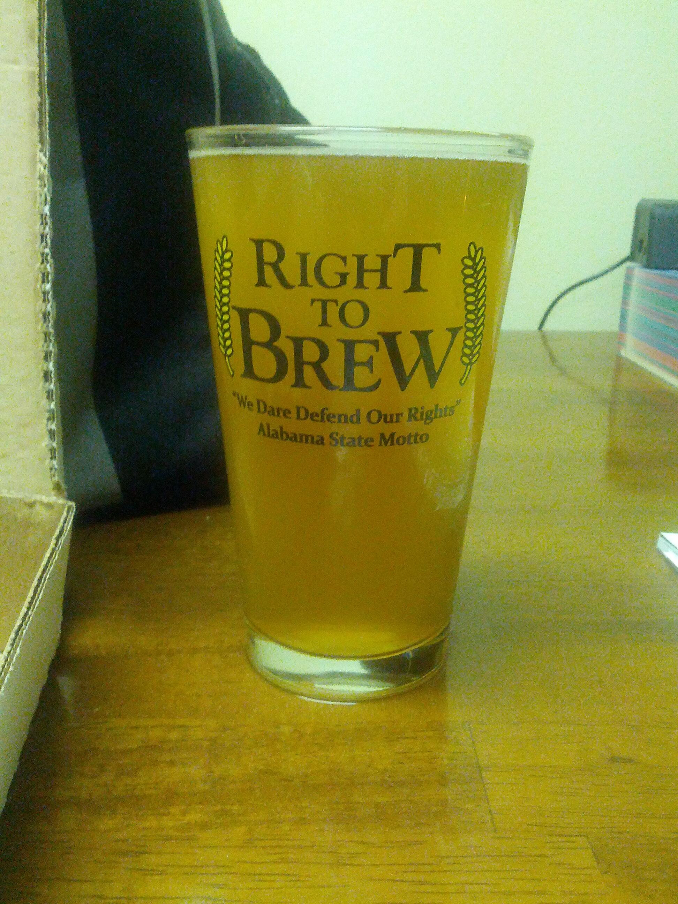
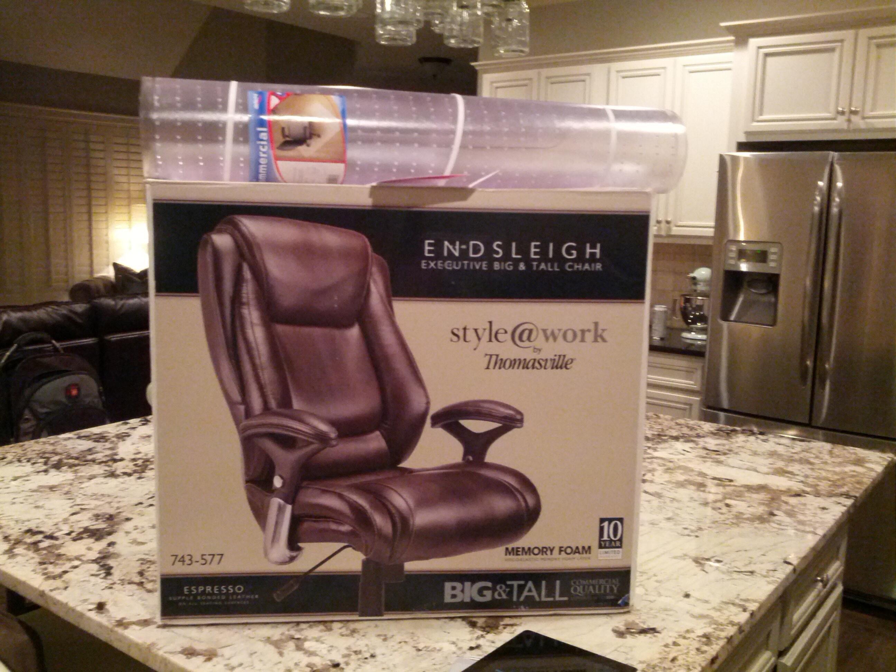

Replying to [@casey1111](https://twitter.com/casey1111/status/307654935749734401)

> what!!! Where did you get that???

 [Sat Mar 02 01:05:08 +0000 2013](https://twitter.com/nhudson/status/307657793404534784)

----

> Drinking a Ryezome Rye Stout by Cahaba Brewing Company at @cahababrewing — http://untp.it/Y4Oxef

 [Sat Mar 02 03:12:11 +0000 2013](https://twitter.com/nhudson/status/307689767154376705)

----

> Made silver dollar pancakes this morning! http://instagr.am/p/WZqguZjzH9/

 [Sun Mar 03 15:50:27 +0000 2013](https://twitter.com/nhudson/status/308242978273628160)

----

Replying to [@jmccarty](https://twitter.com/jmccarty/status/308282596851318784)

> anytime! Com'on

 [Sun Mar 03 18:33:09 +0000 2013](https://twitter.com/nhudson/status/308283922519834625)

----

> Oh great clips, your "no wait" signs are stupid. If you say no wait but yet I am forced to wait, why is there a sign that says no wait?

 [Sun Mar 03 19:53:32 +0000 2013](https://twitter.com/nhudson/status/308304153153789952)

----

> Worked today on racking out a Oud Bruin from a Schug wine barrel. Racked in a Saison. #homebrew 
> 
> 

 [Mon Mar 04 04:16:04 +0000 2013](https://twitter.com/nhudson/status/308430618436456448)

----

Replying to [@mmayhew](https://twitter.com/mmayhew/status/308460133816627200)

> you've seen Breaking Bad right?  I am the Walter White of Alabama

 [Mon Mar 04 12:01:29 +0000 2013](https://twitter.com/nhudson/status/308547743650041857)

----

> Today BHM -&gt; MSP

 [Mon Mar 04 12:02:10 +0000 2013](https://twitter.com/nhudson/status/308547917348732929)

----

Replying to [@Sadiealli](https://twitter.com/sadiealli/status/308564445448245249)

> yeah I'm flying delta too. Should be back there in a few minutes.

 [Mon Mar 04 13:11:57 +0000 2013](https://twitter.com/nhudson/status/308565476739538945)

----

> MSP you are cold and snowy. Not a good way to start off.

 [Mon Mar 04 17:50:05 +0000 2013](https://twitter.com/nhudson/status/308635473427980288)

----

> #snow http://instagr.am/p/Wcde3jDzIv/

 [Mon Mar 04 17:54:14 +0000 2013](https://twitter.com/nhudson/status/308636515364372480)

----

Replying to [@ACD7](https://twitter.com/ACD7/status/308639353951895553)

> shit really?  That sucks.

 [Mon Mar 04 18:08:58 +0000 2013](https://twitter.com/nhudson/status/308640224223821824)

----

> This hotel has a kick ass draught list. — Drinking a Mirror Pond Pale Ale @ Embassy Suites - Minneapolis Airport — http://untp.it/YKicJI

 [Tue Mar 05 00:14:30 +0000 2013](https://twitter.com/nhudson/status/308732213371998208)

----

> On nitro. — Drinking an Oatmeal Stout by @summitbeer @ Embassy Suites - Minneapolis Airport  — http://untp.it/WEMPk9

 [Tue Mar 05 00:26:41 +0000 2013](https://twitter.com/nhudson/status/308735281949970432)

----

> Like I said a kick ass beer selection. More hotels should have this selection of local... (Sweet Child Of Vine) http://untp.it/Z4bLoX

 [Tue Mar 05 00:40:07 +0000 2013](https://twitter.com/nhudson/status/308738661200044034)

----

> Snowing like a mofo tonight in Minneapolis. Supposed to snow till tomorrow evening. 
> 
> 

 [Tue Mar 05 04:22:43 +0000 2013](https://twitter.com/nhudson/status/308794678596235264)

----

> #snow day 2 http://instagr.am/p/WeqpCXDzHN/

 [Tue Mar 05 14:27:51 +0000 2013](https://twitter.com/nhudson/status/308946965293584385)

----

> @SchugWinery followed me the other day, I think that's pretty cool.

 [Tue Mar 05 15:07:48 +0000 2013](https://twitter.com/nhudson/status/308957021582000129)

----

> Drinking a Plead the 5th Imperial Stout by Dark Horse Brewing Co. at @busterson28th — http://untp.it/W3tbBj #photo

 [Tue Mar 05 23:36:37 +0000 2013](https://twitter.com/nhudson/status/309085066775121922)

----

> The nose on this beer is worth the high rating. — Drinking an Abrasive Ale at @busterson28th — http://untp.it/W3wEj8 #photo

 [Wed Mar 06 00:05:17 +0000 2013](https://twitter.com/nhudson/status/309092284673183744)

----

> To everyone who hates on my hat, I had 6 complements today on it. Maybe I should move north. #coldashell

 [Wed Mar 06 00:07:56 +0000 2013](https://twitter.com/nhudson/status/309092950200156160)

----

> Pretty decent pale ale. Tons of hop flavor. — Drinking a Day Tripper by @indeedbrewing at @busterson28th  — http://untp.it/13FeHwa

 [Wed Mar 06 00:26:57 +0000 2013](https://twitter.com/nhudson/status/309097734881832960)

----

> #snow day 3. It quit snowing. Still 2+ feet on the ground. http://instagr.am/p/WhNDiFDzM_/

 [Wed Mar 06 14:07:32 +0000 2013](https://twitter.com/nhudson/status/309304240680095745)

----

> Drinking a Saga IPA by @summitbeer at @cadillacranchmn — http://untp.it/13GipoS

 [Thu Mar 07 00:33:44 +0000 2013](https://twitter.com/nhudson/status/309461830898704384)

----

> In Minneapolis they show High School Hockey on the TV. Its weird, very weird.

 [Thu Mar 07 00:40:10 +0000 2013](https://twitter.com/nhudson/status/309463447249235968)

----

Replying to [@SchugWinery](https://twitter.com/SchugWinery/status/308992291945730048)

> did you see what we did to one of your barrels!  Used it to barrel age some sour beers. 
> 
> 

 [Thu Mar 07 00:53:25 +0000 2013](https://twitter.com/nhudson/status/309466782081634304)

----

Replying to [@_TheBlack77 and @CahabaBrewing](https://twitter.com/_TheBlack77/status/309340221084938241)

> ITS NOT A BERET!!!!

 [Thu Mar 07 01:00:36 +0000 2013](https://twitter.com/nhudson/status/309468590158004225)

----

Replying to [@SchugWinery](https://twitter.com/SchugWinery/status/309468493684830209)

> excellent. We just racked in our 3rd fill. Got a ton of Pinot in the 1st one and an excellent oak character out of the 2nd.

 [Thu Mar 07 01:03:05 +0000 2013](https://twitter.com/nhudson/status/309469216115937280)

----

> Walking through the Mall of America drove me to listen to the entire Modest Mouse Lonesome Crowded West album.

 [Thu Mar 07 01:18:22 +0000 2013](https://twitter.com/nhudson/status/309473062942822401)

----

> Man what an excellent IPA. Good balance of hops and Mango flavor. — Drinking a Mango Mama IPA at @thbrewery — http://untp.it/YPLKWc

 [Thu Mar 07 23:59:29 +0000 2013](https://twitter.com/nhudson/status/309815597326282752)

----

> Weizenbock aged in Buffalo Trace barrels.  Too much bourbon flavor. Still pretty good.... (Tumaltuous Rare) http://untp.it/WxrTRi

 [Fri Mar 08 00:05:42 +0000 2013](https://twitter.com/nhudson/status/309817164926427137)

----

> Jesus. Excellent IPA. Possibly top 3 I've ever had. — Drinking a Masala Mama by Minneapolis Town Hall Brewery — http://untp.it/YfM5BH

 [Fri Mar 08 00:36:50 +0000 2013](https://twitter.com/nhudson/status/309824997596200961)

----

> Just awesome. Who wants a beer with fake vanilla anyway. At @thbrewery bathroom 
> 
> 

 [Fri Mar 08 00:51:05 +0000 2013](https://twitter.com/nhudson/status/309828582606270464)

----

Replying to [@papagraf](https://twitter.com/papagraf/status/309850955514531840)

> the company I work for now is based out of Bloomington.

 [Fri Mar 08 02:57:46 +0000 2013](https://twitter.com/nhudson/status/309860463364165632)

----

> So pretty cool place at MSP airport. You order/pay directly from an iPad in front of you. Pretty cool. 
> 
> 

 [Fri Mar 08 23:39:13 +0000 2013](https://twitter.com/nhudson/status/310172882389053440)

----

> Just what I needed at MSP. — Drinking a Pub Ale by Boddington's Brewery (ABInBev) @ Concourse G  — http://untp.it/YhTVur

 [Sat Mar 09 00:18:14 +0000 2013](https://twitter.com/nhudson/status/310182703137959938)

----

> Drinking a Pale Ale by @GPBrewing — http://untp.it/WBoO2B

 [Sun Mar 10 01:51:35 +0000 2013](https://twitter.com/nhudson/status/310568583535157248)

----

> 1st day starting to work to from home full time. Its going to be a process to get use to.

 [Mon Mar 11 13:51:36 +0000 2013](https://twitter.com/nhudson/status/311112171750825985)

----

> RT @fulmer_ashley: Avondale home for sale! Best price in the area :-) 2BR/1B. Awesome starter home ... it was for me! http://bit.ly/14OXBYv

 [Mon Mar 11 21:06:42 +0000 2013](https://twitter.com/nhudson/status/311221667911327744)

----

Replying to [@Brndon](https://twitter.com/Brndon/status/311223302578393089)

> nope started a new job last week. They are based out of Minneapolis so I get to work from home.

 [Tue Mar 12 00:31:04 +0000 2013](https://twitter.com/nhudson/status/311273099066765312)

----

Replying to [@Brndon](https://twitter.com/Brndon/status/311276651826774016)

> I wasn't really looking just kind of happened I guess. We are a medical imaging archive company. It's called Acuo.

 [Tue Mar 12 00:55:08 +0000 2013](https://twitter.com/nhudson/status/311279153976573952)

----

> RT @AlaHomebrewing: Sounds worse than it is, but here is why #RightToBrew hasn't gotten a vote. http://po.st/YEJBJf Keep calling your ...

 [Tue Mar 12 15:21:26 +0000 2013](https://twitter.com/nhudson/status/311497166835306497)

----

> @AlaHomebrewing glass sporting @CahabaBrewing 100th batch of beer last night #homebrew #craftbeer 
> 
> 

 [Sun Mar 17 00:32:24 +0000 2013](https://twitter.com/nhudson/status/313085371309252608)

----

> Yesterday in Birmingham I did yard work and it was 80. Today I am in Minneapolis and its 10 and it will snow tonight. #needabeer

 [Sun Mar 17 17:26:31 +0000 2013](https://twitter.com/nhudson/status/313340583894720513)

----

> Drinking a Bourbon County Brand Stout (2012) by @GooseIsland @ Butcher And The Boar — http://untp.it/ZKTUjH

 [Sun Mar 17 18:58:22 +0000 2013](https://twitter.com/nhudson/status/313363697613541376)

----

> BCBS on draught in Minneapolis. Oh and its served the only way possible, in a plastic cup. http://instagr.am/p/W-DheWDzOw/

 [Sun Mar 17 19:02:13 +0000 2013](https://twitter.com/nhudson/status/313364668360060928)

----

> Drinking an Old Guardian Oak-Smoked Barleywine (2013) by @StoneBrewingCo @ Butcher And The Boar — http://untp.it/YijIH6

 [Sun Mar 17 19:41:43 +0000 2013](https://twitter.com/nhudson/status/313374610009772033)

----

> Been up since midnight. Going to be a long snowy day.

 [Mon Mar 18 12:08:31 +0000 2013](https://twitter.com/nhudson/status/313622946671374336)

----

> RT @AlaHomebrewing: Congrats @RaiseYourPints and Mississippi homebrewers for earning your #RightToBrew. Alabama, raise a glass to the we ...

 [Tue Mar 19 14:35:21 +0000 2013](https://twitter.com/nhudson/status/314022285092737024)

----

> Do normal people say "its chill"??  Is that the antithesis of "that's hot". Not that normal people say "that's hot".

 [Fri Mar 22 00:57:55 +0000 2013](https://twitter.com/nhudson/status/314903733773430784)

----

> Today is a good day cause I share a birthday with James T Kirk!! http://www.wired.com/geekdad/2013/03/happy-birthday-william-shatner-3/

 [Fri Mar 22 16:54:32 +0000 2013](https://twitter.com/nhudson/status/315144475750039552)

----

Replying to [@jmccarty](https://twitter.com/jmccarty/status/314985142223507456)

> thanks!!

 [Fri Mar 22 16:55:23 +0000 2013](https://twitter.com/nhudson/status/315144689915420673)

----

Replying to [@hkwhateva](https://twitter.com/hkwhateva/status/315221828417228800)

> can't wait!!

 [Fri Mar 22 22:02:53 +0000 2013](https://twitter.com/nhudson/status/315222072525721600)

----

Replying to [@carriejones](https://twitter.com/carriejones/status/315244366732066816)

> THANKS!!

 [Sat Mar 23 02:28:03 +0000 2013](https://twitter.com/nhudson/status/315288805064187904)

----

> Wife got me a new chair and carpet pad for my office. Thanks @hkwhateva!!  #birthday 
> 
> 

 [Sat Mar 23 04:37:22 +0000 2013](https://twitter.com/nhudson/status/315321345493831680)

----

> Yesterday MSP-&gt;BHM. Today BHM-&gt;BOS. @jasonrobert hope you're ready!

 [Sat Mar 23 11:25:51 +0000 2013](https://twitter.com/nhudson/status/315424147733889024)

----

> Greetings from Boston http://instagram.com/p/XQGs8NjzDr/

 [Sun Mar 24 19:17:59 +0000 2013](https://twitter.com/nhudson/status/315905350547161088)

----

> Holy crap this beer is awesome. — Drinking a 3Beans by @sixpoint @ Marriott Burlington MA  — http://untp.it/10dxFV3 #photo

 [Mon Mar 25 20:37:02 +0000 2013](https://twitter.com/nhudson/status/316287631317155840)

----

> RT @freethehops: Tickets for http://www.magiccitybrewfest.com go on sale April 15th!

 [Thu Mar 28 16:14:10 +0000 2013](https://twitter.com/nhudson/status/317308641088782336)

----

> Teddy Williams. Is it baseball season yet? http://instagram.com/p/XesawJjzI2/

 [Sat Mar 30 11:15:07 +0000 2013](https://twitter.com/nhudson/status/317958160096829440)

----

> Headed to @hillfarmstead today with @jasonrobert , #myeric and @hkwhateva

 [Sat Mar 30 11:37:43 +0000 2013](https://twitter.com/nhudson/status/317963848877477888)

----

Replying to [@Sadiealli](https://twitter.com/sadiealli/status/317808391386980352)

> sorry sent from the wrong account.  I will get with you next week on these, found a home for all 4.

 [Sat Mar 30 12:10:22 +0000 2013](https://twitter.com/nhudson/status/317972065967820800)

----

> Why do I not live here....... — Drinking an Edward by @HillFarmstead at @prohibitionpig  — http://untp.it/YRZL7a

 [Sat Mar 30 21:11:06 +0000 2013](https://twitter.com/nhudson/status/318108144834338817)

----

> Today's trip included Hill Farmstead. http://instagram.com/p/XgSOLVjzFy/

 [Sun Mar 31 02:04:21 +0000 2013](https://twitter.com/nhudson/status/318181942216499200)

----

> Also the Prohibition Pig in Waterbury Vermont. http://instagram.com/p/XgSVDHDzF5/

 [Sun Mar 31 02:05:18 +0000 2013](https://twitter.com/nhudson/status/318182183862931456)

----

> Drinking a Green Monsta IPA by @wachusettbrew at @bostonlogan — http://untp.it/YM8A5i

 [Sun Mar 31 18:07:10 +0000 2013](https://twitter.com/nhudson/status/318424243429834753)

----

> UAT doucheness abound on this flight from Baltimore.

 [Sun Mar 31 23:19:59 +0000 2013](https://twitter.com/nhudson/status/318502966762041344)