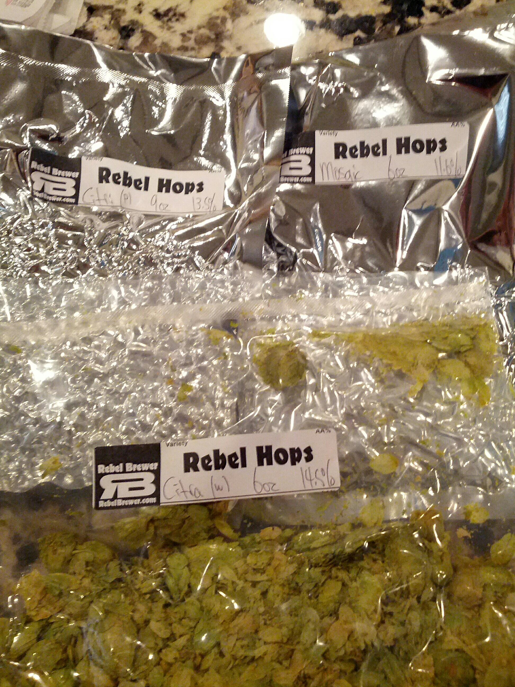

> I really think there is a new start-up in Birmingham.  It's sole purpose is to hire people to troll on @aldotcom comments.

 [Mon Apr 01 17:29:15 +0000 2013](https://twitter.com/nhudson/status/318777091137081344)

----

Replying to [@AlabamaPolitics](https://twitter.com/AlabamaPolitics/status/319174350320308225)

> Did you then ask why they are filibustering, still.???

 [Tue Apr 02 19:54:51 +0000 2013](https://twitter.com/nhudson/status/319176117921665025)

----

> RT @AlaHomebrewing: Rep McCutcheon is hitting it out of the park right now! Great job!

 [Tue Apr 02 20:50:56 +0000 2013](https://twitter.com/nhudson/status/319190232916426752)

----

> ........ House Rep just said "Richard Nixon was a good President".......... speechless

 [Tue Apr 02 21:11:46 +0000 2013](https://twitter.com/nhudson/status/319195477641932801)

----

> Rep Forte from Eufaula is now quoted as saying "Richard Nixon was one of the best Presidents", he said it multiple times...... #alapolitics

 [Tue Apr 02 21:15:38 +0000 2013](https://twitter.com/nhudson/status/319196446995910656)

----

Replying to [@adamnason and @freethehops](https://twitter.com/adamnason/status/319198326190911488)

> true it would not.

 [Tue Apr 02 21:23:25 +0000 2013](https://twitter.com/nhudson/status/319198406608318465)

----

> FUD

 [Tue Apr 02 21:25:14 +0000 2013](https://twitter.com/nhudson/status/319198864089436162)

----

> RT @JoePilleteri: According to Alvin Holmes homebrew will be "taminated with e-cola"

 [Tue Apr 02 21:53:57 +0000 2013](https://twitter.com/nhudson/status/319206093286957057)

----

> Drinking a Hitchhiker by @GPBrewing at @gpbrewing — http://untp.it/Z022NJ

 [Tue Apr 02 23:36:37 +0000 2013](https://twitter.com/nhudson/status/319231926735093761)

----

> Drinking a Bourbon Barrel Aged Jose Marti by @CigarCityBeer — http://untp.it/12ciVLq

 [Tue Apr 02 23:50:40 +0000 2013](https://twitter.com/nhudson/status/319235463854563328)

----

> Drinking a Brandy Nightmare On Brett by @CrookedStave at @gpbrewing — http://untp.it/16l4yBj

 [Tue Apr 02 23:59:47 +0000 2013](https://twitter.com/nhudson/status/319237757446791168)

----

> Drinking a Kentucky Breakfast Stout by @foundersbrewing at @gpbrewing — http://untp.it/12cux1c

 [Wed Apr 03 00:47:21 +0000 2013](https://twitter.com/nhudson/status/319249731316494336)

----

> A few days late watching GoT.  The beer was kind of meh. — Drinking a Game Of Thrones - Iron Throne — http://untp.it/10zY9it

 [Thu Apr 04 00:38:47 +0000 2013](https://twitter.com/nhudson/status/319609960982003712)

----

> Well that's one growler down — Drinking a Citra Single Hop Pale Ale by @HillFarmstead — http://untp.it/16u0O0r

 [Thu Apr 04 23:52:55 +0000 2013](https://twitter.com/nhudson/status/319960807045746690)

----

Replying to [@tsutrav](https://twitter.com/tsutrav/status/319977603962400768)

> never even heard of it. If you find some I would like to know where it is.

 [Fri Apr 05 01:43:16 +0000 2013](https://twitter.com/nhudson/status/319988575053680640)

----

> Drinking a Centennial Ale by Cahaba Brewing Company at @cahababrewing — http://untp.it/10El6Cr

 [Sat Apr 06 23:53:46 +0000 2013](https://twitter.com/nhudson/status/320685795973402624)

----

> Drinking a Daisy Cutter Pale Ale by @halfacrebeer — http://untp.it/Y6NfAH

 [Sun Apr 07 19:40:45 +0000 2013](https://twitter.com/nhudson/status/320984510139359232)

----

> Drinking a Saison Vieille Artisanal by @CrookedStave — http://untp.it/10IhkIo

 [Mon Apr 08 22:45:42 +0000 2013](https://twitter.com/nhudson/status/321393441542135808)

----

> Surprisingly this beer has got better with a few months of age. — Drinking a Dry-Hopped L'Brett D'Or — http://untp.it/16J5OR1 #photo

 [Mon Apr 08 23:04:11 +0000 2013](https://twitter.com/nhudson/status/321398094052880385)

----

> Drinking a L'Brett D'Or by @CrookedStave — http://untp.it/16Jbqul #photo

 [Tue Apr 09 00:07:05 +0000 2013](https://twitter.com/nhudson/status/321413922030747651)

----

> dad says to me going to Regions tonight. "Well good for you.  Don't get shot, robbed, and/or stabbed." How do we change this????????????????

 [Thu Apr 11 00:31:26 +0000 2013](https://twitter.com/nhudson/status/322144827850493952)

----

Replying to [@Birmingsam](https://twitter.com/@Birmingsam/status/322160731053236226)

> sadly I doubt he would ever come. I'll give it a shot though

 [Thu Apr 11 03:26:28 +0000 2013](https://twitter.com/nhudson/status/322188873407012864)

----

Replying to [@casey1111](https://twitter.com/casey1111/status/322147262471995392)

> yeah its sad but true.

 [Thu Apr 11 03:27:02 +0000 2013](https://twitter.com/nhudson/status/322189015858167808)

----

> You know an IPA is going to be made when the package it was delivered in smells like hops. 
> 
> 

 [Thu Apr 11 20:36:00 +0000 2013](https://twitter.com/nhudson/status/322447965799206912)

----

> Enjoying a Pimms at chez fon fon tonight. Makes me miss dprecise and @mlprecise http://instagram.com/p/YBpEZVjzK5/

 [Sat Apr 13 00:59:41 +0000 2013](https://twitter.com/nhudson/status/322876713728106496)

----

> With the secret fruit. — Drinking a Fraxinus Maximus by Cahaba Brewing Company at @jclyde_bham  — http://untp.it/ZTioa0

 [Sat Apr 13 19:12:14 +0000 2013](https://twitter.com/nhudson/status/323151660404838400)

----

> Smoky and bourbon — Drinking a Bourbon Barrel Aged Double Oatmeal Stout by @StraightToAle — http://untp.it/1156DQC

 [Sat Apr 13 20:26:37 +0000 2013](https://twitter.com/nhudson/status/323170381517180928)

----

> Enjoying my last growler of @hillfarmstead. Also brewing a HF inspired IPA with Citra and Mosaic.... (Everett) http://untp.it/179UUlt

 [Sun Apr 14 19:17:56 +0000 2013](https://twitter.com/nhudson/status/323515483997499393)

----

> Brewing up an IPA today with Citra and Mosaic hops. http://instagram.com/p/YGSsjWDzM_/

 [Sun Apr 14 20:19:43 +0000 2013](https://twitter.com/nhudson/status/323531030067818498)

----

Replying to [@casey1111](https://twitter.com/casey1111/status/323533751269351426)

> ha yeah hiding behind garage doors is getting old.

 [Sun Apr 14 20:32:46 +0000 2013](https://twitter.com/nhudson/status/323534317127090177)

----

Replying to [@casey1111](https://twitter.com/casey1111/status/323553216879026176)

> I haven't seen an email in a month or so. Did you get a rank?

 [Sun Apr 14 23:21:53 +0000 2013](https://twitter.com/nhudson/status/323576873697304577)

----

Replying to [@casey1111](https://twitter.com/casey1111/status/323577629376643072)

> holy crap. Awesome!

 [Sun Apr 14 23:30:52 +0000 2013](https://twitter.com/nhudson/status/323579135760924673)

----

Replying to [@casey1111](https://twitter.com/casey1111/status/323580096487247874)

> Ah well you had me excited.  I just logged into my account to see if my score was up and it's not.  Hopefully this means soon!

 [Sun Apr 14 23:36:51 +0000 2013](https://twitter.com/nhudson/status/323580643156049921)

----

> RT @AlaHomebrewing: ACTION ALERT! Help HB9 get a Senate vote: http://po.st/HjZ5L5 We all deserve the #RightToBrew in Alabama!

 [Thu Apr 18 17:00:55 +0000 2013](https://twitter.com/nhudson/status/324930553436569600)

----

> Canned 4/10 I think. Excellent. — Drinking a Jai Alai IPA by @CigarCityBeer — http://untp.it/17OqIPT

 [Sat Apr 20 20:51:53 +0000 2013](https://twitter.com/nhudson/status/325713452301709312)

----

> I can get this album out of my head recently. Possibly the best record from The Magnetic Fields. http://instagram.com/p/YdUmFGDzGZ/

 [Tue Apr 23 18:59:19 +0000 2013](https://twitter.com/nhudson/status/326772290337505282)

----

> Canned 4/2 — Drinking a Monkeynaut by @StraightToAle — http://untp.it/ZqDDom

 [Sat Apr 27 03:29:21 +0000 2013](https://twitter.com/nhudson/status/327987807706570752)

----

> Braised baby backs are on the menu tonight. http://instagram.com/p/YoPdz8DzBv/

 [Sun Apr 28 00:45:46 +0000 2013](https://twitter.com/nhudson/status/328309025580134400)

----

> RT @CharliePapazian: ALABAMA ACTION ALERT: Homebrew deserves vote. http://bit.ly/11moVwT Time running out. AL peep call Sens now.

 [Mon Apr 29 19:00:13 +0000 2013](https://twitter.com/nhudson/status/328946843406974976)

----

> My 2nd year Cascade hop plant is starting to grow. Slowly. http://instagram.com/p/YtHUI7jzKB/

 [Mon Apr 29 22:10:42 +0000 2013](https://twitter.com/nhudson/status/328994780849782785)

----

Replying to [@brightsides](https://twitter.com/brightsides/status/329026456158085120)

> they were looking for Magnum

 [Tue Apr 30 00:21:29 +0000 2013](https://twitter.com/nhudson/status/329027690898276352)

----

> Possibly one of the best beers I've ever had a hand in crafting. 2 years in a wine barrel and tasting… http://instagram.com/p/Yvzk2tDzA9/

 [Tue Apr 30 23:17:03 +0000 2013](https://twitter.com/nhudson/status/329373864440262658)