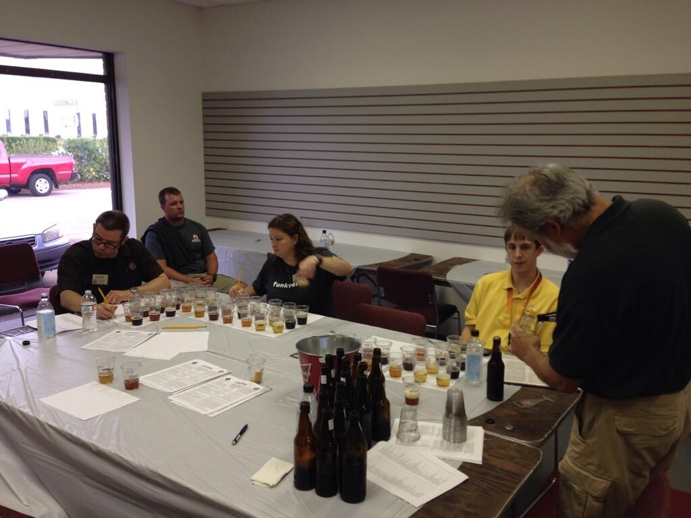

Replying to [@alanjones19](https://twitter.com/0xAlan/status/351789755706523649)

> Don't know if it's everything you're looking for but expensify was pretty awesome when I used it.

 [Mon Jul 01 20:01:40 +0000 2013](https://twitter.com/nhudson/status/351792740952051712)

----

Replying to [@casey1111](https://twitter.com/casey1111/status/351469715408949248)

> so did you make it back?

 [Mon Jul 01 20:52:09 +0000 2013](https://twitter.com/nhudson/status/351805448803991553)

----

Replying to [@casey1111](https://twitter.com/casey1111/status/351808222539169794)

> ouch. Glad y'all made it back.

 [Mon Jul 01 21:03:35 +0000 2013](https://twitter.com/nhudson/status/351808322564919299)

----

> RT @BhamMtnRadio: Starting today, Birmingham Mountain Radio will be available on 107.3 FM. Thank you, Birmingham!

 [Tue Jul 02 12:35:59 +0000 2013](https://twitter.com/nhudson/status/352042970297536513)

----

> Hop cones really starting to come together. http://instagram.com/p/bQ7IQSDzOh/

 [Tue Jul 02 12:59:29 +0000 2013](https://twitter.com/nhudson/status/352048883221798912)

----

> !!!! http://instagram.com/p/bRJYJ4DzPC/

 [Tue Jul 02 15:04:08 +0000 2013](https://twitter.com/nhudson/status/352080251720970242)

----

> Drinking a St. Bretta (Spring) by @CrookedStave — http://untp.it/13pMV6R

 [Tue Jul 02 23:07:18 +0000 2013](https://twitter.com/nhudson/status/352201847190200320)

----

> Drinking a Vielle Artisanal Saison by @CrookedStave — http://untp.it/1aA3CzF

 [Tue Jul 02 23:26:46 +0000 2013](https://twitter.com/nhudson/status/352206744589578240)

----

Replying to [@Birmingsam and @BigGreenEggInc](https://twitter.com/@Birmingsam/status/352253590921940995)

> let me know how it turns out

 [Wed Jul 03 03:49:30 +0000 2013](https://twitter.com/nhudson/status/352272865862762499)

----

Replying to [@jeffreysmoore](https://twitter.com/jeffreysmoore/status/352415194128973825)

> I've always wondered how people drank Milo's tea to begin with, that stuff is just vile.

 [Wed Jul 03 13:18:27 +0000 2013](https://twitter.com/nhudson/status/352416044377317376)

----

Replying to [@jeffreysmoore](https://twitter.com/jeffreysmoore/status/352416520359514113)

> Yeah you have too, you will end up with dibeetus if you don't.  Way too much sugar

 [Wed Jul 03 13:21:18 +0000 2013](https://twitter.com/nhudson/status/352416763742400512)

----

Replying to [@jeffreysmoore](https://twitter.com/jeffreysmoore/status/352418159602577408)

> WHAT! No wonder that stuff is so sweet.

 [Wed Jul 03 13:27:38 +0000 2013](https://twitter.com/nhudson/status/352418355476578304)

----

> Catching up on today's beers. — Drinking a Hop Savant by @CrookedStave — http://untp.it/18zFJYh

 [Fri Jul 05 01:38:57 +0000 2013](https://twitter.com/nhudson/status/352964787078037505)

----

> Drinking a St. Bretta (Spring) by @CrookedStave — http://untp.it/15jeRsd

 [Fri Jul 05 01:39:21 +0000 2013](https://twitter.com/nhudson/status/352964886604689409)

----

> Drinking a Surette by @CrookedStave — http://untp.it/17WNrwd

 [Fri Jul 05 01:40:06 +0000 2013](https://twitter.com/nhudson/status/352965076610850816)

----

> Drinking an Everett by @HillFarmstead — http://untp.it/13oyAJ6

 [Fri Jul 05 01:40:35 +0000 2013](https://twitter.com/nhudson/status/352965196811214849)

----

> After being in a house all day with 10-18 yo kids, I fear for this generation. I guess thateans I'm getting old too.

 [Fri Jul 05 04:21:31 +0000 2013](https://twitter.com/nhudson/status/353005695743967233)

----

> Dat Mexican Cake — Drinking a Mexican Cake (2013) by @westbrookbeer — http://untp.it/16eu4rL #photo

 [Sat Jul 06 17:35:27 +0000 2013](https://twitter.com/nhudson/status/353567884812881920)

----

> Braised ribs. Bones fell off when I took the foil off. They still need time under the broiler. http://instagram.com/p/bcB82PDzIG/

 [Sat Jul 06 20:30:55 +0000 2013](https://twitter.com/nhudson/status/353612043628183552)

----

> Drinking a Surette Reserva  by @CrookedStave — http://untp.it/16W6Fxs

 [Sat Jul 06 20:38:25 +0000 2013](https://twitter.com/nhudson/status/353613929760571392)

----

Replying to [@jmccarty](https://twitter.com/jmccarty/status/353660733134880768)

> yeah the run is a bit different though.

 [Sun Jul 07 00:11:14 +0000 2013](https://twitter.com/nhudson/status/353667487788826624)

----

> Ribs and German Potato Salad #dinner http://instagram.com/p/bcbZRpjzGK/

 [Sun Jul 07 00:13:24 +0000 2013](https://twitter.com/nhudson/status/353668031983005698)

----

Replying to [@jmccarty](https://twitter.com/jmccarty/status/353712201200181248)

> yeah they turn out tender as hell. It's good, though I prefer smoking them. The wife on the other hand doesn't.

 [Sun Jul 07 03:34:32 +0000 2013](https://twitter.com/nhudson/status/353718650097774593)

----

Replying to [@ditchell and @joey__t](https://twitter.com/ditchell/status/354323946985893888)

> I am pretty sure I am in the minority when I say the only thing I like from Milos is their Lemon Pie, the rest is garbage

 [Mon Jul 08 19:51:24 +0000 2013](https://twitter.com/nhudson/status/354326872772984833)

----

> Anyone watch Falling Skies?  Any good?

 [Mon Jul 08 19:59:46 +0000 2013](https://twitter.com/nhudson/status/354328977667657728)

----

> #homebrew http://instagram.com/p/bh0XGnjzA3/

 [Tue Jul 09 02:29:18 +0000 2013](https://twitter.com/nhudson/status/354427010401042433)

----

Replying to [@edg411](https://twitter.com/edg411/status/354435883014959105)

> thanks, I think I am going to start catching up this week and see how it goes.

 [Tue Jul 09 13:27:56 +0000 2013](https://twitter.com/nhudson/status/354592759505625089)

----

Replying to [@alabamabrewers](https://twitter.com/alabamabrewers/status/355026734162251776)

> Couldn't agree more :)

 [Wed Jul 10 20:31:22 +0000 2013](https://twitter.com/nhudson/status/355061707330174976)

----

> Perfect summer beer. — Drinking a Nightmare On Brett (Grand Cru) by @CrookedStave — http://untp.it/1ac418D

 [Wed Jul 10 21:53:58 +0000 2013](https://twitter.com/nhudson/status/355082495437447168)

----

> Good afternoon everyone. #homebrew http://instagram.com/p/bru-3rjzKq/

 [Fri Jul 12 22:52:57 +0000 2013](https://twitter.com/nhudson/status/355822116085579776)

----

> Hops http://instagram.com/p/btrSucjzIr/

 [Sat Jul 13 16:58:52 +0000 2013](https://twitter.com/nhudson/status/356095392842137600)

----

> Drinking a Hop Revival by @yellowhammerale — http://untp.it/14QQl0E #photo

 [Sun Jul 14 03:53:20 +0000 2013](https://twitter.com/nhudson/status/356260097288187905)

----

> Drinking a Tiger Baby: Open Windows Open Hills by @MikkellerBeer — http://untp.it/12oX5Qt #photo

 [Sun Jul 14 03:54:58 +0000 2013](https://twitter.com/nhudson/status/356260505515597829)

----

> Amazing — Drinking an Unobtanium Old Ale by @StraightToAle — http://untp.it/18ffTpF

 [Sun Jul 14 21:29:18 +0000 2013](https://twitter.com/nhudson/status/356525838214234114)

----

> Drinking an Eclipse - Rittenhouse Rye (2012) by @5050Brewing — http://untp.it/12qlWDB

 [Sun Jul 14 21:55:40 +0000 2013](https://twitter.com/nhudson/status/356532473582206979)

----

> Drinking a Laika Russian Imperial Stout by @StraightToAle — http://untp.it/1dy1BB0

 [Sun Jul 14 21:56:54 +0000 2013](https://twitter.com/nhudson/status/356532783511908352)

----

> Drinking a Gorillanaut Imperial IPA by @StraightToAle — http://untp.it/15v41gR

 [Sun Jul 14 21:58:04 +0000 2013](https://twitter.com/nhudson/status/356533075997507586)

----

> Drinking a Rueuze by @thebruery — http://untp.it/15dUL0H

 [Sun Jul 14 22:20:33 +0000 2013](https://twitter.com/nhudson/status/356538735313166339)

----

> Drinking an Otiose by @thebruery — http://untp.it/11OQrrK

 [Sun Jul 14 22:20:56 +0000 2013](https://twitter.com/nhudson/status/356538831618584577)

----

> Drinking a Fraxinus Maximus by Cahaba Brewing Company — http://untp.it/1amu4tZ

 [Sun Jul 14 22:26:36 +0000 2013](https://twitter.com/nhudson/status/356540256885030914)

----

> After a 2 week fermentation  and a 1 week lag I finally have a pellicle. #homebrew #allbrett http://instagram.com/p/b84K6HDzCh/

 [Fri Jul 19 14:40:56 +0000 2013](https://twitter.com/nhudson/status/358235007036293121)

----

> Some bottles headed to the 1st Alabama Brewoff!!  Can't wait to start judging #homebrew http://instagram.com/p/b9fWcEDzEJ/

 [Fri Jul 19 20:22:53 +0000 2013](https://twitter.com/nhudson/status/358321062758457345)

----

Replying to [@davecowart](https://twitter.com/davecowart/status/358324556328472577)

> yup only pushed it back a week.  Starting tonight and finishing tomorrow. I'll do my best to live tweet.

 [Fri Jul 19 21:18:43 +0000 2013](https://twitter.com/nhudson/status/358335115664953344)

----

Replying to [@davecowart](https://twitter.com/davecowart/status/358324556328472577)

> Also the after party will be at @CahabaBrewing starting at 7p tomorrow, the results will be announced then.

 [Fri Jul 19 21:19:26 +0000 2013](https://twitter.com/nhudson/status/358335295369908224)

----

> RT @RichardLBryant: About to start afternoon judging session for Alabama Brew Off. @DCDaybis @nhudson @siwelwerd

 [Sat Jul 20 18:54:53 +0000 2013](https://twitter.com/nhudson/status/358661305341067264)

----

> Final Best of Show judging going on now for #alabamabrewoff #homebrew 
> 
> 

 [Sat Jul 20 22:29:57 +0000 2013](https://twitter.com/nhudson/status/358715429084090368)

----

> Yup http://instagram.com/p/cAqIDdDzD5/

 [Sun Jul 21 01:54:13 +0000 2013](https://twitter.com/nhudson/status/358766833748279296)

----

> Buffy marathon on Syfy

 [Sun Jul 21 23:41:26 +0000 2013](https://twitter.com/nhudson/status/359095806701207552)

----

> Drinking a Black Chocolate Stout (2010) by @brooklynbrewery — http://untp.it/130o3Ns

 [Mon Jul 22 01:36:31 +0000 2013](https://twitter.com/nhudson/status/359124766721966081)

----

Replying to [@siwelwerd, @RichardLBryant and @DCDaybis](https://twitter.com/siwelwerd/status/359009496238014465)

> Glad to have yall come out and help!  It was a great time and many of a great beer was judged.

 [Mon Jul 22 14:02:42 +0000 2013](https://twitter.com/nhudson/status/359312549281411073)

----

> Tastes like bitter mango juice with alcohol. Pretty good. — Drinking a Scratch 98 - Triple Mango IPA — http://untp.it/145M99M #photo

 [Wed Jul 24 22:16:16 +0000 2013](https://twitter.com/nhudson/status/360161536771239938)

----

> Its what's for dinner. — Drinking a Lunch by @mainebeerbrewer — http://untp.it/17Eshii

 [Thu Jul 25 00:42:46 +0000 2013](https://twitter.com/nhudson/status/360198402694324225)

----

> Not a bad porter. Not overly chocolate and I like that. — Drinking a Dos Cocoas Chocolate Porter at @jclyde_bham — http://untp.it/18FXplW

 [Fri Jul 26 00:43:42 +0000 2013](https://twitter.com/nhudson/status/360561029249372162)

----

> Good lord this beer is good. — Drinking a Brett &amp; No Mices by @westbrookbeer at @jclyde_bham  — http://untp.it/13Jeu9P

 [Fri Jul 26 00:45:06 +0000 2013](https://twitter.com/nhudson/status/360561378160951297)

----

> Really good session beer. Hope to see more of them in Bham — Drinking an Everyday Ale by @fairhopebrewing — http://untp.it/146G6sy

 [Fri Jul 26 00:46:21 +0000 2013](https://twitter.com/nhudson/status/360561693887172609)

----

> Good lord, tons of blueberries. Really refreshing. — Drinking a Justin Blåbær by @EvilTwinBrewing at @jclyde_bham  — http://untp.it/1685rjI

 [Fri Jul 26 00:47:39 +0000 2013](https://twitter.com/nhudson/status/360562022942916609)

----

Replying to [@ditchell and @FairhopeBrewing](https://twitter.com/ditchell/status/360564288131305472)

> I think just at @JClyde_Bham till it's gone.

 [Fri Jul 26 01:10:37 +0000 2013](https://twitter.com/nhudson/status/360567800441470976)

----

> Drinking a Perpetual IPA by @TroegsBeer — http://untp.it/12qjfHl

 [Fri Jul 26 21:20:30 +0000 2013](https://twitter.com/nhudson/status/360872276285079554)

----

> It's either out dated or not hoppy enough. — Drinking a Vipidis Lupulus by @weyerbacher — http://untp.it/19nbBQf

 [Fri Jul 26 21:21:23 +0000 2013](https://twitter.com/nhudson/status/360872499455598593)

----

Replying to [@papagraf and @askRegions](https://twitter.com/papagraf/status/360879931086995456)

> if you hang up they win.

 [Fri Jul 26 23:09:56 +0000 2013](https://twitter.com/nhudson/status/360899816655556609)

----

> Best beer on the lake. — Drinking an American Blonde by Cahaba Brewing Company — http://untp.it/16kHtzK

 [Sat Jul 27 00:46:24 +0000 2013](https://twitter.com/nhudson/status/360924093425516545)

----

Replying to [@Weyerbacher](https://twitter.com/Weyerbacher/status/360877573888159746)

> possibly so :). Still a good beer.

 [Sat Jul 27 04:04:37 +0000 2013](https://twitter.com/nhudson/status/360973978849902592)

----

> I will admit I pushed a push cap tonight on a miller lite can. It didn't make it taste better.

 [Sat Jul 27 04:06:18 +0000 2013](https://twitter.com/nhudson/status/360974402126491648)

----

Replying to [@jmccarty](https://twitter.com/jmccarty/status/361292274858078208)

> absolutely man. Good to see y'all.

 [Sun Jul 28 01:39:55 +0000 2013](https://twitter.com/nhudson/status/361299949163528193)

----

Replying to [@jeffreysmoore](https://twitter.com/jeffreysmoore/status/361953227022934018)

> give me a few and I will test it out.

 [Mon Jul 29 20:59:21 +0000 2013](https://twitter.com/nhudson/status/361954121076588544)

----

Replying to [@jeffreysmoore](https://twitter.com/jeffreysmoore/status/361953227022934018)

> honestly I doubt it will work, the app would need to add in compatibility and the OS would have to add support for it.

 [Mon Jul 29 21:00:51 +0000 2013](https://twitter.com/nhudson/status/361954496445820928)

----

Replying to [@jeffreysmoore](https://twitter.com/jeffreysmoore/status/361955147657646080)

> oh that doesnt work right now, Chrome only works from the desktop right now.

 [Mon Jul 29 21:03:58 +0000 2013](https://twitter.com/nhudson/status/361955282584211459)

----

Replying to [@dartdog and @jeffreysmoore](https://twitter.com/dartdog/status/361955196609376257)

> from what I read Chrome only works from "desktop".  I know it doesnt work from Chrome on my phone to the TV.

 [Mon Jul 29 21:04:47 +0000 2013](https://twitter.com/nhudson/status/361955484892270593)

----

Replying to [@dartdog and @jeffreysmoore](https://twitter.com/dartdog/status/361955785992974336)

> I don't see how. It requires a chrome extension to work. Doesn't work on my iPad, android phone or iphone.

 [Mon Jul 29 21:08:22 +0000 2013](https://twitter.com/nhudson/status/361956387355496448)

----

Replying to [@dartdog and @jeffreysmoore](https://twitter.com/nhudson/status/361956387355496448)

> also it only works in "beta" from your desktop. Reports of it being laggy and slow.

 [Mon Jul 29 21:10:01 +0000 2013](https://twitter.com/nhudson/status/361956804621631489)

----

Replying to [@dartdog and @jeffreysmoore](https://twitter.com/nhudson/status/361956387355496448)

> saying that YouTube, Google Music and Netflix work perfectly and YouTube and Netflix work seamless across devices.

 [Mon Jul 29 21:11:20 +0000 2013](https://twitter.com/nhudson/status/361957134289735680)

----

Replying to [@jeffreysmoore and @dartdog](https://twitter.com/jeffreysmoore/status/361957159883382784)

> it does work. The features that work do. The chrome to cast feature is beta right now.

 [Mon Jul 29 21:12:05 +0000 2013](https://twitter.com/nhudson/status/361957325768105984)

----

Replying to [@dartdog and @jeffreysmoore](https://twitter.com/dartdog/status/361956161886502912)

> there is no add-in app for iOS.  It doesn't do much anyway.

 [Mon Jul 29 21:14:45 +0000 2013](https://twitter.com/nhudson/status/361957996655419393)

----

Replying to [@jeffreysmoore and @dartdog](https://twitter.com/jeffreysmoore/status/361958678527610880)

> for the price it's well worth it.  For me I will use it for streaming music to my TV.  Works perfectly.

 [Mon Jul 29 21:18:03 +0000 2013](https://twitter.com/nhudson/status/361958825336651776)

----

> To watch google play videos in iOS on #chromecast open up YouTube app and go to purchases. You can cast from there.

 [Tue Jul 30 01:29:09 +0000 2013](https://twitter.com/nhudson/status/362022017618280448)

----

> Morning medication http://instagram.com/p/cZAGaYjzB3/

 [Tue Jul 30 12:48:07 +0000 2013](https://twitter.com/nhudson/status/362192885636018177)

----

> Mashed in after a very, very long day at work. Hype Pale. Every hyped up hop you can think of is in… http://instagram.com/p/ccuyX9jzP0/

 [Wed Jul 31 23:34:28 +0000 2013](https://twitter.com/nhudson/status/362717933203488768)

----

> That's not what you think it is #homebrew #hops http://instagram.com/p/ccxml5DzEQ/

 [Wed Jul 31 23:58:44 +0000 2013](https://twitter.com/nhudson/status/362724039707463682)

----

> &lt;5 hour brew day. I'll call it a day now. #homebrewing

 [Thu Aug 01 03:22:12 +0000 2013](https://twitter.com/nhudson/status/362775244248854529)

----

Replying to [@WarEagleArt](https://twitter.com/LanceCurryArt/status/362726495506010112)

> smells like pineapples and mango in my back yard.

 [Thu Aug 01 03:22:41 +0000 2013](https://twitter.com/nhudson/status/362775363962679296)