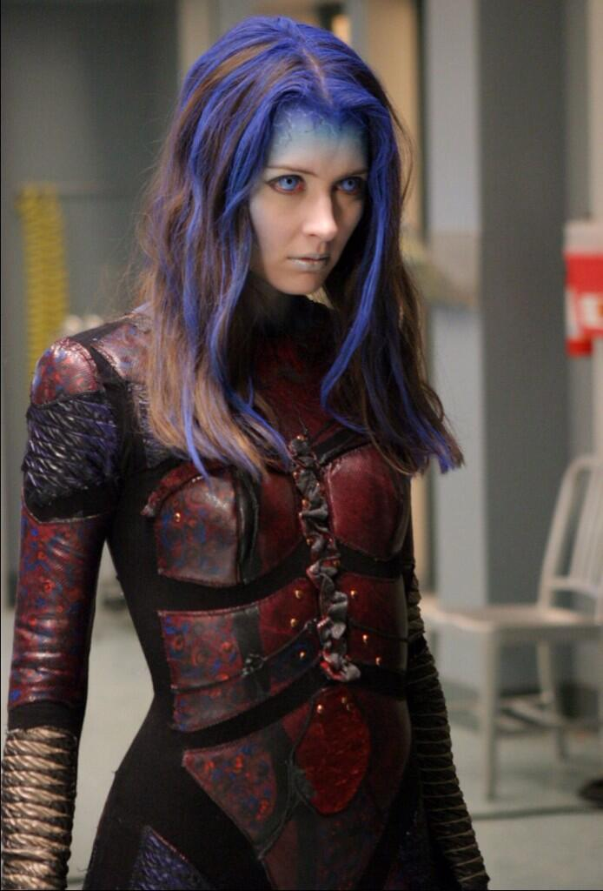
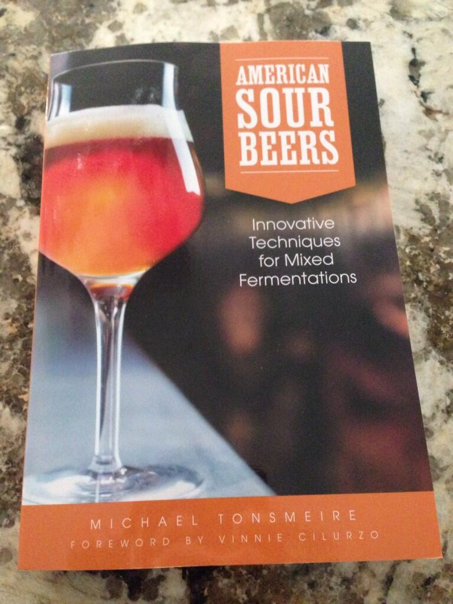

> RT @whedonesque: Today is International Illyria Day 
> 
> 

 [Sun Jun 01 15:55:11 +0000 2014](https://twitter.com/nhudson/status/473130647901724672)

----

> 3rd year cascade hops. June progress. http://instagram.com/p/ot2eGdjzO0/

 [Sun Jun 01 21:24:35 +0000 2014](https://twitter.com/nhudson/status/473213546365325313)

----

> Morning time rituals http://instagram.com/p/oyFwWejzCQ/

 [Tue Jun 03 12:55:07 +0000 2014](https://twitter.com/nhudson/status/473810108397285378)

----

> Drinking an Ettaler Kloster Dunkel by Klosterbrauerei Ettal @ Hudson House of Ales and Sours — http://untpd.it/s/c90555300

 [Thu Jun 05 00:53:07 +0000 2014](https://twitter.com/nhudson/status/474353185378025472)

----

> Drinking a Gozu by @westbrookbeer @ Hudson House of Ales and Sours — http://untpd.it/s/c90716107 #photo

 [Fri Jun 06 00:22:01 +0000 2014](https://twitter.com/nhudson/status/474707750262673408)

----

> Pre-MCBF work being done.... (La Folie (Lips of Faith) (2013)) http://untpd.it/s/c90722275 #photo

 [Fri Jun 06 00:38:21 +0000 2014](https://twitter.com/nhudson/status/474711857211920385)

----

> Sampling homebrew at 8am. Must be #mcbf2014 weekend! http://instagram.com/p/o52GD-jzCs/

 [Fri Jun 06 13:12:11 +0000 2014](https://twitter.com/nhudson/status/474901569096646657)

----

> RT @WeldBham: Be sure to come out the @freethehops Magic City Brewfest today and tomorrow! For ticket info, visit http://magiccitybrewfest.com

 [Fri Jun 06 14:33:45 +0000 2014](https://twitter.com/nhudson/status/474922093889323009)

----

> Nice day to come to Sloss and drink beer. #mcbf2014 http://instagram.com/p/o6cTRhjzCU/

 [Fri Jun 06 18:46:04 +0000 2014](https://twitter.com/nhudson/status/474985589683412992)

----

> Why am I at Nana Funks???

 [Sat Jun 07 05:35:54 +0000 2014](https://twitter.com/nhudson/status/475149127266078720)

----

Replying to [@ditchell](https://twitter.com/ditchell/status/475149746211151872)

> I've been at Sloss since noon. Why am I not at home?  #mywifeiscrazy

 [Sat Jun 07 05:39:17 +0000 2014](https://twitter.com/nhudson/status/475149978143588352)

----

Replying to [@ditchell](https://twitter.com/ditchell/status/475153806028980227)

> touché

 [Sat Jun 07 06:17:39 +0000 2014](https://twitter.com/nhudson/status/475159632927670272)

----

Replying to [@chipwtd](https://twitter.com/chipwtd/status/475272942969163776)

> god I hope not. Wife went so I did too. It was terrible.

 [Sat Jun 07 13:52:47 +0000 2014](https://twitter.com/nhudson/status/475274171807969280)

----

Replying to [@chipwtd](https://twitter.com/chipwtd/status/475277339442806784)

> haha no. I drank a snake handler and we left. I then went to Cahaba. Got home at 230.

 [Sat Jun 07 14:11:32 +0000 2014](https://twitter.com/nhudson/status/475278890802237440)

----

> 4.5 hours of sleep and now Say 2 starts now. http://instagram.com/p/o8kT9PDzDJ/

 [Sat Jun 07 14:34:32 +0000 2014](https://twitter.com/nhudson/status/475284676966236160)

----

> Popping tickers - Drinking  The Abyss (2007) by @deschutesbeer - http://untpd.it/s/c91157044 #photo

 [Sat Jun 07 18:50:28 +0000 2014](https://twitter.com/nhudson/status/475349085927800832)

----

Replying to [@craighendry, @RichardLBryant, @Thile and @ButchBaileyRYP](https://twitter.com/craighendry/status/475418302630854656)

> we cut a big hole on the top at MCBF. Also makes them easy to refill.

 [Sun Jun 08 15:00:51 +0000 2014](https://twitter.com/nhudson/status/475653691006267395)

----

> Started #mcbf2014 weekend with a homebrew. Ending #mcbf2014 weekend with one too. http://instagram.com/p/pARacijzK6/

 [Mon Jun 09 01:06:21 +0000 2014](https://twitter.com/nhudson/status/475806070737104897)

----

> about to drop @BBVACompass checking accounts and make the switch to @simple.  Multiple issues, very long hold times, no help.

 [Mon Jun 09 16:53:12 +0000 2014](https://twitter.com/nhudson/status/476044353128120321)

----

Replying to [@davecowart](https://twitter.com/davecowart/status/476045276013420544)

> holy fuck I hope not

 [Mon Jun 09 16:57:13 +0000 2014](https://twitter.com/nhudson/status/476045360885166083)

----

Replying to [@davecowart](https://twitter.com/nhudson/status/476045360885166083)

> looks like they bought them but are still acting independently. Looks like I'm about to switch again. Good lord.

 [Mon Jun 09 16:59:21 +0000 2014](https://twitter.com/nhudson/status/476045897873498112)

----

> Thanks @BBVACompass my issue is now resolved.

 [Mon Jun 09 19:39:24 +0000 2014](https://twitter.com/nhudson/status/476086176525586432)

----

> Homemade Cider. Bottled back late last year. #homebrew http://instagram.com/p/pFd8jcjzH4/

 [Wed Jun 11 01:32:04 +0000 2014](https://twitter.com/nhudson/status/476537317746671617)

----

> Drinking a Gose by @westbrookbeer at @jclyde_bham — http://untpd.it/s/c92184521

 [Thu Jun 12 22:28:19 +0000 2014](https://twitter.com/nhudson/status/477215851859288064)

----

> Drinking a Mexican Cake by @westbrookbeer at @jclyde_bham — http://untpd.it/s/c92185378

 [Thu Jun 12 22:31:17 +0000 2014](https://twitter.com/nhudson/status/477216595668779010)

----

Replying to [@mmayhew](https://twitter.com/mmayhew/status/477318583765065728)

> yeah I read. Just had too many issues with my account the last few months.

 [Fri Jun 13 12:56:12 +0000 2014](https://twitter.com/nhudson/status/477434260278616064)

----

> It's past beer:30. #homebrew http://instagram.com/p/pMwtPHjzGR/

 [Fri Jun 13 21:30:41 +0000 2014](https://twitter.com/nhudson/status/477563734383022080)

----

> Drinking a Liquid Amber by Cahaba Brewing Company at @johnscitydiner — http://untpd.it/s/c92496112

 [Sat Jun 14 01:20:49 +0000 2014](https://twitter.com/nhudson/status/477621649781841920)

----

> Ugh yeah. Pretty dang good. #betterthankrispykreme http://instagram.com/p/pPHonFjzAU/

 [Sat Jun 14 19:29:31 +0000 2014](https://twitter.com/nhudson/status/477895627138154496)

----

> #enjoyby35226 amazing. Keeping sending them! - Drinking a Stone Enjoy By 07.04.14 IPA - http://untpd.it/s/c92693272 #photo

 [Sat Jun 14 19:39:47 +0000 2014](https://twitter.com/nhudson/status/477898211634716672)

----

> Good raspberry flavor and aroma but a really thin.... (La Vie En Rose (Batch 2)) http://untpd.it/s/c92715199 #photo

 [Sat Jun 14 20:26:35 +0000 2014](https://twitter.com/nhudson/status/477909990481858560)

----

> Working in the yard = beer:30 - Drinking a Pivo Pils by @FirestoneWalker @ Hudson House of Ales and Sours  — http://untpd.it/s/c93012403

 [Sun Jun 15 17:00:31 +0000 2014](https://twitter.com/nhudson/status/478220518097944576)

----

> Got my copy of @MadFermentation Am. Sour Beers. As someone who has been following your blog for the longest. Thanks!! 
> 
> 

 [Tue Jun 17 16:28:11 +0000 2014](https://twitter.com/nhudson/status/478937159697571840)

----

> So I am trying to win an invite for the @oneplus one!

 [Tue Jun 17 20:30:22 +0000 2014](https://twitter.com/nhudson/status/478998105954996224)

----

> Writing up tasting notes for a #homebrew pale ale. I think my hand writing is worse now that I am older. http://instagram.com/p/pXM-KwDzN3/

 [Tue Jun 17 22:50:04 +0000 2014](https://twitter.com/nhudson/status/479033263432810496)

----

> Really sweet. No peppercorns coming through. - Drinking a Green Peppercorn Tripel by @brewersart - http://untpd.it/s/c93504435

 [Wed Jun 18 03:37:09 +0000 2014](https://twitter.com/nhudson/status/479105510567055362)

----

Replying to [@brewersart](https://twitter.com/brewersart/status/479253228953948160)

> sorry it was shared last night. I didn't see a date. Very possibly it was older.

 [Wed Jun 18 13:26:52 +0000 2014](https://twitter.com/nhudson/status/479253915351801856)

----

Replying to [@brewersart](https://twitter.com/brewersart/status/479359336968241152)

> would love one. I've had Ozzy before, if I recall and enjoyed it.

 [Wed Jun 18 20:28:47 +0000 2014](https://twitter.com/nhudson/status/479360094077845504)

----

> Love the mead. The venue though.... - Drinking a Zombie Killer Cherry Cyser by @bnektar at @toddenglishpub  — http://untpd.it/s/c93584443

 [Wed Jun 18 22:52:32 +0000 2014](https://twitter.com/nhudson/status/479396270168358912)

----

> Drinking a Maggie's Peach Farmhouse Ale by @TerrapinBeerCo at @toddenglishpub — http://untpd.it/s/c93600453

 [Wed Jun 18 23:45:53 +0000 2014](https://twitter.com/nhudson/status/479409695317184512)

----

> Terrapin beer dinner at Todd English #uptownbham http://instagram.com/p/pZ5xUHjzCg/

 [Thu Jun 19 00:00:01 +0000 2014](https://twitter.com/nhudson/status/479413252405751809)

----

> cherry Smoked Tomato gazpacho and Maggie's farmhouse #uptownbham http://instagram.com/p/pZ556aDzCv/

 [Thu Jun 19 00:01:11 +0000 2014](https://twitter.com/nhudson/status/479413547454066688)

----

> Chilton county poached peaches with baby greens and Brie with Terrapin Rye #uptownbham http://instagram.com/p/pZ7Cu9jzEb/

 [Thu Jun 19 00:11:07 +0000 2014](https://twitter.com/nhudson/status/479416048475967489)

----

> Soy glazed pork with wok fried beans with Monks Revenge #uptownbham http://instagram.com/p/pZ-dGjDzJK/

 [Thu Jun 19 00:40:56 +0000 2014](https://twitter.com/nhudson/status/479423551590903809)

----

> Drinking a Rye by @TerrapinBeerCo at @toddenglishpub — http://untpd.it/s/c93622188

 [Thu Jun 19 00:51:55 +0000 2014](https://twitter.com/nhudson/status/479426315679178753)

----

> Chocolate orange soufflé with roasted banana ice cream with Terrapin Moonray #uptownbham http://instagram.com/p/paCvrsDzOq/

 [Thu Jun 19 01:18:26 +0000 2014](https://twitter.com/nhudson/status/479432987210043392)

----

> Thanks to @ToddEnglishPUB in bham for the @TerrapinBeerCo Beer Dinner tonight. Really awesome food and people tonight.
> #uptownbham

 [Thu Jun 19 03:29:12 +0000 2014](https://twitter.com/nhudson/status/479465895413436417)

----

> Brewday. Gratzer. 100% Home Oak Smoked Wheat malt and Lublin Hops. Smells fantastic. http://instagram.com/p/pbz92zDzP2/

 [Thu Jun 19 17:47:46 +0000 2014](https://twitter.com/nhudson/status/479681962731667456)

----

> Steel City Jug Slammers at jonathan_hay birthday party. http://instagram.com/p/pfOmmRjzKM/

 [Sat Jun 21 01:38:15 +0000 2014](https://twitter.com/nhudson/status/480162750509764608)

----

> I don't understand why Post Office Pies only carries Avondale beers. If I wanted one I would go right next door.

 [Sat Jun 21 04:04:32 +0000 2014](https://twitter.com/nhudson/status/480199564444459008)

----

Replying to [@chipwtd](https://twitter.com/chipwtd/status/480314769753141250)

> weird I can't think how that would work. It's not like it's apart of the brewery. They still have to go through a distributor.

 [Sat Jun 21 12:58:27 +0000 2014](https://twitter.com/nhudson/status/480333930013274112)

----

Replying to [@the_dan_roberts](https://twitter.com/realDanRoberts/status/480366556103204864)

> didn't know something like that was possible. Good to know thanks. Aren't you moving today?

 [Sat Jun 21 15:38:46 +0000 2014](https://twitter.com/nhudson/status/480374272544612352)

----

Replying to [@the_dan_roberts](https://twitter.com/realDanRoberts/status/480374745322373122)

> ah cool. Good luck hope you get moved in. Let me know when you're settled and we'll catch a pint

 [Sat Jun 21 15:45:15 +0000 2014](https://twitter.com/nhudson/status/480375906679021568)

----

Replying to [@the_dan_roberts](https://twitter.com/realDanRoberts/status/480375018686148611)

> so technically not considered a brew pub if someone else owns the food side of the business.

 [Sat Jun 21 15:46:23 +0000 2014](https://twitter.com/nhudson/status/480376191094767617)

----

> Interesting. IPA with lactose. Pretty tasty. - Drinking a Tangerine Dreamsicle by @TerrapinBeerCo - http://untpd.it/s/c94296428 #photo

 [Sat Jun 21 20:44:56 +0000 2014](https://twitter.com/nhudson/status/480451321938845696)

----

> Amazing as always. - Drinking a Gose by @westbrookbeer - http://untpd.it/s/c94496966

 [Sun Jun 22 03:20:36 +0000 2014](https://twitter.com/nhudson/status/480550898046099456)

----

> Drinking a Pale Ale by @GPBrewing - http://untpd.it/s/c94497112

 [Sun Jun 22 03:20:58 +0000 2014](https://twitter.com/nhudson/status/480550989578399744)

----

Replying to [@jasonrobert](https://twitter.com/jasonrobert/status/480553394143502336)

> you really don't know what you're missing. Salty, Sour, Delicious.

 [Sun Jun 22 03:36:45 +0000 2014](https://twitter.com/nhudson/status/480554962456702976)

----

Replying to [@JChase__, @jasonrobert and @wm_jones](https://twitter.com/@JChase__/status/480707418309935104)

> you really don't know the awesomeness of what you're missing. Do eet

 [Sun Jun 22 14:47:32 +0000 2014](https://twitter.com/nhudson/status/480723769447944192)

----

> Sundays listening pleasure. #slint #spiderland http://instagram.com/p/pjaFZQjzFM/

 [Sun Jun 22 16:35:32 +0000 2014](https://twitter.com/nhudson/status/480750947233435648)

----

> TSA Pre, Best $80 I've ever spent.

 [Mon Jun 23 10:35:20 +0000 2014](https://twitter.com/nhudson/status/481022689197297664)

----

Replying to [@_TheBlack77](https://twitter.com/_TheBlack77/status/481047217105408000)

> TSA pre check. You are pre screened and then allowed in a non existent line. Don't have to remove shoes, belt or laptop.

 [Mon Jun 23 13:33:28 +0000 2014](https://twitter.com/nhudson/status/481067515171205123)

----

Replying to [@jasonrobert, @JChase__ and @wm_jones](https://twitter.com/jasonrobert/status/481192434521489409)

> this is the only thing you fail at

 [Mon Jun 23 21:54:28 +0000 2014](https://twitter.com/nhudson/status/481193599489437697)

----

> Drinking a Bud Light by @AnheuserBusch @ Homewood Suites — http://untpd.it/s/c94839626

 [Mon Jun 23 22:39:00 +0000 2014](https://twitter.com/nhudson/status/481204804203851776)

----

> Holy crap. Go Cubbies!!!! http://instagram.com/p/pmwC4sDzN8/

 [Mon Jun 23 23:45:09 +0000 2014](https://twitter.com/nhudson/status/481221452901789697)

----

> Good beer but $10 for 12oz good. I don't know. - Drinking a Matilda by @GooseIsland at @mlb  — http://untpd.it/s/c94863154

 [Tue Jun 24 00:18:17 +0000 2014](https://twitter.com/nhudson/status/481229792399085568)

----

> Drinking a Heileman's Old Style by @pabstblueribbon at @mlb — http://untpd.it/s/c94876568

 [Tue Jun 24 01:08:28 +0000 2014](https://twitter.com/nhudson/status/481242417916817408)

----

> So Sting just gave the 7th Inning stretch at Wrigley. Yeah that Sting. http://instagram.com/p/pnBj5KjzIb/

 [Tue Jun 24 02:18:13 +0000 2014](https://twitter.com/nhudson/status/481259970965413888)

----

> He didn't http://instagram.com/p/pnJs4rjzEK/

 [Tue Jun 24 03:29:20 +0000 2014](https://twitter.com/nhudson/status/481277870434942976)

----

> Drinking a Daisy Cutter Pale Ale by @halfacrebeer @ Murphy's Rooftop Company — http://untpd.it/s/c94907644

 [Tue Jun 24 03:31:28 +0000 2014](https://twitter.com/nhudson/status/481278405753978882)

----

> Drinking a Daisy Cutter Pale Ale by @halfacrebeer @ Murphy's Rooftop Company — http://untpd.it/s/c94908240

 [Tue Jun 24 03:35:41 +0000 2014](https://twitter.com/nhudson/status/481279468787748864)

----

> Drinking a Kölsch by Rock Bottom Restaurant &amp; Brewery at @rockbottomchi — http://untpd.it/s/c94991804

 [Tue Jun 24 23:38:26 +0000 2014](https://twitter.com/nhudson/status/481582150698168320)

----

> Drinking an IPA (India Pale Ale) by Rock Bottom Restaurant &amp; Brewery at @rockbottomchi — http://untpd.it/s/c94992026

 [Tue Jun 24 23:39:24 +0000 2014](https://twitter.com/nhudson/status/481582392642400256)

----

> Drinking a Dry Irish Stout by Rock Bottom Restaurant &amp; Brewery at @rockbottomchi — http://untpd.it/s/c94992313

 [Tue Jun 24 23:40:21 +0000 2014](https://twitter.com/nhudson/status/481582630476218368)

----

> Drinking a Kölsch by Rock Bottom Restaurant &amp; Brewery at @rockbottomchi — http://untpd.it/s/c94992407

 [Tue Jun 24 23:40:50 +0000 2014](https://twitter.com/nhudson/status/481582752090054656)

----

> Drinking a Red Rocks Red Ale by Rock Bottom Restaurant &amp; Brewery at @rockbottomchi — http://untpd.it/s/c94991923

 [Tue Jun 24 23:41:03 +0000 2014](https://twitter.com/nhudson/status/481582809686220801)

----

> Drinking an Anti-Hero IPA by @revbrewchicago @ Mercadito — http://untpd.it/s/c95019125

 [Wed Jun 25 01:08:02 +0000 2014](https://twitter.com/nhudson/status/481604697963634689)

----

> Nice day today in Chicago. It's a cool 60 degrees and foggy. http://instagram.com/p/prd5OUjzPC/

 [Wed Jun 25 19:42:45 +0000 2014](https://twitter.com/nhudson/status/481885225685757952)

----

> Drinking a Berliner Weisse by @GooseClybourn at @gooseclybourn — http://untpd.it/s/c95166584

 [Thu Jun 26 00:34:01 +0000 2014](https://twitter.com/nhudson/status/481958527120850945)

----

> Drinking a Royal Arms by @GooseClybourn at @gooseclybourn — http://untpd.it/s/c95170580

 [Thu Jun 26 00:47:03 +0000 2014](https://twitter.com/nhudson/status/481961803485044736)

----

> IATTBYH #wilco http://instagram.com/p/puIHJKDzK3/

 [Thu Jun 26 20:30:08 +0000 2014](https://twitter.com/nhudson/status/482259537916084224)

----

> Drinking a DirtWolf by @VictoryBeer @ Das haus — http://untpd.it/s/c95543017

 [Fri Jun 27 23:02:17 +0000 2014](https://twitter.com/nhudson/status/482660217675862016)

----

> Pre anniversary dinner beer. Pretty good, but expected more peach.... (Halia) http://untpd.it/s/c95829722 #photo

 [Sat Jun 28 20:35:57 +0000 2014](https://twitter.com/nhudson/status/482985776243044352)

----

> Anniversary beer #1. Pretty good beer. Good barrel character but not enough peach. http://instagram.com/p/pzUMfPjzIb/

 [Sat Jun 28 20:51:55 +0000 2014](https://twitter.com/nhudson/status/482989796412129280)

----

> Anniversary beer no. 2. - Drinking an Atrial Rubicite (Blend 3) @ Hudson House of Ales and Sours - http://untpd.it/s/c95860806 #photo

 [Sat Jun 28 21:41:58 +0000 2014](https://twitter.com/nhudson/status/483002393249185793)

----

> RT @LanceCurryArt: So sad to hear the news about @lutzenkirchen He'll always be one of my all time favorites. #WarEagle http://t.co/CnWegmE…

 [Sun Jun 29 17:54:26 +0000 2014](https://twitter.com/nhudson/status/483307517272141824)

----

> Drinking a Rasberry Berliner Weissbier by Trim Tab Brewing Company @ Trimtab Brewing Company — http://untpd.it/s/c96145858

 [Sun Jun 29 19:43:54 +0000 2014](https://twitter.com/nhudson/status/483335067348262912)