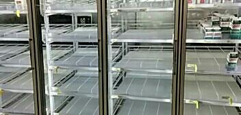

> Wow crazy disappointed in this. After having it previous... (Wild Saison Barrel Aged Brett) http://untp.beer/s/c135166936 #photo

 [Sat Dec 06 02:23:52 +0000 2014](https://twitter.com/nhudson/status/541055391464177665)

----

Replying to [@siwelwerd and @CarboyJunkies](https://twitter.com/siwelwerd/status/541270195721891841)

> I'm looking forward to the retake today . See you there. Good luck!

 [Sat Dec 06 16:47:21 +0000 2014](https://twitter.com/nhudson/status/541272694545985536)

----

> RT @captainsdead: The world needs a new @GlossaryTN record

 [Sat Dec 06 16:47:46 +0000 2014](https://twitter.com/nhudson/status/541272801626570752)

----

> Drinking a Fraxinus Maximus by @cahababrewing at @cahababrewing — http://untp.beer/s/c135431887

 [Sat Dec 06 21:51:03 +0000 2014](https://twitter.com/nhudson/status/541349122398498816)

----

> Drinking a Single Hop #7: Galaxy by @cahababrewing at @cahababrewing — http://untp.beer/s/c135440265

 [Sat Dec 06 22:06:06 +0000 2014](https://twitter.com/nhudson/status/541352910274437120)

----

> Drinking a Ryezome Rye Stout by @cahababrewing at @cahababrewing — http://untp.beer/s/c135460977

 [Sat Dec 06 22:41:39 +0000 2014](https://twitter.com/nhudson/status/541361858503245826)

----

> All these @Buick commercials makes me never want to buy one.

 [Sun Dec 07 02:20:59 +0000 2014](https://twitter.com/nhudson/status/541417056282103808)

----

> The bloom http://instagram.com/p/wT8QvejzJz/

 [Sun Dec 07 16:06:05 +0000 2014](https://twitter.com/nhudson/status/541624698694803456)

----

> Pulled sample of a Scottish ale the @carboyjunkies did back in May. Nose is wood and Jack Daniels.… http://instagram.com/p/wUOw5zDzLV/

 [Sun Dec 07 18:47:46 +0000 2014](https://twitter.com/nhudson/status/541665386706382848)

----

> 1st brew day in about 2.5 months. Golden Sour with Oats going on Bug Farm yeast and wine soaked oak… http://instagram.com/p/wUXfFSDzFC/

 [Sun Dec 07 20:03:59 +0000 2014](https://twitter.com/nhudson/status/541684565241528320)

----

> Yeti and Orca coolers. So they are 10000x more expensive with 10000x less room.

 [Thu Dec 11 16:16:01 +0000 2014](https://twitter.com/nhudson/status/543076749920464896)

----

> Drinking a Sourdough Wild Ale by @AlmanacBeer @ Hudson House of Ales and Sours — http://untp.beer/s/c136584636

 [Fri Dec 12 00:29:58 +0000 2014](https://twitter.com/nhudson/status/543201057052966912)

----

> Very nice! - Drinking a Bourbon Barrel Aged Ryezome Stout by @cahababrewing at @cahababrewing  — http://untp.beer/s/c136871063

 [Sat Dec 13 00:55:22 +0000 2014](https://twitter.com/nhudson/status/543569835662508033)

----

> Drinking a Ryezome Rye Stout by @cahababrewing at @cahababrewing — http://untp.beer/s/c136871261

 [Sat Dec 13 00:55:42 +0000 2014](https://twitter.com/nhudson/status/543569920408453120)

----

> Anyone know wtf is up with Vittora?  Tried to go there tonight and it was weird and I had to to Bittola. Ended up elsewhere.

 [Sat Dec 13 02:34:53 +0000 2014](https://twitter.com/nhudson/status/543594879851708416)

----

> Bacon scented dryer sheets. THIS NEEDS TO EXIST!!!!!!!!!!

 [Sat Dec 13 02:52:42 +0000 2014](https://twitter.com/nhudson/status/543599364212793344)

----

Replying to [@acnatta](https://twitter.com/acnatta/status/543600130843492352)

> sadly those are prank packs. I want the real thing!

 [Sat Dec 13 03:10:32 +0000 2014](https://twitter.com/nhudson/status/543603849760890881)

----

Replying to [@alanjones19](https://twitter.com/0xAlan/status/543599953625755648)

> do not the same menu?  If they make it more of Bettola I will not be going back.

 [Sat Dec 13 03:12:25 +0000 2014](https://twitter.com/nhudson/status/543604324895834113)

----

> So this is a 50lb bag of corn sugar (dextrose/not mine). Wonder what the guy will be using this… http://instagram.com/p/wjkItsDzAl/

 [Sat Dec 13 17:43:08 +0000 2014](https://twitter.com/nhudson/status/543823446657204225)

----

> Not my normal vice. Its pretty darn good though. Dry, plummy jam fresh pressed fruit and a bit of… http://instagram.com/p/wjxdyvjzM6/

 [Sat Dec 13 19:39:36 +0000 2014](https://twitter.com/nhudson/status/543852757640552448)

----

> Drinking a Classic Gueuze by Brasserie Cantillon @ No Dinner Before 9 — http://untp.beer/s/c137429584 #photo

 [Sun Dec 14 04:16:36 +0000 2014](https://twitter.com/nhudson/status/543982864594141184)

----

> Drinking a Kocoum Stout by @cahababrewing - http://untp.beer/s/c137476014

 [Sun Dec 14 06:58:46 +0000 2014](https://twitter.com/nhudson/status/544023674907815936)

----

> 30 min to go on an English Mild. 1.037SG and should be fine in a few days. One of my favorite beers to… http://instagram.com/p/wmUPcljzKd/

 [Sun Dec 14 19:21:57 +0000 2014](https://twitter.com/nhudson/status/544210705487245312)

----

> From last night. Amazing. - Drinking an Oblivion Sour Red by @wickedweedbeer @ No Dinner Before 9  — http://untp.beer/s/c137583960

 [Sun Dec 14 20:53:08 +0000 2014](https://twitter.com/nhudson/status/544233650284670976)

----

> Pulley's and Weights/Fingers through the notches in your spine/Circus Wheels. This song has everything. http://instagram.com/p/wsV11dDzMt/

 [Wed Dec 17 03:31:23 +0000 2014](https://twitter.com/nhudson/status/545058648389861376)

----

> I'm unaware of a snow coming our way. Apparently Target shoppers think the world is ending. 
> 
> 

 [Wed Dec 17 23:12:19 +0000 2014](https://twitter.com/nhudson/status/545355841210429440)

----

> Drinking a Grand Arbor by @stbcbeer at @johnscitydiner — http://untp.beer/s/c138711143

 [Sat Dec 20 01:48:53 +0000 2014](https://twitter.com/nhudson/status/546120018535399424)

----

> @johnscitydiner new decor is awesome! http://instagram.com/p/wz6DtojzMU/

 [Sat Dec 20 02:02:32 +0000 2014](https://twitter.com/nhudson/status/546123452667928576)

----

> Drinking a Liquidambar by @cahababrewing at @johnscitydiner — http://untp.beer/s/c138727677

 [Sat Dec 20 02:14:49 +0000 2014](https://twitter.com/nhudson/status/546126546155888641)

----

> @AnchorBrewing is the OSA out yet?  I can't find it on the shelves here in Alabama. Any idea when we will see it?

 [Sat Dec 20 18:29:12 +0000 2014](https://twitter.com/nhudson/status/546371757016625152)

----

> Drinking a Velvet Evil by @StraightToAle @ Hudson House of Ales and Sours — http://untp.beer/s/c138983447 #photo

 [Sat Dec 20 21:45:38 +0000 2014](https://twitter.com/nhudson/status/546421191339429889)

----

> 2013 bottle date. Always amazing beer. - Drinking a Chocolate Rain @ Hudson House of Ales and Sours - http://untp.beer/s/c139005036 #photo

 [Sat Dec 20 22:25:46 +0000 2014](https://twitter.com/nhudson/status/546431290413965312)

----

> Drinking an Irish Walker by @oldehickory @ Das haus — http://untp.beer/s/c139202808

 [Sun Dec 21 03:48:15 +0000 2014](https://twitter.com/nhudson/status/546512447771664384)

----

> Drinking a Dortmunder Gold by @GLBC_Cleveland @ Das haus — http://untp.beer/s/c139203402

 [Sun Dec 21 03:49:45 +0000 2014](https://twitter.com/nhudson/status/546512821862023168)

----

> Bozzy but good - Drinking a Momi Hiwa by @AveryBrewingCo @ Das haus  — http://untp.beer/s/c139209151

 [Sun Dec 21 04:01:22 +0000 2014](https://twitter.com/nhudson/status/546515745233203202)

----

> Drinking a Head Hunter IPA by @FatHeadsBeer @ Hudson House of Ales and Sours — http://untp.beer/s/c139316173 #photo

 [Sun Dec 21 18:06:55 +0000 2014](https://twitter.com/nhudson/status/546728536120504320)

----

> Too early?  Nah. Merry Krampus http://instagram.com/p/w_wMmSDzLm/

 [Wed Dec 24 16:27:15 +0000 2014](https://twitter.com/nhudson/status/547790618119118849)

----

> @mmayhew will I see you at Wallgreens later tonight?

 [Wed Dec 24 22:37:32 +0000 2014](https://twitter.com/nhudson/status/547883802534506498)

----

Replying to [@mmayhew](https://twitter.com/mmayhew/status/547884266450067456)

> wow. Really disappointed in you this year.

 [Wed Dec 24 23:17:44 +0000 2014](https://twitter.com/nhudson/status/547893919288401920)

----

> Merry Christmas everyone! - Drinking a Merry Christmas &amp; Happy New Year (Our Special Ale) (2012) - http://untp.beer/s/c140591035 #photo

 [Thu Dec 25 20:56:58 +0000 2014](https://twitter.com/nhudson/status/548220882649640962)

----

> Drinking a L'Brett d'Or Grand Cru by @CrookedStave - http://untp.beer/s/c140649603 #photo

 [Thu Dec 25 22:39:51 +0000 2014](https://twitter.com/nhudson/status/548246771865235456)

----

> 2011 Bottle - Drinking an Oude Geuze Golden Blend by @3fonteinen - http://untp.beer/s/c140659366 #photo

 [Thu Dec 25 22:56:50 +0000 2014](https://twitter.com/nhudson/status/548251049321308161)

----

> My parents keep it classy for Christmas. http://instagram.com/p/xIWoaYjzF0/

 [Sun Dec 28 00:37:01 +0000 2014](https://twitter.com/nhudson/status/549001036124659713)

----

> I totally hated Santa http://instagram.com/p/xIWrW_jzF8/

 [Sun Dec 28 00:37:25 +0000 2014](https://twitter.com/nhudson/status/549001137303855104)

----

> Today is everyone cough and clear your throat at work day.

 [Mon Dec 29 20:06:42 +0000 2014](https://twitter.com/nhudson/status/549657785542385666)

----

> Wow this beer is... (2011 Stone Old Guardian Barley Wine Aged In Temecula Red Wine Barrels) http://untp.beer/s/c142758188 #photo

 [Wed Dec 31 23:09:08 +0000 2014](https://twitter.com/nhudson/status/550428472473296896)

----

> Drinking a Rueuze (2012) by @thebruery @ Hudson House of Ales and Sours — http://untp.beer/s/c142950744 #photo

 [Thu Jan 01 02:46:46 +0000 2015](https://twitter.com/nhudson/status/550483241246150656)

----

> Not as good as I w... (Straight To Ale International Space Saison (Chardonnay Barrel Aged)) http://untp.beer/s/c143014065 #photo

 [Thu Jan 01 03:52:22 +0000 2015](https://twitter.com/nhudson/status/550499750215450625)

----

> This beer is strangely good.... (4th Anniversary Chocolate Coconut Almond) http://untp.beer/s/c143018180 #photo

 [Thu Jan 01 03:56:55 +0000 2015](https://twitter.com/nhudson/status/550500894077644800)

----

Replying to [@siwelwerd](https://twitter.com/siwelwerd/status/550504967539142656)

> they are lacking. STA does make some decent beers but I agree that most beers in state are lacking.

 [Thu Jan 01 05:08:03 +0000 2015](https://twitter.com/nhudson/status/550518795232870401)

----

> How did Joey Galloway get a job being on TV?

 [Thu Jan 01 05:08:34 +0000 2015](https://twitter.com/nhudson/status/550518924572651522)

----

Replying to [@siwelwerd](https://twitter.com/nhudson/status/550518795232870401)

> ill add. We have some good ones in state but most are very lacking. I can think of 1 or 2 that are good that I want to  have.

 [Thu Jan 01 05:14:41 +0000 2015](https://twitter.com/nhudson/status/550520465312456704)