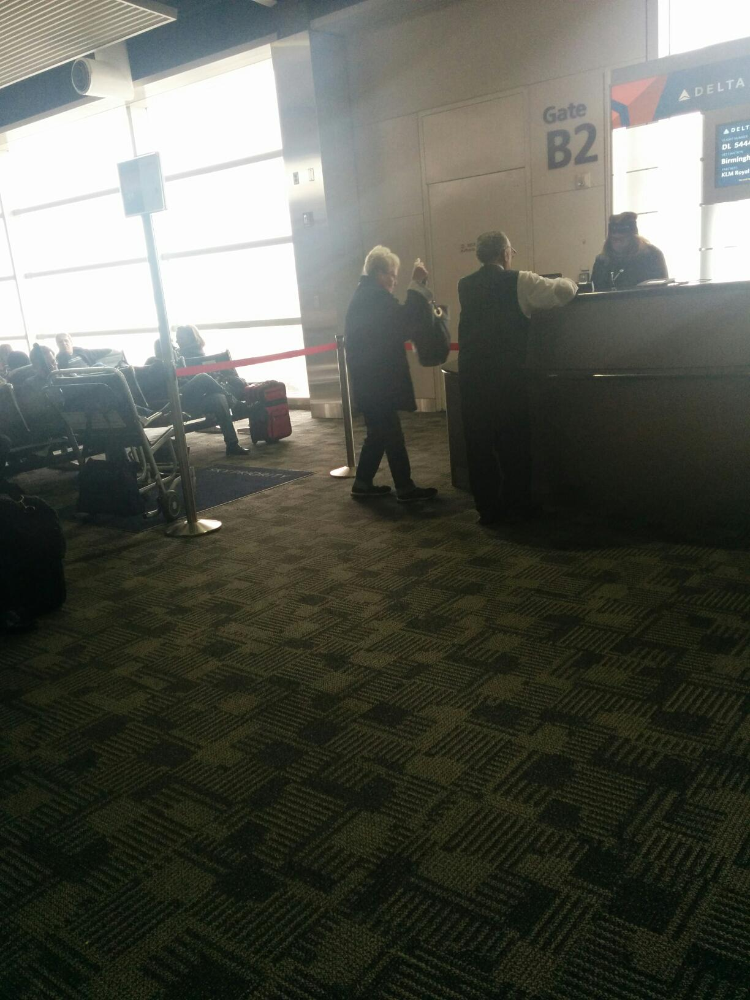

> @jasonrobert shall I expect a Boston dystopia tomorrow when I arrive?

 [Mon Feb 02 03:20:27 +0000 2015](https://twitter.com/nhudson/status/562088128534827008)

----

Replying to [@jasonrobert](https://twitter.com/jasonrobert/status/562088660729081856)

> I fully expect snow and a burning car as soon as I step off the plane.

 [Mon Feb 02 03:27:45 +0000 2015](https://twitter.com/nhudson/status/562089965186998272)

----

> Plane rerouted through Detroit going to Boston. Going through one dystopia to another.

 [Mon Feb 02 19:55:23 +0000 2015](https://twitter.com/nhudson/status/562338509634416640)

----

> Oh @delta how terrible your service is. No announcement on delayed flight and no one around to ask.

 [Mon Feb 02 20:59:12 +0000 2015](https://twitter.com/nhudson/status/562354572858253312)

----

> Been trying for this the 2nd week to get to Boston. @delta keep rerouting then cancelling or have very large delays. Terrible

 [Mon Feb 02 21:00:29 +0000 2015](https://twitter.com/nhudson/status/562354892720078848)

----

> @jasonrobert week two of trying to get to Boston has failed. No idea when I'll be back. Very sad. I'm now stuck in Detroit

 [Tue Feb 03 02:49:33 +0000 2015](https://twitter.com/nhudson/status/562442739695226880)

----

> Drinking an Oronoko Cocoa Stout by @RoundBarnBrews - http://untp.beer/s/c151920495

 [Tue Feb 03 03:13:58 +0000 2015](https://twitter.com/nhudson/status/562448883847294976)

----

Replying to [@jasonrobert](https://twitter.com/jasonrobert/status/562442982608363520)

> yes, yes we do. I'm very upset by this. I hope to be able to come back in a few weeks.

 [Tue Feb 03 03:39:58 +0000 2015](https://twitter.com/nhudson/status/562455429184487425)

----

> Stuck in Detroit and found some craft. - Drinking a Bonfire Brown by @saugatuckbrew at @embassysuites  — http://untp.beer/s/c151926174

 [Tue Feb 03 03:42:41 +0000 2015](https://twitter.com/nhudson/status/562456110377234432)

----

> Drinking a Golden Export by @GBBrewingCo at @dtweetin — http://untp.beer/s/c151955082

 [Tue Feb 03 16:14:27 +0000 2015](https://twitter.com/nhudson/status/562645301350387712)

----

> Drinking a Blonde Bock by @GBBrewingCo at @dtweetin — http://untp.beer/s/c151955782

 [Tue Feb 03 16:34:28 +0000 2015](https://twitter.com/nhudson/status/562650338160025603)

----

> I don't know why these GB beers have such low raitings. They are excellab... (Czech Style Pilsner) http://untp.beer/s/c151971442

 [Tue Feb 03 20:14:01 +0000 2015](https://twitter.com/nhudson/status/562705589114241026)

----

> Look I know you're old. But if you're up standing and walking around you do jot need a wheel chair 
> 
> 

 [Tue Feb 03 20:53:52 +0000 2015](https://twitter.com/nhudson/status/562715618915659776)

----

Replying to [@siwelwerd](https://twitter.com/siwelwerd/status/563167605964673024)

> always

 [Thu Feb 05 02:55:24 +0000 2015](https://twitter.com/nhudson/status/563168985810993152)

----

> Enjoying a Stone Enjoy By 02.14.15 IPA by @StoneBrewingCo @ Hudson House of Ales and Sours — http://untp.beer/s/c152401314 #photo

 [Fri Feb 06 01:43:34 +0000 2015](https://twitter.com/nhudson/status/563513298394820608)

----

> Sad Eeyore is sad. http://instagram.com/p/y16xMjDzIo/

 [Sun Feb 08 13:50:01 +0000 2015](https://twitter.com/nhudson/status/564420888981151745)

----

> Found an arcade version of Tux Racer. Used to spend many an hour playing this. http://instagram.com/p/y2pkf1DzJX/

 [Sun Feb 08 20:38:58 +0000 2015](https://twitter.com/nhudson/status/564523806690377728)

----

> When/How did mom jeans become fashionable to women who aren't mother's?

 [Sun Feb 08 22:10:07 +0000 2015](https://twitter.com/nhudson/status/564546743464120323)

----

> Always a favorite. - Drinking a Saison Dupont by Brasserie Dupont - http://untp.beer/s/c153603492

 [Mon Feb 09 02:33:26 +0000 2015](https://twitter.com/nhudson/status/564613009885384704)

----

> Drinking a Hi-Res (2015) by @sixpoint - http://untp.beer/s/c153737108

 [Tue Feb 10 01:03:38 +0000 2015](https://twitter.com/nhudson/status/564952799805714432)

----

> Love these beers. Glad we can get Sixpoint now! - Drinking a Resin by @sixpoint - http://untp.beer/s/c153744637

 [Tue Feb 10 01:27:41 +0000 2015](https://twitter.com/nhudson/status/564958853293694977)

----

> 2015 Bottle - Drinking a La Folie (Lips of Faith) by @newbelgium - http://untp.beer/s/c153758779

 [Tue Feb 10 02:14:26 +0000 2015](https://twitter.com/nhudson/status/564970619339800577)

----

> At Universal. - Drinking a Duff by @FLORIDABEER - http://untp.beer/s/c153832298

 [Tue Feb 10 19:16:27 +0000 2015](https://twitter.com/nhudson/status/565227815604600832)

----

> Absolutely one of my favorite IPA's. - Drinking a Head Hunter IPA by @FatHeadsBeer - http://untp.beer/s/c153893861

 [Wed Feb 11 00:44:51 +0000 2015](https://twitter.com/nhudson/status/565310459486941184)

----

> At Epcot in Norway. - Drinking a Carlsberg by @carlsberggroup - http://untp.beer/s/c154009481

 [Wed Feb 11 19:28:34 +0000 2015](https://twitter.com/nhudson/status/565593254381780993)

----

> UK at Epcot. - Drinking a Pub Ale by @abinbevnews - http://untp.beer/s/c154028917

 [Wed Feb 11 21:48:13 +0000 2015](https://twitter.com/nhudson/status/565628397934878720)

----

> I dont expext much while at Epcot, but i do expext a clean glass. This is just gross. http://instagram.com/p/y-gH1GDzPb/

 [Wed Feb 11 21:50:20 +0000 2015](https://twitter.com/nhudson/status/565628930653442050)

----

> Drinking an Altenmünster Oktoberfest by Allguer Brauhaus - http://untp.beer/s/c154108420

 [Thu Feb 12 01:56:53 +0000 2015](https://twitter.com/nhudson/status/565690976996708353)

----

> Epcot Germany - Drinking a Radeberger Pilsner by Radeberger Gruppe - http://untp.beer/s/c154108621

 [Thu Feb 12 01:57:15 +0000 2015](https://twitter.com/nhudson/status/565691070194151425)

----

> Just posted a photo http://instagram.com/p/y-_rLyDzO1/

 [Thu Feb 12 02:26:02 +0000 2015](https://twitter.com/nhudson/status/565698314151415808)

----

> Drinking a Head Hunter IPA by @FatHeadsBeer - http://untp.beer/s/c154635354

 [Sat Feb 14 01:48:49 +0000 2015](https://twitter.com/nhudson/status/566413721694904320)

----

> Drinking a Resin by @sixpoint @ Hudson House of Ales and Sours — http://untp.beer/s/c154665322

 [Sat Feb 14 02:29:43 +0000 2015](https://twitter.com/nhudson/status/566424016769282049)

----

> Drinking a Snake Handler Double IPA by @GPBrewing @ Hudson House of Ales and Sours — http://untp.beer/s/c154989573

 [Sat Feb 14 22:24:39 +0000 2015](https://twitter.com/nhudson/status/566724730133442560)

----

> My wife knows me all too well. http://instagram.com/p/zGdnoSjzEk/

 [Sun Feb 15 00:02:23 +0000 2015](https://twitter.com/nhudson/status/566749325813104641)

----

> VD steaks about to hit up the #bge http://instagram.com/p/zGeEyFjzF0/

 [Sun Feb 15 00:06:22 +0000 2015](https://twitter.com/nhudson/status/566750327148670977)

----

> Wife approved http://instagram.com/p/zGnzA1jzKH/

 [Sun Feb 15 01:31:19 +0000 2015](https://twitter.com/nhudson/status/566771707026079745)

----

> Drinking a Rodenbach Caractère Rouge by @rodenbachbeer @ Hudson House of Ales and Sours — http://untp.beer/s/c155137157 #photo

 [Sun Feb 15 01:46:45 +0000 2015](https://twitter.com/nhudson/status/566775588661526528)

----

> Drinking a Bigfoot (2015) by @SierraNevada @ Hudson House of Ales and Sours — http://untp.beer/s/c155373194

 [Sun Feb 15 20:35:41 +0000 2015](https://twitter.com/nhudson/status/567059695417196544)

----

Replying to [@vbatts, @lenovo and @Broadcom](https://twitter.com/vbatts/status/567738891734904832)

> amen brother. Having the same issue with my t440. It sucks terribly.

 [Tue Feb 17 19:49:42 +0000 2015](https://twitter.com/nhudson/status/567772897356177409)

----

> @vbatts ran into push-it today. I thought fondly of you.

 [Tue Feb 17 19:50:13 +0000 2015](https://twitter.com/nhudson/status/567773027408965633)

----

Replying to [@MagicCityBurn](https://twitter.com/MagicCityBurn/status/566755786278182912)

> how do you like it?  I just have an electric element that works fairly well

 [Tue Feb 17 19:51:44 +0000 2015](https://twitter.com/nhudson/status/567773412043390976)

----

Replying to [@vbatts, @lenovo and @Broadcom](https://twitter.com/vbatts/status/567773488002629632)

> yeah mine was supposed to have that chip but it was ordered incorrectly, I was told

 [Tue Feb 17 19:53:37 +0000 2015](https://twitter.com/nhudson/status/567773884120698880)

----

> So effin good! - Drinking a Robust Porter (Small Batch) by @cahababrewing at @cahababrewing  — http://untp.beer/s/c156129995

 [Thu Feb 19 01:59:54 +0000 2015](https://twitter.com/nhudson/status/568228449124540416)

----

> Amazing. - Drinking a Single Hops #8 Mosiac Hop by @cahababrewing at @cahababrewing  — http://untp.beer/s/c156131034

 [Thu Feb 19 02:02:18 +0000 2015](https://twitter.com/nhudson/status/568229055637659648)

----

> @jclyde_bham = awesome - Drinking a Vintage 2012 by @rodenbachbeer at @jclyde_bham  — http://untp.beer/s/c156176433 #photo

 [Thu Feb 19 04:31:47 +0000 2015](https://twitter.com/nhudson/status/568266672836100097)

----

> Drinking a Barrel-Aged Lil Poison - Cuvaison Port Wine by @fairhopebrewing at @jclyde_bham — http://untp.beer/s/c156180524

 [Thu Feb 19 04:55:26 +0000 2015](https://twitter.com/nhudson/status/568272623467159552)

----

> A coworker has the most epic Kansas jacket in the world. She wears it with pride. http://instagram.com/p/zSdmaBjzEy/

 [Thu Feb 19 15:53:06 +0000 2015](https://twitter.com/nhudson/status/568438133576089602)

----

> Seriously one of the better barrel aged stouts out th... (Double Barrel Rye Imperial Stout) http://untp.beer/s/c156534624 #photo

 [Fri Feb 20 22:44:46 +0000 2015](https://twitter.com/nhudson/status/568904118930157568)

----

> Drinking a Single Hops #8 Mosiac Hop by @cahababrewing at @cahababrewing — http://untp.beer/s/c156545275 #photo

 [Fri Feb 20 23:06:24 +0000 2015](https://twitter.com/nhudson/status/568909562872500225)

----

> Drinking a Pale Ale by @GPBrewing at @johnscitydiner — http://untp.beer/s/c156597623 #photo

 [Sat Feb 21 00:30:56 +0000 2015](https://twitter.com/nhudson/status/568930839024803840)

----

> @johnscitydiner beef short ribs and grits. Paired with a @gpbrewing Pale Ale. Get some http://instagram.com/p/zV_t-9DzG6/

 [Sat Feb 21 00:48:57 +0000 2015](https://twitter.com/nhudson/status/568935373201653761)

----

> Brewing jonathan_hay recipe for Hop Damn APA today. Should be tasty with all these kiwi hops. http://instagram.com/p/zaftJMjzJA/

 [Sun Feb 22 18:45:26 +0000 2015](https://twitter.com/nhudson/status/569568664447533057)

----

> Voted!!!  RT @craighendry @nhudson #Vote4Craig #homebrew
> http://www.homebrewersassociation.org/membership/aha-governing-committee/

 [Mon Feb 23 03:40:52 +0000 2015](https://twitter.com/nhudson/status/569703409915465728)

----

> Live long and prosper Leonard Nimoy/William Bell/Spock. Very sad day. RIP

 [Fri Feb 27 18:03:44 +0000 2015](https://twitter.com/nhudson/status/571370108683051009)

----

> RT @benheck: Leonard Nimoy is gone. And the Kardashians continue to spawn. There is no God.

 [Fri Feb 27 18:19:49 +0000 2015](https://twitter.com/nhudson/status/571374156115087361)

----

> RIP Old Friend. Live Long and Prosper. https://instagram.com/p/znVIbvDzLn/

 [Fri Feb 27 18:23:10 +0000 2015](https://twitter.com/nhudson/status/571374999296086016)

----

> Drinking a Hi-Res (2015) by @sixpoint - http://untp.beer/s/c158954458 #photo

 [Sat Feb 28 22:11:36 +0000 2015](https://twitter.com/nhudson/status/571794874971897856)