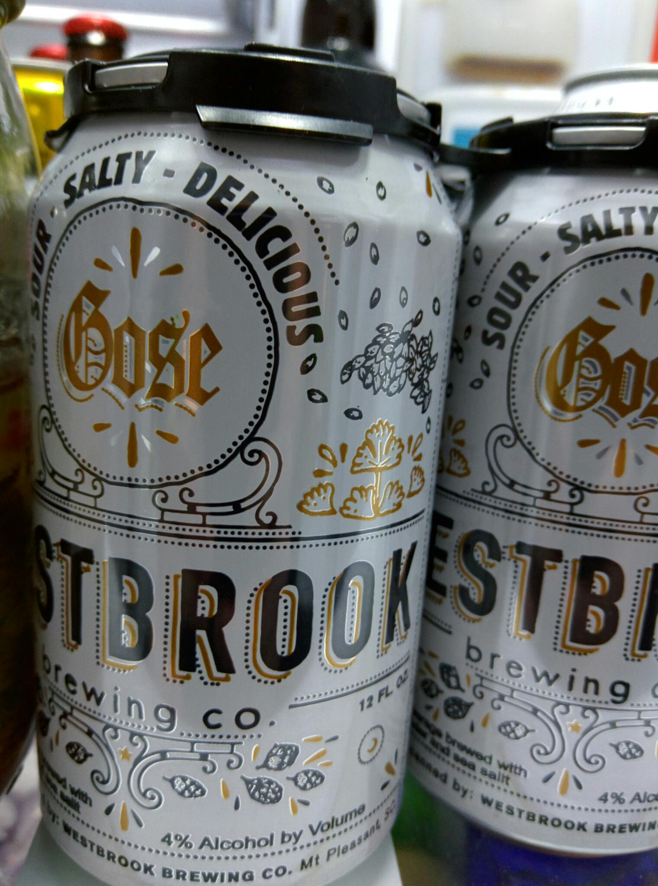

> @therealjoelp @jasonrobert I know y'all think you have the best beer up there. I disagree its in my fridge 
> 
> 

 [Fri May 01 12:48:39 +0000 2015](https://twitter.com/nhudson/status/594121250861096960)

----

> RT @freethehops: Tickets for MCBF now available for $38 and no Ticketmaster fees at @JClyde_Bham starting today!!

 [Fri May 01 14:28:43 +0000 2015](https://twitter.com/nhudson/status/594146435047751680)

----

> Drinking a Single Hop #8 Mosaic by @cahababrewing at @cahababrewing — http://untp.beer/s/c178236246

 [Sat May 02 01:21:57 +0000 2015](https://twitter.com/nhudson/status/594310827890585603)

----

> 2013 bottle. Refreshingly dry, with slight hints of funk. - Drinking a Cidre Nouveau by @virtuecider - http://untp.beer/s/c179073258 #photo

 [Sun May 03 19:55:50 +0000 2015](https://twitter.com/nhudson/status/594953533855834112)

----

> BM in the PM...... Genius #bobsburgers

 [Mon May 04 01:01:15 +0000 2015](https://twitter.com/nhudson/status/595030392115240960)

----

> From last night at Iron City. https://instagram.com/p/2ZA8zoDzEs/

 [Thu May 07 18:31:38 +0000 2015](https://twitter.com/nhudson/status/596381892632522752)

----

> Sazerac to kick off a long weekend in NOLA. https://instagram.com/p/2Zj9GiDzPr/

 [Thu May 07 23:37:30 +0000 2015](https://twitter.com/nhudson/status/596458868256985089)

----

> GB IPA. Unheard of...  Its surprisingly really good. - Drinking a Hop Bomb @ Gordon Biersch Brewery Restaurant - http://untp.beer/s/c180153355

 [Fri May 08 03:06:47 +0000 2015](https://twitter.com/nhudson/status/596511534064508929)

----

Replying to [@_TheBlack77](https://twitter.com/_TheBlack77/status/596711152760926208)

> yeah I was shocked it was even made.

 [Fri May 08 19:03:14 +0000 2015](https://twitter.com/nhudson/status/596752235209580545)

----

> Drinking a Forêt Noire by Brasserie Trois Dames at @avenuepubnola — http://untp.beer/s/c180303618

 [Fri May 08 21:07:55 +0000 2015](https://twitter.com/nhudson/status/596783613653422080)

----

> Drinking a Peach IPA by @BayouTecheBiere at @avenuepubnola — http://untp.beer/s/c180318033

 [Fri May 08 21:38:36 +0000 2015](https://twitter.com/nhudson/status/596791335576850433)

----

> Drinking an Oude Kriek by @3fonteinen at @avenuepubnola — http://untp.beer/s/c180327573 #photo

 [Fri May 08 21:57:57 +0000 2015](https://twitter.com/nhudson/status/596796204547203073)

----

> Just used @Uber in New Orleans. Stupid simple and easy to use. Why do we not have this in Birmingham???

 [Sat May 09 05:08:53 +0000 2015](https://twitter.com/nhudson/status/596904653163462656)

----

> Metz, Wednesday, Workplay. I'm ready to have my face melted off. https://instagram.com/p/2ho4NnDzAb/

 [Mon May 11 02:54:27 +0000 2015](https://twitter.com/nhudson/status/597595595285598208)

----

> RT @freethehops: Want to get into #magiccitybrewfest for free?  If you volunteer you can! http://www.magiccitybrewfest.com/volunteer

 [Wed May 13 13:23:43 +0000 2015](https://twitter.com/nhudson/status/598478731510964225)

----

> Drinking a Judge Roy Bean by @fairhopebrewing at @hopcitybham — http://untp.beer/s/c182000219

 [Wed May 13 22:46:59 +0000 2015](https://twitter.com/nhudson/status/598620481407815680)

----

> Drinking a Kiwi Kolsch by @cahababrewing at @cahababrewing — http://untp.beer/s/c182036796

 [Thu May 14 00:03:36 +0000 2015](https://twitter.com/nhudson/status/598639765446078464)

----

> Thanks to @METZtheband for making my ears bleed tonight at @WorkPlayBham. Awesome show!

 [Thu May 14 04:57:14 +0000 2015](https://twitter.com/nhudson/status/598713660119330817)

----

> RT @freethehops: We are still looking for volunteers for the Saturday session if #magiccitybrewfest. Sign up and get in Sat for free! http:…

 [Thu May 14 15:58:16 +0000 2015](https://twitter.com/nhudson/status/598880011345596416)

----

> Drinking an Eureka (w/ Citra) by @treehousebrewco @ Hudson House of Ales and Sours — http://untp.beer/s/c182310075 #photo

 [Thu May 14 23:47:57 +0000 2015](https://twitter.com/nhudson/status/598998213610315778)

----

> Even a Gose @jasonrobert will enjoy. - Drinking a Jammer by @sixpoint at @jclyde_bham  — http://untp.beer/s/c182618129

 [Fri May 15 22:21:41 +0000 2015](https://twitter.com/nhudson/status/599338889371869184)

----

> Got my scores sheets back from War of the Wort. My 1 beer was judged by @craighendry and @wickdawg. Awesome score sheets back guys Good job!

 [Wed May 20 03:15:10 +0000 2015](https://twitter.com/nhudson/status/600862299658813440)

----

Replying to [@wickdawg and @craighendry](https://twitter.com/wickdawg/status/600863057263390720)

> Eng Barleywine scored a 39. Really well written score sheets. Even though I didnt place I appreciate the feedback

 [Wed May 20 03:27:19 +0000 2015](https://twitter.com/nhudson/status/600865358317264896)

----

> RT @alabamabrewers: BIR adopted 19-5.

 [Thu May 21 20:13:39 +0000 2015](https://twitter.com/nhudson/status/601480998992379904)

----

> RT @alabamabrewers: Committee substitute is adopted using previous roll.

 [Thu May 21 20:14:21 +0000 2015](https://twitter.com/nhudson/status/601481175010508802)

----

> RT @alabamabrewers: Motion to carry over. They are voting rather than voice vote.

 [Thu May 21 20:16:29 +0000 2015](https://twitter.com/nhudson/status/601481711952756736)

----

> RT @alabamabrewers: Motion to carry over fails.

 [Thu May 21 20:18:46 +0000 2015](https://twitter.com/nhudson/status/601482283338588160)

----

> RT @alabamabrewers: Carried over to call of chair.

 [Thu May 21 20:18:49 +0000 2015](https://twitter.com/nhudson/status/601482297225904128)

----

> RT @alabamabrewers: So this means we are delayed for now. It passed a procedural hoop and can be brought back up by the chair of the commit…

 [Thu May 21 20:41:29 +0000 2015](https://twitter.com/nhudson/status/601488003501006848)

----

> RT @JClyde_Bham: Hope you'll join us at Free the Hops Magic City Brewfest! We'll be sponsoring the Alabama Cask Garden which will... http:/…

 [Thu May 21 22:44:20 +0000 2015](https://twitter.com/nhudson/status/601518919824867335)

----

> Nothing like coming home and finding that your motherboard quit working. After an hour of… https://instagram.com/p/29qUCIjzNA/

 [Fri May 22 00:05:43 +0000 2015](https://twitter.com/nhudson/status/601539399684337666)

----

> Small tasting of Islandic beers - Drinking an Icelandic White Ale @ Hudson House of Ales and Sours - http://untp.beer/s/c184642627 #photo

 [Fri May 22 00:12:15 +0000 2015](https://twitter.com/nhudson/status/601541041892794370)

----

> Drinking an Arctic Berry Ale by @EinstokBeer - http://untp.beer/s/c184644320 #photo

 [Fri May 22 00:14:01 +0000 2015](https://twitter.com/nhudson/status/601541489194356736)

----

> Drinking an Icelandic Pale Ale by @EinstokBeer @ Hudson House of Ales and Sours — http://untp.beer/s/c184645184 #photo

 [Fri May 22 00:15:36 +0000 2015](https://twitter.com/nhudson/status/601541887980380160)

----

Replying to [@therealjoelp and @EinstokBeer](https://twitter.com/therealjoelp/status/601541854136524801)

> really refreshing beer. I liked their Toasted Porter the best though.

 [Fri May 22 01:16:27 +0000 2015](https://twitter.com/nhudson/status/601557199903653888)

----

> Not as bad as I was expecting. The blueberry tastes artifi... (Woodchuck Summer Hard Cider) http://untp.beer/s/c184706535 #photo

 [Fri May 22 02:07:53 +0000 2015](https://twitter.com/nhudson/status/601570144196960256)

----

> Chamomile... Not a fan - Drinking an Oopsy Daisy by @WoodchuckCider @ Hudson House of Ales and Sours  — http://untp.beer/s/c184707996 #photo

 [Fri May 22 02:10:35 +0000 2015](https://twitter.com/nhudson/status/601570823015661568)

----

> Wow great apple flavor, dry and very refreshing. - Drinking a Gumption @ Hudson House of Ales and Sours - http://untp.beer/s/c184708857 #photo

 [Fri May 22 02:12:25 +0000 2015](https://twitter.com/nhudson/status/601571283340533760)

----

> Hops kind of make this meh.  Has a weird aftertaste and the cascade really d... (Hopsation) http://untp.beer/s/c184710574 #photo

 [Fri May 22 02:15:35 +0000 2015](https://twitter.com/nhudson/status/601572083286601728)

----

Replying to [@whiteoi](https://twitter.com/kimberlyeng12/status/601571743778492416)

> I was pleasantly surprised. The rest of them were meh

 [Fri May 22 16:04:40 +0000 2015](https://twitter.com/nhudson/status/601780728200822784)

----

> Finally got my new name tag. #bjcp https://instagram.com/p/3AK93ejzNa/

 [Fri May 22 23:29:32 +0000 2015](https://twitter.com/nhudson/status/601892681783091201)

----

> Drinking a Laka Laka Pineapple Hefe by @HornyGoatBrewCo @ Hudson House of Ales and Sours — http://untp.beer/s/c185035349

 [Sat May 23 00:14:20 +0000 2015](https://twitter.com/nhudson/status/601903953513684992)

----

> Drinking a Tango Delta by @HornyGoatBrewCo @ Hudson House of Ales and Sours — http://untp.beer/s/c185053285

 [Sat May 23 00:35:39 +0000 2015](https://twitter.com/nhudson/status/601909318997377027)

----

> Drinking a Good Morning by @treehousebrewco @ Hudson House of Ales and Sours — http://untp.beer/s/c185057528

 [Sat May 23 00:41:28 +0000 2015](https://twitter.com/nhudson/status/601910785095380993)

----

> This might be one of he worst beers I've ever tasted. Artifici... (Chocolate Peanut Butter Porter) http://untp.beer/s/c185130286

 [Sat May 23 02:16:44 +0000 2015](https://twitter.com/nhudson/status/601934758063558656)

----

> Easy drinking Gose. - Drinking a Jammer by @sixpoint @ Hudson House of Ales and Sours  — http://untp.beer/s/c185438593 #photo

 [Sat May 23 20:32:42 +0000 2015](https://twitter.com/nhudson/status/602210569429594113)

----

> Sloe Gin Fizz.  4oz Plymouth Sloe Gin, 1oz Lemon Juice, 1oz simple syrup. Shake with ice till… https://instagram.com/p/3Ck6QSjzCS/

 [Sat May 23 21:54:43 +0000 2015](https://twitter.com/nhudson/status/602231206781067264)

----

> Drinking a Dunkleweizen by @cahababrewing at @cahababrewing — http://untp.beer/s/c185560313

 [Sat May 23 23:00:55 +0000 2015](https://twitter.com/nhudson/status/602247867768639489)

----

> Drinking a Peach Wheat W/Lacto by @bluepantsbrew at @hopcitybham — http://untp.beer/s/c185610413

 [Sun May 24 00:01:28 +0000 2015](https://twitter.com/nhudson/status/602263106333626369)

----

> Hey yeah let me card you to get into this coffee shop. Stupid

 [Sun May 24 02:23:52 +0000 2015](https://twitter.com/nhudson/status/602298939908427776)

----

> Drinking an Atalanta by @orpheusbrewing - http://untp.beer/s/c186764377

 [Wed May 27 01:11:11 +0000 2015](https://twitter.com/nhudson/status/603367813835837440)

----

> Drinking a DaySpring by @creaturebeer - http://untp.beer/s/c186767173

 [Wed May 27 01:19:19 +0000 2015](https://twitter.com/nhudson/status/603369862342287361)

----

> Drinking an Atalanta by @orpheusbrewing @ Hudson House of Ales and Sours — http://untp.beer/s/c187473563 #photo

 [Fri May 29 22:07:38 +0000 2015](https://twitter.com/nhudson/status/604408785256464384)

----

> Cooking burgers and bacon on the #bge tonight https://instagram.com/p/3UwtSpjzNb/

 [Sat May 30 23:24:08 +0000 2015](https://twitter.com/nhudson/status/604790424864215041)

----

> So glad this beer is now in brown bottles. - Drinking a Pilsner Urquell @ Hudson House of Ales and Sours - http://untp.beer/s/c188199535 #photo

 [Sun May 31 00:24:48 +0000 2015](https://twitter.com/nhudson/status/604805693082898433)

----

> Drinking a Jammer by @sixpoint @ Hudson House of Ales and Sours — http://untp.beer/s/c188207313 #photo

 [Sun May 31 00:33:46 +0000 2015](https://twitter.com/nhudson/status/604807949123493888)

----

> Now playing.... https://instagram.com/p/3VFAO8DzG6/

 [Sun May 31 02:21:29 +0000 2015](https://twitter.com/nhudson/status/604835055127654400)

----

> Drinking an Imperial Pilsner by @yellowhammerale at @yellowhammerale — http://untp.beer/s/c188543263

 [Sun May 31 20:38:09 +0000 2015](https://twitter.com/nhudson/status/605111044047032320)

----

> Drinking a Cryptic Double IPA by Below the Radar @ Below the Radar — http://untp.beer/s/c188608174

 [Sun May 31 22:49:23 +0000 2015](https://twitter.com/nhudson/status/605144068943945729)