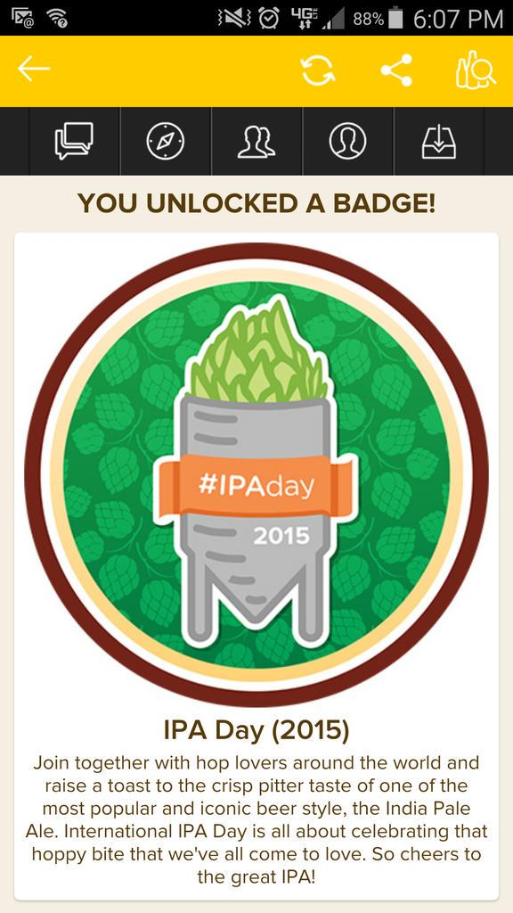
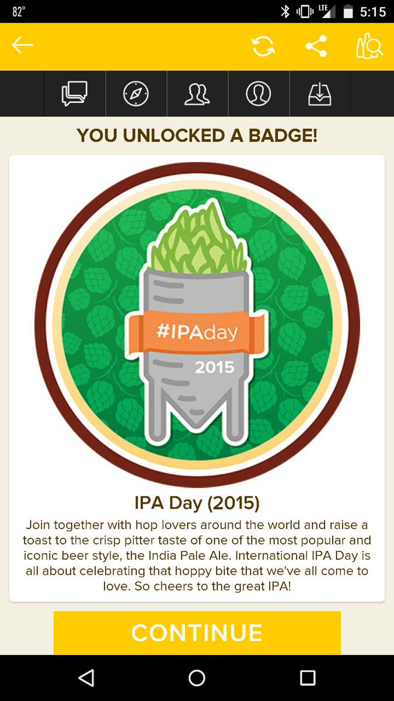
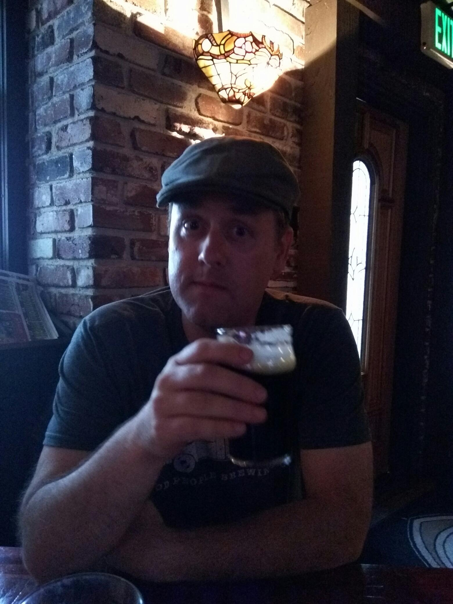

> Drinking a Harmony by @treehousebrewco @ Hudson House of Ales and Sours — http://untp.beer/s/c209794977 #photo

 [Sat Aug 01 21:19:05 +0000 2015](https://twitter.com/nhudson/status/627589389661683712)

----

> Found this yesterday. No idea there was a distillery in Opelika. https://instagram.com/p/55LPWojzMnv-gVIAyCYDLE8XcXPNwxXMeWW6g0/

 [Sun Aug 02 19:51:26 +0000 2015](https://twitter.com/nhudson/status/627929719950942208)

----

> A mosiac bomb. Wonderfully soft and easy to drink.... (Curiosity Twenty) http://untp.beer/s/c210277801 #photo

 [Sun Aug 02 20:23:55 +0000 2015](https://twitter.com/nhudson/status/627937896427819008)

----

Replying to [@jasonrobert, @untappd, @ECrumrine and @therealjoelp](https://twitter.com/jasonrobert/status/628326030890172417)

> Obviously misspelled.  BAE Crafted from here on out!

 [Mon Aug 03 22:07:17 +0000 2015](https://twitter.com/nhudson/status/628326297995972608)

----

Replying to [@jasonrobert and @therealjoelp](https://twitter.com/jasonrobert/status/628377511307669504)

> oh I love sourBaes. They are the bestest.

 [Tue Aug 04 01:35:43 +0000 2015](https://twitter.com/nhudson/status/628378751190102017)

----

Replying to [@therealjoelp and @jasonrobert](https://twitter.com/therealjoelp/status/628378955855343616)

> sadly I just got here. Flying out Wednesday. If a miracle happens and I can get out tomorrow I'll holla at bae

 [Tue Aug 04 01:37:24 +0000 2015](https://twitter.com/nhudson/status/628379172738629632)

----

Replying to [@jasonrobert and @therealjoelp](https://twitter.com/jasonrobert/status/628379018782445568)

> I fail at bae

 [Tue Aug 04 01:37:46 +0000 2015](https://twitter.com/nhudson/status/628379264652570624)

----

> It just rained and hailed here in Boston. You would have thought everyone was thinking the world was ending.

 [Tue Aug 04 20:29:28 +0000 2015](https://twitter.com/nhudson/status/628664068468031488)

----

> Drinking a Grapefruit Sculpin by @bpbrewing at @gaffwaltham — http://untp.beer/s/c210844466

 [Tue Aug 04 23:43:16 +0000 2015](https://twitter.com/nhudson/status/628712838538874880)

----

> @jasonrobert you would love this. - Drinking a Monk's Café Flemish Sour Ale by Brouwerij Van Steenberge - http://untp.beer/s/c210845615

 [Tue Aug 04 23:45:26 +0000 2015](https://twitter.com/nhudson/status/628713386361114624)

----

> Drinking a Bière de Mars by @jollypumpkin at @gaffwaltham — http://untp.beer/s/c210855182

 [Wed Aug 05 00:07:02 +0000 2015](https://twitter.com/nhudson/status/628718819842871297)

----

Replying to [@jasonrobert](https://twitter.com/jasonrobert/status/628725062141526016)

> you would like it.

 [Wed Aug 05 00:49:39 +0000 2015](https://twitter.com/nhudson/status/628729545085034496)

----

> Drinking a Fée Des Fleurs by @DTRBrewery at @dunngaherins — http://untp.beer/s/c210984026

 [Wed Aug 05 16:34:08 +0000 2015](https://twitter.com/nhudson/status/628967233193156608)

----

> Drinking a Funk'd Nelson by @nightshiftbeer at @nightshiftbeer — http://untp.beer/s/c210995498

 [Wed Aug 05 17:45:33 +0000 2015](https://twitter.com/nhudson/status/628985206926647296)

----

> Drinking a Funk'd Ella by @nightshiftbeer at @nightshiftbeer — http://untp.beer/s/c210996494

 [Wed Aug 05 17:51:52 +0000 2015](https://twitter.com/nhudson/status/628986794386792449)

----

> Drinking a Maracuya by @nightshiftbeer at @nightshiftbeer — http://untp.beer/s/c210996991

 [Wed Aug 05 17:54:33 +0000 2015](https://twitter.com/nhudson/status/628987469762048000)

----

> Picked up new shoes this week. Redwing Iron Rangers.  So far really… https://instagram.com/p/6BZYw6jzHkE43YYXyssfhL1tnVxofVDWP0oAQ0/

 [Thu Aug 06 00:28:58 +0000 2015](https://twitter.com/nhudson/status/629086729270611968)

----

> To the person at gate B24 in Atlanta that is crop dusting everyone please stop. Jesus

 [Thu Aug 06 01:19:16 +0000 2015](https://twitter.com/nhudson/status/629099385557749765)

----

> RT @jasonrobert: Hi @therealjoelp. Hi @nhudson. 
> 
> 

 [Thu Aug 06 22:09:35 +0000 2015](https://twitter.com/nhudson/status/629414039886675968)

----

> #IPADay! - Drinking a (Take The) Causeway IPA by @fairhopebrewing at @jclyde_bham  — http://untp.beer/s/c211365264

 [Thu Aug 06 22:15:49 +0000 2015](https://twitter.com/nhudson/status/629415606278823936)

----

Replying to [@therealjoelp and @jasonrobert](https://twitter.com/therealjoelp/status/629414004780363776)

> 

 [Thu Aug 06 22:16:06 +0000 2015](https://twitter.com/nhudson/status/629415678714490880)

----

> Drinking a Tangier by @stbcbeer at @jclyde_bham — http://untp.beer/s/c211375667

 [Thu Aug 06 22:33:40 +0000 2015](https://twitter.com/nhudson/status/629420097698942976)

----

> Drinking a White IPA by @cahababrewing at @jclyde_bham — http://untp.beer/s/c211377707

 [Thu Aug 06 22:37:04 +0000 2015](https://twitter.com/nhudson/status/629420955002118144)

----

> Drinking a Hoppy Feet 2.0 by @clownshoesbeer at @jclyde_bham — http://untp.beer/s/c211383484

 [Thu Aug 06 22:46:42 +0000 2015](https://twitter.com/nhudson/status/629423380417118208)

----

> Best DIPA in the state. - Drinking a Hop Hogan by @fairhopebrewing at @jclyde_bham  — http://untp.beer/s/c211392161

 [Thu Aug 06 23:00:44 +0000 2015](https://twitter.com/nhudson/status/629426912109199360)

----

> Drinking a Classic Saison by Blackberry Farm Brewery at @jclyde_bham — http://untp.beer/s/c211404849

 [Thu Aug 06 23:19:51 +0000 2015](https://twitter.com/nhudson/status/629431720945782784)

----

> RT @jasonrobert: FIXED. @nhudson waaaaaah I can't wait til you move back to Boston. Cc: @jasonrobert because. https://twitter.com/therealjoelp/status/629423689939951616

 [Thu Aug 06 23:22:50 +0000 2015](https://twitter.com/nhudson/status/629432473429114880)

----

> RT @therealjoelp: @nhudson waaaaaah I can't wait til you come back to Boston. Cc: @jasonrobert because.

 [Thu Aug 06 23:22:58 +0000 2015](https://twitter.com/nhudson/status/629432507549810688)

----

Replying to [@therealjoelp and @jasonrobert](https://twitter.com/therealjoelp/status/629423689939951616)

> I'll try to bring up some sours for us to try. Wait, for Joel and I to try.

 [Thu Aug 06 23:49:01 +0000 2015](https://twitter.com/nhudson/status/629439060524859392)

----

> So in love with this beer. - Drinking a Julius by @treehousebrewco @ Hudson House of Ales and Sours  — http://untp.beer/s/c212308958 #photo

 [Sat Aug 08 20:51:17 +0000 2015](https://twitter.com/nhudson/status/630119109120892928)

----

> Got a few pears today from the in laws. Guess I'll make a Perry now. https://instagram.com/p/6L0pqbjzPkI2ZDelnGDarmhPtBp458kbzMe-Y0/

 [Mon Aug 10 01:39:37 +0000 2015](https://twitter.com/nhudson/status/630554058340831232)

----

Replying to [@dartdog](https://twitter.com/dartdog/status/630790238563139584)

> mine will be delivered today as well. Looking forward to it.

 [Mon Aug 10 17:27:25 +0000 2015](https://twitter.com/nhudson/status/630792580918329344)

----

Replying to [@dartdog](https://twitter.com/dartdog/status/630797233361940481)

> I don't really use my gvoice so I ported it for now. I will eventually port my T-Mobile # though.

 [Mon Aug 10 17:47:47 +0000 2015](https://twitter.com/nhudson/status/630797705141448708)

----

Replying to [@dartdog](https://twitter.com/dartdog/status/630798698260393984)

> rethink porting?  Why is that?

 [Mon Aug 10 21:21:12 +0000 2015](https://twitter.com/nhudson/status/630851412575059968)

----

Replying to [@dartdog](https://twitter.com/dartdog/status/630854197118926848)

> well I was hoping to have both services for a month or so. Guess I'll go ahead and port my T-Mobile number over.

 [Mon Aug 10 22:22:16 +0000 2015](https://twitter.com/nhudson/status/630866781964361728)

----

> 75lbs of pears juiced. 5.5 gallons of a Common Perry at 1.045 SG. Camden… https://instagram.com/p/6OaR43DzH2mp_CPjodf1NHkGxKN6WoiLTMrGI0/

 [Tue Aug 11 01:46:54 +0000 2015](https://twitter.com/nhudson/status/630918279670951936)

----

Replying to [@jonoftherobbins](https://twitter.com/jonoftherobbins/status/630920961768861696)

> yeah threw a few of them away as they looked really bad but yeah. Ton of work, hope it works out.

 [Tue Aug 11 02:46:22 +0000 2015](https://twitter.com/nhudson/status/630933246591803392)

----

Replying to [@dartdog](https://twitter.com/dartdog/status/630880558873223168)

> ended up porting my tm#. Had to also reset my phone back to the fi 5.1.1 for it to take.

 [Tue Aug 11 02:47:39 +0000 2015](https://twitter.com/nhudson/status/630933567162449921)

----

Replying to [@jonoftherobbins](https://twitter.com/nhudson/status/630933246591803392)

> I'll add that I could have got more if I had a real cider press. Maybe another 1-1.5 gal

 [Tue Aug 11 02:50:18 +0000 2015](https://twitter.com/nhudson/status/630934233079488512)

----

> #proper?  Pretty close. Glad we finally have some decent beer in Birmingha... (Fairhope 51) http://untp.beer/s/c213656897 #photo

 [Wed Aug 12 23:17:06 +0000 2015](https://twitter.com/nhudson/status/631605357257822208)

----

Replying to [@siwelwerd](https://twitter.com/siwelwerd/status/631621479461883904)

> yeah its a bigger apa. I wouldn't say IPA. I didn't get onion, but there is something. It's FF and Saaz I think.

 [Thu Aug 13 02:18:59 +0000 2015](https://twitter.com/nhudson/status/631651129693220864)

----

Replying to [@siwelwerd](https://twitter.com/siwelwerd/status/631621479461883904)

> but again you're much better than me at picking up those tiny subtleties.

 [Thu Aug 13 02:20:05 +0000 2015](https://twitter.com/nhudson/status/631651405196042240)

----

Replying to [@jasonrobert, @JeffBC94 and @therealjoelp](https://twitter.com/jasonrobert/status/631876034292486145)

> I need this!!

 [Fri Aug 14 03:30:00 +0000 2015](https://twitter.com/nhudson/status/632031388208795648)

----

> Apparently there is a blend of hops call Fruity. Who knew...... (Fruity IPA (Small Batch)) http://untp.beer/s/c214336217 #photo

 [Fri Aug 14 23:04:26 +0000 2015](https://twitter.com/nhudson/status/632326944374267904)

----

Replying to [@MadFermentation and @TreeHouseBrewCo](https://twitter.com/MadFermentation/status/632320324466528257)

> you'll be in for a treat. Amazing beer and amazing Brewery.

 [Fri Aug 14 23:05:30 +0000 2015](https://twitter.com/nhudson/status/632327212847525889)

----

Replying to [@siwelwerd](https://twitter.com/siwelwerd/status/632340241152520192)

> its a bit heavy on the bitterness for me but the flavor is good. Fruity hops are surprisingly.. Fruity.

 [Sat Aug 15 01:55:48 +0000 2015](https://twitter.com/nhudson/status/632370071554387968)

----

> RT @talkbeerdotcom: Congrats on the soft opening @DeciduousBeer!

 [Sat Aug 15 15:38:02 +0000 2015](https://twitter.com/nhudson/status/632576991397593088)

----

> RT @jasonrobert: I spend most of my days doing something ridiculous and then immediately screaming 
> 
> I HAVE A MASTERS DEGREE.

 [Tue Aug 18 20:20:14 +0000 2015](https://twitter.com/nhudson/status/633735175956860930)

----

> Drinking an Imperial Peach Bu by @DeGardeBrewing @ Piggly Wiggly — http://untp.beer/s/c216168641

 [Thu Aug 20 00:39:11 +0000 2015](https://twitter.com/nhudson/status/634162727532036096)

----

> Drinking a Dortmunder Adambier by @bluepantsbrew @ Piggly Wiggly — http://untp.beer/s/c216168891

 [Thu Aug 20 00:39:31 +0000 2015](https://twitter.com/nhudson/status/634162811111911424)

----

> Drinking a Crystal Hero by @revbrewchicago @ Piggly Wiggly — http://untp.beer/s/c216173162

 [Thu Aug 20 00:48:19 +0000 2015](https://twitter.com/nhudson/status/634165026752999425)

----

> Drinking an Old Horizontal (2013) by @VictoryBeer @ Piggly Wiggly — http://untp.beer/s/c216175594

 [Thu Aug 20 00:53:37 +0000 2015](https://twitter.com/nhudson/status/634166362156466176)

----

> Thanks Jedi! - Drinking a Tigerlily by @therarebarrel @ Piggly Wiggly  — http://untp.beer/s/c216190715 #photo

 [Thu Aug 20 01:24:13 +0000 2015](https://twitter.com/nhudson/status/634174061929758720)

----

> Wow, just wow - Drinking a Barrel-Aged Merry Widows by @fairhopebrewing at @jclyde_bham  — http://untp.beer/s/c216354788

 [Thu Aug 20 21:23:40 +0000 2015](https://twitter.com/nhudson/status/634475912860446720)

----

> Drinking a Double Bastard Ale by @StoneBrewingCo at @jclyde_bham — http://untp.beer/s/c216382355

 [Thu Aug 20 22:33:14 +0000 2015](https://twitter.com/nhudson/status/634493420833214464)

----

> @jasonrobert I found this guy today. 
> 
> 

 [Thu Aug 20 22:54:16 +0000 2015](https://twitter.com/nhudson/status/634498712442679296)

----

Replying to [@jasonrobert](https://twitter.com/jasonrobert/status/634499650150604800)

> totally agree. Needs to happen soon!!!

 [Thu Aug 20 23:20:52 +0000 2015](https://twitter.com/nhudson/status/634505406480543744)

----

> #milkthefunk beer tonight. #mtf Berliner recipe made with Goodbelly L.… https://instagram.com/p/6qnspyDzEJNSJYlc2NH1GC_UgHyMwwpI37r-80/

 [Sat Aug 22 00:42:53 +0000 2015](https://twitter.com/nhudson/status/634888437070491648)

----

> Drinking a Julius by @treehousebrewco @ Hudson House of Ales and Sours — http://untp.beer/s/c216876772

 [Sat Aug 22 01:15:03 +0000 2015](https://twitter.com/nhudson/status/634896529288003584)

----

> RT @thinkprogress: The absolute insanity of Donald Trump's big Alabama pep rally, in 17 tweets http://thkpr.gs/3694178 
> 
> 

 [Sat Aug 22 01:54:41 +0000 2015](https://twitter.com/nhudson/status/634906505242873856)

----

> So why isn't Trump running under his real name, Dwayne Elizondo "Mountain Dew" Herbert Camacho?  Seems more appropriate.

 [Sat Aug 22 02:01:03 +0000 2015](https://twitter.com/nhudson/status/634908105596399616)

----

Replying to [@McMatt945](https://twitter.com/McMattRadio/status/634920844448415744)

> I took it to the next level. I wrote the state senators at the time explaining why more money was needed to develop it

 [Sat Aug 22 03:52:47 +0000 2015](https://twitter.com/nhudson/status/634936228027232256)

----

> Cidery, watery, rice-y, terrible. - Drinking a Light by Kirkland Signature - http://untp.beer/s/c217499309

 [Sun Aug 23 01:37:19 +0000 2015](https://twitter.com/nhudson/status/635264520684969984)

----

> When you have both your beers kick early at a wedding reception it makes… https://instagram.com/p/6tX5aCDzEDisisLriygSF_ys4FYGqARVRhC2E0/

 [Sun Aug 23 02:22:32 +0000 2015](https://twitter.com/nhudson/status/635275902360907776)

----

Replying to [@craighendry and @jonoftherobbins](https://twitter.com/craighendry/status/635847149167734784)

> yeah I just put in 5. Had no issues.

 [Mon Aug 24 16:28:30 +0000 2015](https://twitter.com/nhudson/status/635851182200721409)

----

Replying to [@GoodBellyDrink](https://twitter.com/GoodBellyDrink/status/635835467485810688)

> don't know yet. Checking PH tonight. Hopefully pretty good

 [Mon Aug 24 16:29:29 +0000 2015](https://twitter.com/nhudson/status/635851430625181696)

----

> Last Treehouse beer in the house. Must go back soon!!... (Julius) http://untp.beer/s/c218087331 #photo

 [Mon Aug 24 23:38:36 +0000 2015](https://twitter.com/nhudson/status/635959422246891520)

----

> @jasonrobert 9/19 Lord Hobo. You, me @therealjoelp and sour beers.

 [Wed Aug 26 02:55:28 +0000 2015](https://twitter.com/nhudson/status/636371352455352321)

----

> Happy National Pup Day. #dogsofinstagram #nationaldogday https://instagram.com/p/630Vv9jzPXuyMpOWCI41pNDVMhXFSmXN5UBB40/

 [Thu Aug 27 03:43:29 +0000 2015](https://twitter.com/nhudson/status/636745824777732096)

----

> Blending test with a Oat Malt Wild Ale that's been aging on Monastrell… https://instagram.com/p/7BHuakjzCOf1S_t9RPRumw5kh0erOFdMifPCE0/

 [Sun Aug 30 18:26:02 +0000 2015](https://twitter.com/nhudson/status/638055089001906176)

----

Replying to [@jasonrobert, @therealjoelp and @ehcalara](https://twitter.com/jasonrobert/status/638042278494371840)

> best beer!

 [Mon Aug 31 03:42:37 +0000 2015](https://twitter.com/nhudson/status/638195158677331968)

----

> RT @angstybeer: When in doubt, work harder, practice more, taste more, and for the love of all that is good and holy ignore armchair profes…

 [Mon Aug 31 13:05:56 +0000 2015](https://twitter.com/nhudson/status/638336920020471808)

----

> Woman next to me is trying to convince someone to work for her on the phone. "We all would be fired before they fired you". Sold!!!!

 [Mon Aug 31 16:19:13 +0000 2015](https://twitter.com/nhudson/status/638385561066209280)

----

> BYOB restaurant. Need more of these around. - Drinking a Vintage 2012 by @rodenbachbeer @ Sweet Basil  — http://untp.beer/s/c220419390

 [Mon Aug 31 22:00:49 +0000 2015](https://twitter.com/nhudson/status/638471529009946624)