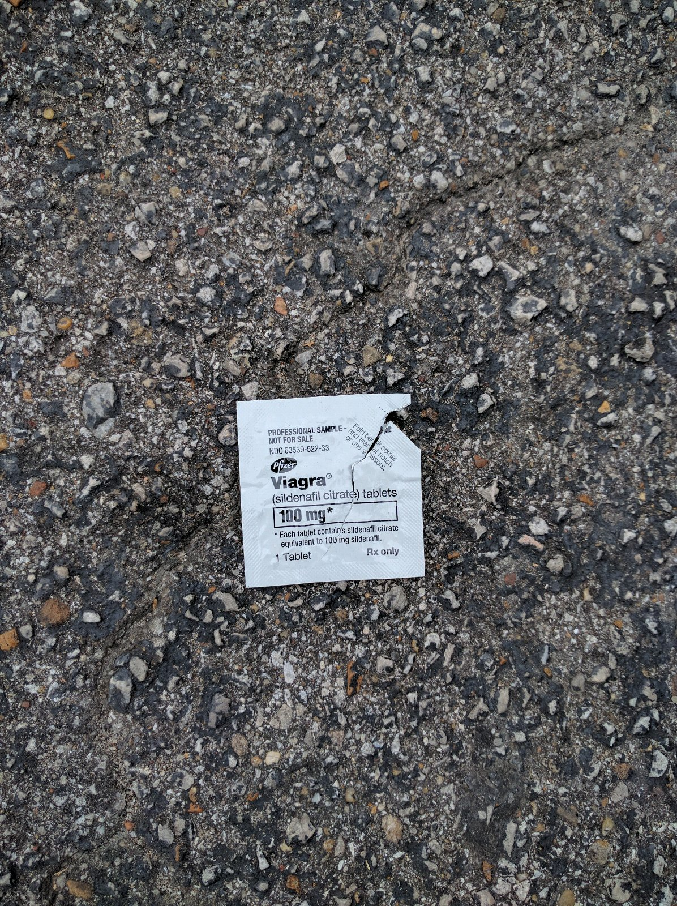

> Drinking a Session IPA #8 by @GPBrewing at @gpbrewing — http://untp.beer/s/c318675702

 [Thu Jun 02 20:34:56 +0000 2016](https://twitter.com/nhudson/status/738468969036779520)

----

> Solid beer for a solid style. - Drinking a Dunkleweizen by @cahababrewing at @cahababrewing  — http://untp.beer/s/c318675916

 [Thu Jun 02 20:39:06 +0000 2016](https://twitter.com/nhudson/status/738470013716320256)

----

Replying to [@heathermilam, @freethehops, @miamicousin, @Ludwigbama and @WeldBham](https://twitter.com/heathermilam/status/738522527153201152)

> personally looking forward to @CrookedStave beers.

 [Fri Jun 03 00:11:50 +0000 2016](https://twitter.com/nhudson/status/738523551708368896)

----

Replying to [@therealjoelp](https://twitter.com/therealjoelp/status/738738156271460352)

> not soon enough 😭😭

 [Fri Jun 03 14:33:29 +0000 2016](https://twitter.com/nhudson/status/738740391743217664)

----

> In the Cobb Lane parking lot. Good for him and her. 
> 
> 

 [Sat Jun 04 15:14:48 +0000 2016](https://twitter.com/nhudson/status/739113178370576386)

----

> Drinking a Funky Wit by @PerennialBeer - http://untp.beer/s/c320288787 #photo

 [Sun Jun 05 18:58:17 +0000 2016](https://twitter.com/nhudson/status/739531808690327554)

----

> Drinking a Tart of Darkness (2015) by @BrueryTerreux - http://untp.beer/s/c320289423

 [Sun Jun 05 18:58:34 +0000 2016](https://twitter.com/nhudson/status/739531881281118208)

----

> Drinking a Need A Hug by @FontaFloraBrew - http://untp.beer/s/c320295585 #photo

 [Sun Jun 05 19:09:48 +0000 2016](https://twitter.com/nhudson/status/739534708200050693)

----

> Drinking a Balaton by @SideProjectBrew - http://untp.beer/s/c320299373 #photo

 [Sun Jun 05 19:16:59 +0000 2016](https://twitter.com/nhudson/status/739536514477088768)

----

> Drinking an El Cuatro (2015) by @drugstorebrewer - http://untp.beer/s/c320306271 #photo

 [Sun Jun 05 19:28:57 +0000 2016](https://twitter.com/nhudson/status/739539527497175040)

----

> Drinking a Biere de Norma (2015) by @HillFarmstead - http://untp.beer/s/c320306810

 [Sun Jun 05 19:29:53 +0000 2016](https://twitter.com/nhudson/status/739539760990060544)

----

> Drinking a Classic Gueuze (2011) by Brasserie Cantillon - http://untp.beer/s/c320309853 #photo

 [Sun Jun 05 19:35:31 +0000 2016](https://twitter.com/nhudson/status/739541178408960001)

----

> Drinking a DFPF by @JWBrewing - http://untp.beer/s/c320317725 #photo

 [Sun Jun 05 19:48:37 +0000 2016](https://twitter.com/nhudson/status/739544475387764736)

----

> Drinking a Nightmare On Brett (Aged In Port Barrels) by @CrookedStave - http://untp.beer/s/c320323477

 [Sun Jun 05 19:58:34 +0000 2016](https://twitter.com/nhudson/status/739546979982790656)

----

> Drinking an Abraxas by @PerennialBeer - http://untp.beer/s/c320332484 #photo

 [Sun Jun 05 20:13:32 +0000 2016](https://twitter.com/nhudson/status/739550747147264000)

----

> Drinking an Urban Monk by @FontaFloraBrew - http://untp.beer/s/c320353594 #photo

 [Sun Jun 05 20:49:16 +0000 2016](https://twitter.com/nhudson/status/739559739571474433)

----

> Drinking a Bourbon Abominable by @fremontbrewing - http://untp.beer/s/c320374761 #photo

 [Sun Jun 05 21:25:22 +0000 2016](https://twitter.com/nhudson/status/739568821846085632)

----

> Drinking a Coffee Cinnamon Bourbon Abominable (2015) by @fremontbrewing - http://untp.beer/s/c320481325 #photo

 [Mon Jun 06 00:41:00 +0000 2016](https://twitter.com/nhudson/status/739618053302980608)

----

> BOOM!!!

 [Wed Jun 08 03:09:01 +0000 2016](https://twitter.com/nhudson/status/740380079788810241)

----

> RT @CoachGusMalzahn: Thank you @Auburn_Softball for an incredible season!!!! The Auburn family is very proud of you!!!   War Eagle!!

 [Thu Jun 09 02:22:45 +0000 2016](https://twitter.com/nhudson/status/740730825726136321)

----

> RT @jasonrobert: Okay @nhudson - you're my go to person on these things. Thoughts on @projectfi? Is it time to switch?

 [Fri Jun 10 19:47:15 +0000 2016](https://twitter.com/nhudson/status/741356069147004928)

----

Replying to [@jasonrobert and @projectfi](https://twitter.com/jasonrobert/status/741338482514235392)

> yes it's always a good time. If you know your data usage then you should be good.

 [Fri Jun 10 19:47:50 +0000 2016](https://twitter.com/nhudson/status/741356216631332864)

----

Replying to [@jasonrobert and @projectfi](https://twitter.com/jasonrobert/status/741338482514235392)

> I also don't recall any issues around Boston either. I have always have had really good coverage.

 [Fri Jun 10 19:48:55 +0000 2016](https://twitter.com/nhudson/status/741356490875887617)

----

Replying to [@jasonrobert and @projectfi](https://twitter.com/jasonrobert/status/741338482514235392)

> also check this out http://imgur.com/a/moEXp.  The r/projectfi community on @reddit is pretty awesome too.

 [Fri Jun 10 20:17:56 +0000 2016](https://twitter.com/nhudson/status/741363789870866432)

----

Replying to [@jasonrobert and @projectfi](https://twitter.com/jasonrobert/status/741364150828433410)

> didn't think yp'rs had cell phones?

 [Fri Jun 10 20:27:50 +0000 2016](https://twitter.com/nhudson/status/741366284579901441)

----

> Drinking a Mama Bear's Sour Cherry Pie by @CrookedStave at @jclyde_bham — http://untp.beer/s/c322014455

 [Sat Jun 11 00:57:32 +0000 2016](https://twitter.com/nhudson/status/741434157251825664)

----

> Drinking a Vieille Reserva Prunus Armeniaca by @CrookedStave at @jclyde_bham — http://untp.beer/s/c322035201

 [Sat Jun 11 01:21:28 +0000 2016](https://twitter.com/nhudson/status/741440179517411328)

----

> Drinking a HopSavant by @CrookedStave at @jclyde_bham — http://untp.beer/s/c322047714

 [Sat Jun 11 01:35:49 +0000 2016](https://twitter.com/nhudson/status/741443790377000961)

----

> Drinking a Mama Bear's Sour Cherry Pie by @CrookedStave at @jclyde_bham — http://untp.beer/s/c322071561

 [Sat Jun 11 02:04:54 +0000 2016](https://twitter.com/nhudson/status/741451110037258241)

----

> Last bottle I have, proud to share it with C... (Persica Wild Wild Brett (Batch 1 - 750ml)) http://untp.beer/s/c322088586 #photo

 [Sat Jun 11 02:27:01 +0000 2016](https://twitter.com/nhudson/status/741456673617936384)

----

> Again happy to share my favorite beer from @crookedstave with Chad. Amazing bee... (Oculus) http://untp.beer/s/c322110231 #photo

 [Sat Jun 11 02:58:28 +0000 2016](https://twitter.com/nhudson/status/741464587980165120)

----

> Drinking a Nightmare On Brett W/ Blueberries by @CrookedStave at @jclyde_bham — http://untp.beer/s/c322119076

 [Sat Jun 11 03:12:58 +0000 2016](https://twitter.com/nhudson/status/741468240417820672)

----

> Just another reason to stay away from @LinkedIn http://www.theverge.com/platform/amp/2016/6/13/11920072/microsoft-linkedin-acquisition-2016

 [Mon Jun 13 12:49:45 +0000 2016](https://twitter.com/nhudson/status/742338166888235008)

----

> Drinking a HopSavant by @CrookedStave @ Hudson House of Ales and Sours — http://untp.beer/s/c324237870

 [Thu Jun 16 23:50:31 +0000 2016](https://twitter.com/nhudson/status/743591617328717824)

----

> My personal hell today. 7 routers, 2 servers and 2 switches. 
> 
> 

 [Fri Jun 17 18:51:08 +0000 2016](https://twitter.com/nhudson/status/743878664086036480)

----

> After cutting grass beer. - Drinking a HopSavant by @CrookedStave @ Hudson House of Ales and Sours  — http://untp.beer/s/c325205736 #photo

 [Sat Jun 18 20:29:06 +0000 2016](https://twitter.com/nhudson/status/744265704543780864)

----

> Still a ton of peach flavor here. Not too sour, more funk than anyt... (Persica (Blend #2)) http://untp.beer/s/c325233388 #photo

 [Sat Jun 18 20:55:02 +0000 2016](https://twitter.com/nhudson/status/744272230754967552)

----

> Drinking a Kriek Ale by @cascadebrewing @ Hudson House of Ales and Sours — http://untp.beer/s/c325251579 #photo

 [Sat Jun 18 21:12:39 +0000 2016](https://twitter.com/nhudson/status/744276665484836864)

----

Replying to [@_TheBlack77](https://twitter.com/_TheBlack77/status/744506721603821569)

> 5 minutes, you crazy. More like 3 hours.

 [Sun Jun 19 13:17:43 +0000 2016](https://twitter.com/nhudson/status/744519530936930304)

----

Replying to [@_TheBlack77](https://twitter.com/_TheBlack77/status/744525135621853184)

> I would just have to explain it to you.

 [Sun Jun 19 13:46:35 +0000 2016](https://twitter.com/nhudson/status/744526795844816897)

----

> Drinking a Snake Handler Double IPA by @GPBrewing @ Mellow Mushroom — http://untp.beer/s/c325717263

 [Sun Jun 19 17:04:43 +0000 2016](https://twitter.com/nhudson/status/744576657009291265)

----

Replying to [@McMatt945](https://twitter.com/McMattRadio/status/744682483246063616)

> amen

 [Mon Jun 20 00:15:54 +0000 2016](https://twitter.com/nhudson/status/744685170402328576)

----

> Drinking a Petite Sour Passion Fruit by @CrookedStave @ Hudson House of Ales and Sours — http://untp.beer/s/c327041788 #photo

 [Thu Jun 23 22:49:38 +0000 2016](https://twitter.com/nhudson/status/746113012092772352)

----

> Apparently everyone's opinion matters, even if they don't act on said opinion. #stupid

 [Sat Jun 25 21:52:30 +0000 2016](https://twitter.com/nhudson/status/746823408009248768)

----

> Happy 4th anniversary to @hkwhateva. Great dinner at @littlesavanah… https://www.instagram.com/p/BHGfaVXjTEJr_YYOj0J3yjIJjY11WruYIGpkWM0/

 [Sun Jun 26 02:45:56 +0000 2016](https://twitter.com/nhudson/status/746897254070484992)

----

> I don't understand. Why would you go to a place like Collins Bar and drink BMC only?  They will make you anything, like anything to drink.

 [Sun Jun 26 03:01:06 +0000 2016](https://twitter.com/nhudson/status/746901071289671680)

----

> Drinking an Evolving Hare: COLUMBUS by @redharebrewing at @jclyde_bham — http://untp.beer/s/c328406680

 [Sun Jun 26 03:59:15 +0000 2016](https://twitter.com/nhudson/status/746915703501033472)