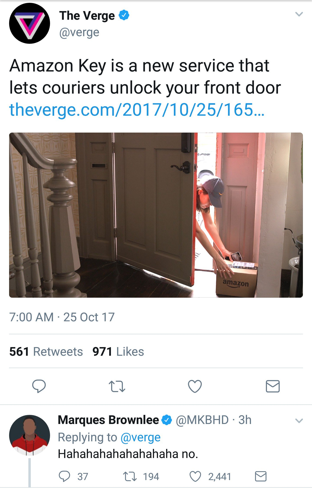

> RT @ValaAfshar: Talented employees commit when
> 
> 1 paid well
> 2 mentored
> 3 challenged
> 4 inspired
> 5 involved
> 6 appreciated
> 7 trusted
> 8 empower…

 [Wed Oct 18 23:57:54 +0000 2017](https://twitter.com/nhudson/status/920801139926360064)

----

> RIP headphone jack. Never thought I would be without you 
> 
> 

 [Fri Oct 20 13:57:47 +0000 2017](https://twitter.com/nhudson/status/921374894071386112)

----

> @hkwhateva had a fan at breakfast this morning 
> 
> 

 [Mon Oct 23 18:31:03 +0000 2017](https://twitter.com/nhudson/status/922530827401093121)

----

> RT @yazoobrewmaster: Good lord, you can spend a lot of money on homebrew equipment nowadays.   Was more fun to build it yourself I think ht…

 [Mon Oct 23 21:31:41 +0000 2017](https://twitter.com/nhudson/status/922576286471553024)

----

> Saw this and thought about @jasonrobert 
> 
> 

 [Tue Oct 24 15:52:02 +0000 2017](https://twitter.com/nhudson/status/922853195176665088)

----

Replying to [@jasonrobert and @jasonrobert](https://twitter.com/nhudson/status/922853195176665088)

> they are everywhere 
> 
> 

 [Tue Oct 24 15:54:14 +0000 2017](https://twitter.com/nhudson/status/922853751693697026)

----

Replying to [@therealjoelp and @jasonrobert](https://twitter.com/therealjoelp/status/922855140402565120)

> Hahaha wish I could have seen that

 [Tue Oct 24 16:04:59 +0000 2017](https://twitter.com/nhudson/status/922856456923303937)

----

> RT @MossRockFest: @CarboyJunkies are back representing the #homebrewing community at #BeerGarden Nov 4-5. Can't wait to taste what they've…

 [Wed Oct 25 03:45:06 +0000 2017](https://twitter.com/nhudson/status/923032643733684226)

----

> RT @MKBHD: For real tho 
> 
> 

 [Wed Oct 25 15:23:46 +0000 2017](https://twitter.com/nhudson/status/923208469360074752)

----

> RT @nprmusic: Fats Domino, one of the architects of rock 'n' roll, has died. He was 89. http://n.pr/2yPvsdw 
> 
> 

 [Wed Oct 25 15:24:22 +0000 2017](https://twitter.com/nhudson/status/923208623878270976)

----

> RT @MasteringVim: I don't use tmux, but for those who do, could be interesting:
> 
> A few Vim &amp; tmux mappings https://bluz71.github.io/2017/06/14/a-few-vim-tmux-mappings.html

 [Thu Oct 26 21:18:58 +0000 2017](https://twitter.com/nhudson/status/923660246840733696)

----

> Drinking a Gallery #006 New England Double India Pale Ale — http://untp.beer/s/c520318956

 [Sat Oct 28 02:05:57 +0000 2017](https://twitter.com/nhudson/status/924094855315324929)