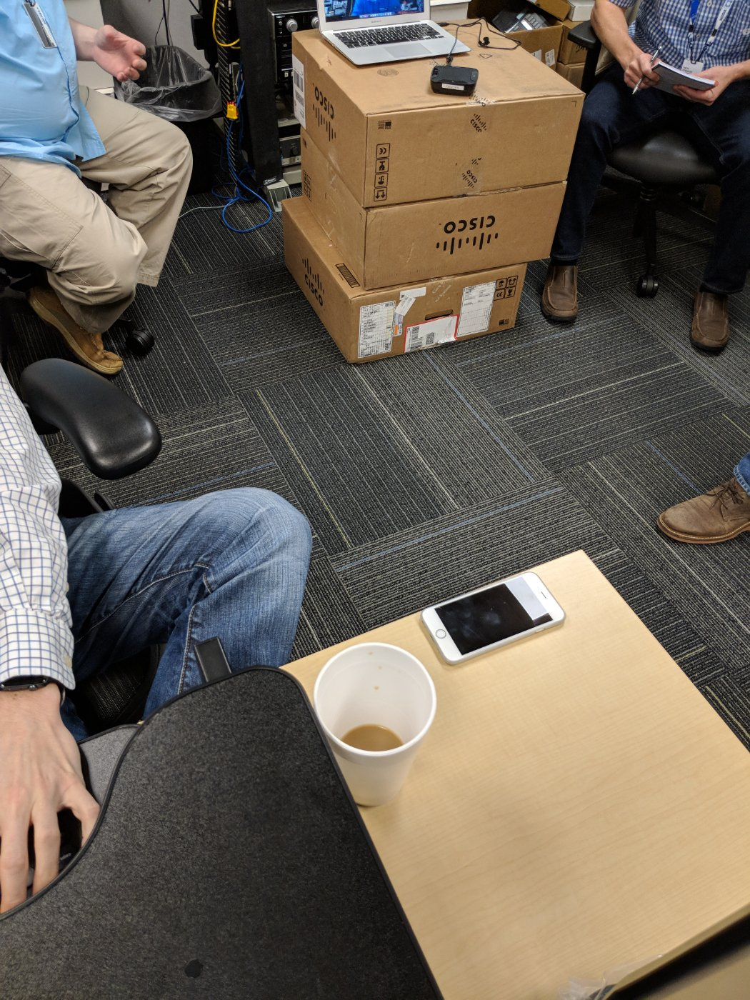
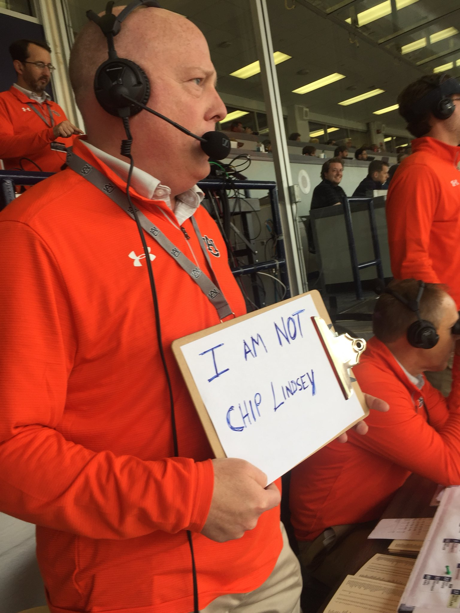
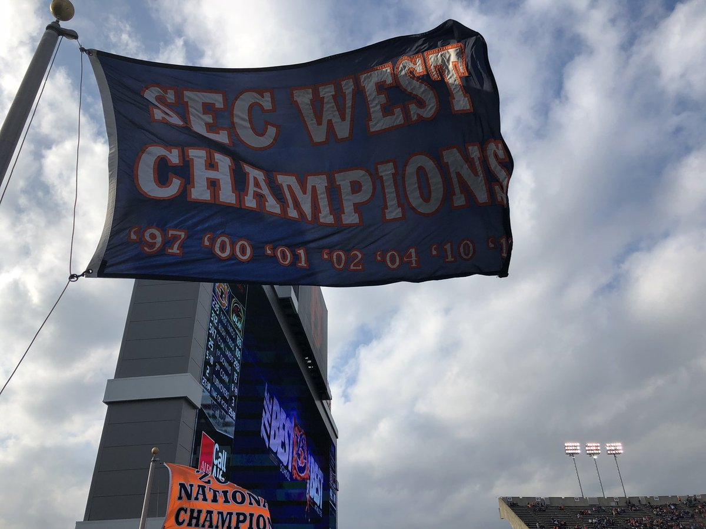
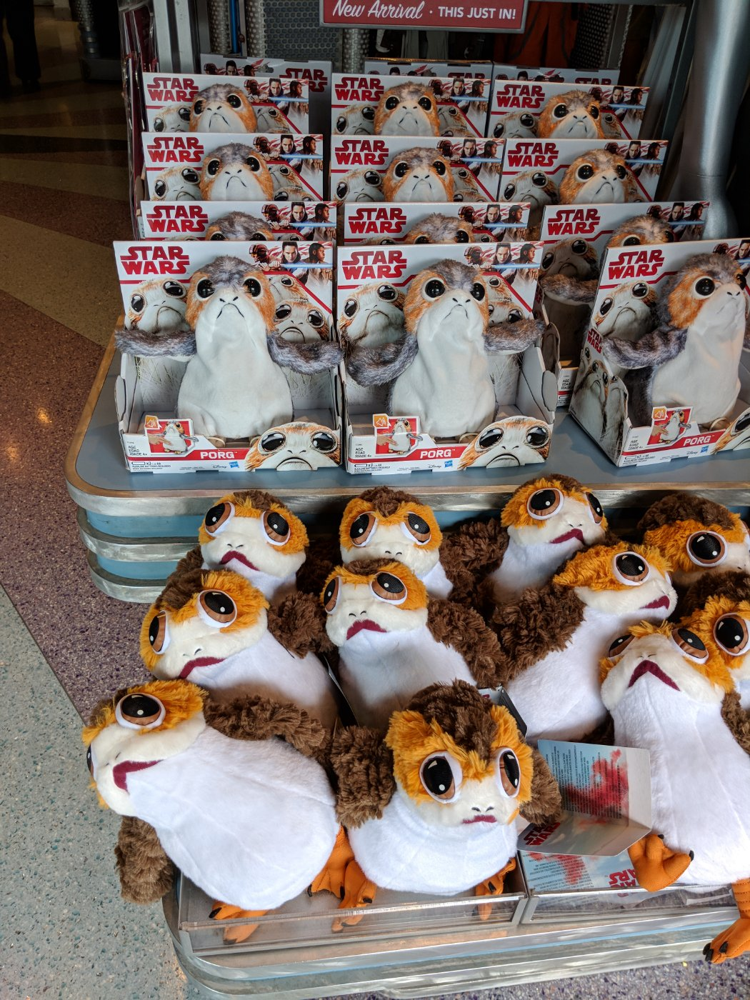
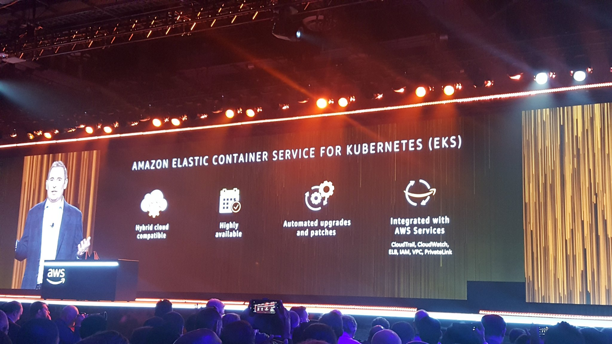

> RT @MossRockFest: @CarboyJunkies #MRFBeerGarden lineup: Coffee Milk Stout, Saison w Sauvignon Blanc grapes, Export Stout, IPA, Porter! #cra…

 [Wed Nov 01 22:28:27 +0000 2017](https://twitter.com/nhudson/status/925852059936706561)

----

> RT @bitfield: “RunC recently added support for rootless containers, which are created, run and managed by an unprivileged user.” https://t.…

 [Thu Nov 02 04:38:51 +0000 2017](https://twitter.com/nhudson/status/925945275503579136)

----

> <video controls><source src="media/925945449277771776-DNmeemBUMAUC9V6.mp4">Your browser does not support the video tag.</video>

 [Thu Nov 02 04:39:32 +0000 2017](https://twitter.com/nhudson/status/925945449277771776)

----

> Nothing better than a team meeting at a Fortune 500 company where we use a laptop, boxes and a USB speaker. 
> 
> 

 [Thu Nov 02 14:37:09 +0000 2017](https://twitter.com/nhudson/status/926095842766925824)

----

> Drinking a Kochere Coffee Snob by @carboyjunkies @ Moss Rock — http://untp.beer/s/c523811988

 [Sun Nov 05 17:33:05 +0000 2017](https://twitter.com/nhudson/status/927227281160003584)

----

> Drinking a Dry Hopped Saison by @carboyjunkies @ Moss Rock — http://untp.beer/s/c523813775

 [Sun Nov 05 17:37:19 +0000 2017](https://twitter.com/nhudson/status/927228345481416705)

----

> RT @PrometheusIO: Prometheus 2.0 is out! Check out the performance improvements and other changes: https://prometheus.io/blog/2017/11/08/announcing-prometheus-2-0/

 [Wed Nov 08 18:27:28 +0000 2017](https://twitter.com/nhudson/status/928328131538309120)

----

> Am I watching this year's Auburn team?  #wareagle

 [Sat Nov 11 23:02:03 +0000 2017](https://twitter.com/nhudson/status/929484394791866368)

----

Replying to [@nhudson](https://twitter.com/nhudson/status/929484394791866368)

> Oh there they are

 [Sat Nov 11 23:15:56 +0000 2017](https://twitter.com/nhudson/status/929487889871835143)

----

> RT @UAB_FB: Remember the 🐲! UAB leaves San Antonio victorious! The Blazers picked up their seventh win tonight tying the most FBS wins in p…

 [Sun Nov 12 03:37:06 +0000 2017](https://twitter.com/nhudson/status/929553612094787587)

----

> Does Butch Jones get on the plane with the team leaving Columbus?

 [Sun Nov 12 03:38:46 +0000 2017](https://twitter.com/nhudson/status/929554034842918912)

----

> RT @GDouglasJones: I need you now, we can make history.
> 
> The numbers:
> New poll has us up 4.
> 30 days out.
> 158,328 on children’s healthcare.…

 [Sun Nov 12 17:12:54 +0000 2017](https://twitter.com/nhudson/status/929758917487419394)

----

> Well there is the #auburn team that didn't need to show up today

 [Sat Nov 18 18:14:47 +0000 2017](https://twitter.com/nhudson/status/931948818228277248)

----

> RT @VoiceofAUTigers: This... 
> 
> 

 [Sat Nov 18 19:34:26 +0000 2017](https://twitter.com/nhudson/status/931968863880835072)

----

Replying to [@jasonrobert and @untappd](https://twitter.com/jasonrobert/status/934211980352802816)

> Oh you just let me know know who's butt to kick!

 [Sat Nov 25 00:10:56 +0000 2017](https://twitter.com/nhudson/status/934212773856382976)

----

> Thank the gods for Alabama kickers

 [Sat Nov 25 23:04:20 +0000 2017](https://twitter.com/nhudson/status/934558400503001089)

----

> RT @AUFAMILY: FINAL: #AUBURN 26 #BAMA 14
> 
> SEC West Champs!!!!
> 
> https://www.aufamily.com/forums/topic/160110-final-auburn-26-alabama-14/ 
> 
> 

 [Sun Nov 26 00:01:02 +0000 2017](https://twitter.com/nhudson/status/934572671089741825)

----

> RT @Deadspin: 
> 
> <video controls><source src="media/934577408140865536-DPg5xoxXUAAK0L7.mp4">Your browser does not support the video tag.</video>

 [Sun Nov 26 00:19:52 +0000 2017](https://twitter.com/nhudson/status/934577408140865536)

----

Replying to [@ditchell](https://twitter.com/ditchell/status/934577360963284994)

> Sadly I would not be shocked come Tuesday they are #4 and we are #5

 [Sun Nov 26 00:20:56 +0000 2017](https://twitter.com/nhudson/status/934577675741560832)

----

Replying to [@ditchell](https://twitter.com/nhudson/status/934577675741560832)

> Either way War Eagle man

 [Sun Nov 26 00:21:12 +0000 2017](https://twitter.com/nhudson/status/934577742686932998)

----

> RT @UnderArmour: Did we mention #WarEagle? @auburnfootball K.O.'s Number 1. See you in the SEC Championship. #IWILL 
> 
> <video controls><source src="media/934578711139180544-Q2iWkUS7yx89xITr.mp4">Your browser does not support the video tag.</video>

 [Sun Nov 26 00:25:03 +0000 2017](https://twitter.com/nhudson/status/934578711139180544)

----

Replying to [@JoeGoodmanJr](https://twitter.com/JoeGoodmanJr/status/934586938924904448)

> Should I read the comments from this article? I feel like I should

 [Sun Nov 26 01:04:05 +0000 2017](https://twitter.com/nhudson/status/934588537185423361)

----

> RT @McMatt1033: Favorite college football story of the year is easy, UAB goes 8-4 after not having football for two years. Amazing story. B…

 [Sun Nov 26 01:15:28 +0000 2017](https://twitter.com/nhudson/status/934591400716521472)

----

> I hate Gary Danielson, but him calling Jalen Hurts "Mr Clutch" is my top TV moment of 2017

 [Sun Nov 26 01:29:32 +0000 2017](https://twitter.com/nhudson/status/934594941048803330)

----

> RT @AuburnFootball: How the @SEC West was won. 
> 
> #WarEagle 
> 
> <video controls><source src="media/934619657973239808-lOE6EPE3yUvEbcH0.mp4">Your browser does not support the video tag.</video>

 [Sun Nov 26 03:07:45 +0000 2017](https://twitter.com/nhudson/status/934619657973239808)

----

> You know with all the data modeling, ai and Alexa functionality #aws has you think @AWSreInvent would be more organized and scheduled better. #reInvent

 [Tue Nov 28 18:10:32 +0000 2017](https://twitter.com/nhudson/status/935571628087373825)

----

> RT @gpharris: Want to see what literal troll looks like? Look @finebaum face, he doesn’t even believe what he’s saying https://t.co/b5On1qW…

 [Tue Nov 28 22:54:57 +0000 2017](https://twitter.com/nhudson/status/935643200735162368)

----

Replying to [@therealjoelp and @jasonrobert](https://twitter.com/therealjoelp/status/935655936420667392)

>  
> 
> 

 [Tue Nov 28 23:47:02 +0000 2017](https://twitter.com/nhudson/status/935656309856256001)

----

> RT @chrismessina: ⚠️ Go fix the #MacOS #HighSierra root password vulnerability now! 
> 
> 1) open Directory Utility
> 2) Click 🔒 to make changes,…

 [Wed Nov 29 07:23:24 +0000 2017](https://twitter.com/nhudson/status/935771157617430528)

----

> RT @AWSreInvent: Managed Kubernetes for AWS - The Elastic Container Service for Kubernetes (EKS) #reinvent 
> 
> 

 [Wed Nov 29 17:18:42 +0000 2017](https://twitter.com/nhudson/status/935920970602242049)

----

> RT @jbeda: This is the thing that makes me super optimistic about AKS. Every indication is that the goal is to work with upstream and ecosy…

 [Wed Nov 29 17:20:16 +0000 2017](https://twitter.com/nhudson/status/935921366208884737)