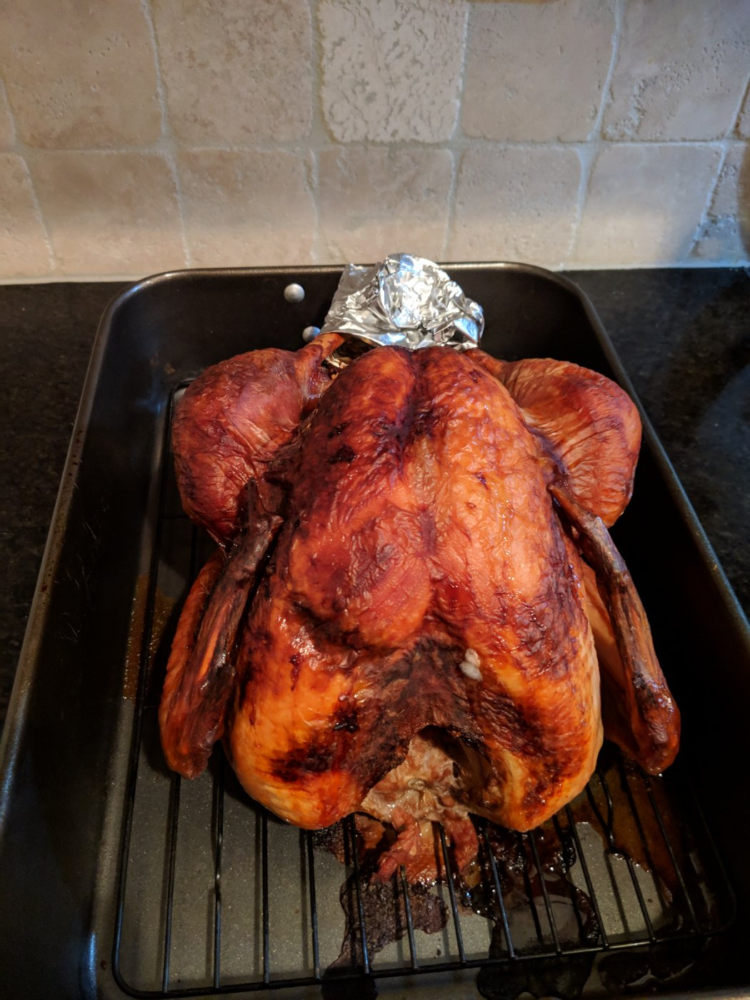
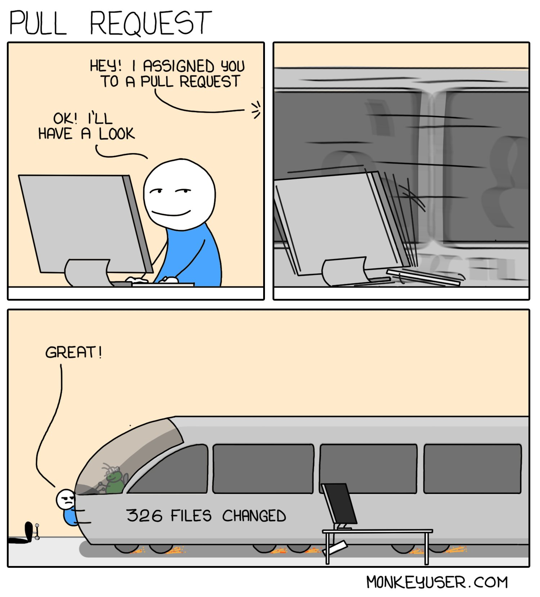

> Proudly voted for @MilamForAL today, can't wait to see what she will do. #govote

 [Tue Nov 06 15:54:42 +0000 2018](https://twitter.com/nhudson/status/1059836481827680257)

----

> #auburn #auburnfootball 
> 
> <video controls><source src="media/1061432951051821057-Drr3pJFU4AAImNX.mp4">Your browser does not support the video tag.</video>

 [Sun Nov 11 01:38:30 +0000 2018](https://twitter.com/nhudson/status/1061432951051821057)

----

Replying to [@siwelwerd](https://twitter.com/siwelwerd/status/1061476409569435649)

> After this year's iron bowl he will be 4-8 I think.  He is 2-4 against UGA and 2-3 against Bama. Has only won 1 bowl game ( Birmingham Bowl ). I could be off a bit on numbers.

 [Sun Nov 11 04:52:54 +0000 2018](https://twitter.com/nhudson/status/1061481874026041350)

----

Replying to [@siwelwerd](https://twitter.com/siwelwerd/status/1061484278658293760)

> Never liked him, really thought he was a bad hire 6 years ago. No way he is leaving though so we will have at least one more year.

 [Sun Nov 11 05:05:37 +0000 2018](https://twitter.com/nhudson/status/1061485072497459200)

----

Replying to [@siwelwerd](https://twitter.com/siwelwerd/status/1061723366640508928)

> Out you're hilarious. I bet you are real fun at parties

 [Sun Nov 11 21:06:15 +0000 2018](https://twitter.com/nhudson/status/1061726825662107650)

----

> RT @bitfield: Parents, talk to your kids about Emacs... before somebody else does. https://twitter.com/mfdii/status/1058474537715666955

 [Mon Nov 12 14:49:19 +0000 2018](https://twitter.com/nhudson/status/1061994352170487809)

----

Replying to [@siwelwerd, @wickdawg and @Homebrewchef](https://twitter.com/siwelwerd/status/1065243562323918849)

> Doing the same thing as well. No idea yet what I'm going to use for the brine. Thinking citrus IPA or Pale Ale. Sadly I have no Homebrew to use

 [Wed Nov 21 14:14:11 +0000 2018](https://twitter.com/nhudson/status/1065247003024736256)

----

Replying to [@wickdawg, @siwelwerd and @Homebrewchef](https://twitter.com/wickdawg/status/1065251676737687554)

> Here is mine this year!! 
> 
> 

 [Thu Nov 22 22:09:56 +0000 2018](https://twitter.com/nhudson/status/1065729118673821698)

----

> RT @kelseyhightower: If you can't appreciate great technology because it was not built by you, or your employer, then you're doing yourself…

 [Tue Nov 27 07:00:13 +0000 2018](https://twitter.com/nhudson/status/1067312117538144256)

----

> RT @mndoci: And here you go https://aws.amazon.com/blogs/aws/new-ec2-instances-a1-powered-by-arm-based-aws-graviton-processors/

 [Tue Nov 27 19:15:42 +0000 2018](https://twitter.com/nhudson/status/1067497210349121536)

----

> RT @abbyfuller: Looks like the lady engineer container power hour video was posted! @jessfraz @clare_liguori ❤️👯‍♀️🎉
> 
> #aws #reInvent
> 
> https…

 [Tue Nov 27 23:13:49 +0000 2018](https://twitter.com/nhudson/status/1067557131593760768)

----

> @nest why do you guys go down at the worst times?  Lots going on around my house and I would love to have some sort of visibility I to what is going on. Building a #unifi system asap.

 [Wed Nov 28 02:43:03 +0000 2018](https://twitter.com/nhudson/status/1067609788870144000)

----

> Tonight I found out that both Hoover and Vestavia have a SWAT team. My mind is blown. Why?

 [Wed Nov 28 04:05:12 +0000 2018](https://twitter.com/nhudson/status/1067630462279999488)

----

> RT @CloudNativeFdn: [NEWS] @CloudNativeFdn Announces @EnvoyProxy Graduation 🎉🎓 https://www.cncf.io/announcement/2018/11/28/cncf-announces-envoy-graduation/ 
> 
> 

 [Wed Nov 28 18:26:27 +0000 2018](https://twitter.com/nhudson/status/1067847200976195584)

----

> RT @ismonkeyuser: Pull Request (https://www.monkeyuser.com/2018/pull-request/) 
> 
> 

 [Fri Nov 30 09:19:53 +0000 2018](https://twitter.com/nhudson/status/1068434429134045185)